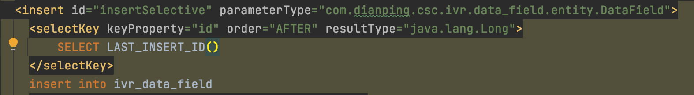

#### 一、为什么要用分布式ID？

我们来简单分析一下为什么用分布式ID？分布式ID应该满足哪些特征？

###### 1、什么是分布式ID？

拿MySQL数据库举个例子：

在我们业务数据量不大的时候，单库单表完全可以支撑现有业务，数据再大一点搞个MySQL主从同步读写分离也能对付。

但随着数据日渐增长，主从同步也扛不住了，就需要对数据库进行分库分表，但分库分表后需要有一个唯一ID来标识一条数据，数据库的自增ID显然不能满足需求；特别一点的如订单、优惠券也都需要有唯一ID做标识。此时一个能够生成全局唯一ID的系统是非常必要的。那么这个全局唯一ID就叫分布式ID。

###### 2、那么分布式ID需要满足那些条件？

*   全局唯一：必须保证ID是全局性唯一的，基本要求
    
*   高性能：高可用低延时，ID生成响应要块，否则反倒会成为业务瓶颈
    
*   高可用：100%的可用性是骗人的，但是也要无限接近于100%的可用性
    
*   好接入：要秉着拿来即用的设计原则，在系统设计和实现上要尽可能的简单
    
*   趋势递增：最好趋势递增，这个要求就得看具体业务场景了，一般不严格要求
    

#### 二、 分布式ID都有哪些生成方式？

今天主要分析一下以下9种，分布式ID生成器方式以及优缺点：

*   UUID
    
*   数据库自增ID
    
*   数据库多主模式
    
*   号段模式
    
*   Redis
    
*   雪花算法（SnowFlake）
    
*   滴滴出品（TinyID）
    
*   百度 （Uidgenerator）
    
*   美团（Leaf）
    

那么它们都是如何实现？以及各自有什么优缺点？我们往下看

##### 1、基于UUID

在Java的世界里，想要得到一个具有唯一性的ID，首先被想到可能就是UUID，毕竟它有着全球唯一的特性。那么UUID可以做分布式ID吗？**答案是可以的，但是并不推荐！**

UUID的生成简单到只有一行代码，输出结果 c2b8c2b9e46c47e3b30dca3b0d447718，但UUID却并不适用于实际的业务需求。像用作订单号UUID这样的字符串没有丝毫的意义，看不出和订单相关的有用信息；而对于数据库来说用作业务主键ID，它不仅是太长还是字符串，存储性能差查询也很耗时，所以不推荐用作分布式ID。

**优点：** 

*   生成足够简单，本地生成无网络消耗，具有唯一性
    

**缺点：** 

*   无序的字符串，不具备趋势自增特性
    
*   没有具体的业务含义
    
*   长度过长16 字节128位，36位长度的字符串，存储以及查询对MySQL的性能消耗较大，**MySQL官方明确建议主键要尽量越短越好**，作为数据库主键 UUID 的无序性会导致数据位置频繁变动，严重影响性能。
    

##### 2、基于数据库自增ID

基于数据库的auto\_increment自增ID完全可以充当分布式ID，具体实现：需要一个单独的MySQL实例用来生成ID，建表结构如下：

当我们需要一个ID的时候，向表中插入一条记录返回主键ID，但这种方式有一个比较致命的缺点，访问量激增时MySQL本身就是系统的瓶颈，用它来实现分布式服务风险比较大，不推荐！

**优点：** 

*   实现简单，ID单调自增，数值类型查询速度快
    

**缺点：** 

*   **DB单点**存在宕机风险，无法扛住高并发场景
    

##### 3、基于数据库集群模式

分库分表后面临的问题

唯一ID问题：由于采用了分库分表后，原来单库的ID无法保证唯一性，和连续性，故而需要全局ID组件； 

全局ID主要有两个特性：连续性和唯一性，根据系统的需求判定需要的特性；引入外部ID生成组件来实现全局ID(常用：数据库自增ID组件，UUID，Twitter snowFlake方法等)；

前边说了单点数据库方式不可取，那对上边的方式做一些高可用优化，换成主从模式集群。害怕一个主节点挂掉没法用，那就做双主模式集群，也就是两个Mysql实例都能单独的生产自增ID。

那这样还会有个问题，两个MySQL实例的自增ID都从1开始，**会生成重复的ID怎么办？**

**解决方案**：设置起始值和自增步长

MySQL\_1 配置：

set @@auto\_increment\_offset = 1; -- 起始值 set @@auto\_increment\_increment = 2; -- 步长

MySQL\_2 配置：

set @@auto\_increment\_offset = 2; -- 起始值 set @@auto\_increment\_increment = 2; -- 步长

这样两个MySQL实例的自增ID分别就是：

> 1、3、5、7、9  
> 2、4、6、8、10

那如果集群后的性能还是扛不住高并发咋办？就要进行MySQL扩容增加节点，这是一个比较麻烦的事。

从上图可以看出，水平扩展的数据库集群，有利于解决数据库单点压力的问题，同时为了ID生成特性，将自增步长按照机器数量来设置。

增加第三台MySQL实例需要人工修改一、二两台MySQL实例的起始值和步长，把第三台机器的ID起始生成位置设定在比现有最大自增ID的位置远一些，但必须在一、二两台MySQL实例ID还没有增长到第三台MySQL实例的起始ID值的时候，否则自增ID就要出现重复了，**必要时可能还需要停机修改**。

**优点：** 

*   解决DB单点问题
    

**缺点：** 

*   不利于后续扩容，而且实际上单个数据库自身压力还是大，依旧无法满足高并发场景。
    

##### 4、基于数据库的号段模式

号段模式是当下分布式ID生成器的主流实现方式之一，号段模式可以理解为从数据库批量的获取自增ID，每次从数据库取出一个号段范围，例如 (1,1000\] 代表1000个ID，具体的业务服务将本号段，生成1~1000的自增ID并加载到内存。表结构如下：

biz\_type ：代表不同业务类型

max\_id ：当前最大的可用id

step ：代表号段的长度

version ：是一个乐观锁，每次都更新version，保证并发时数据的正确性

等这批号段ID用完，再次向数据库申请新号段，对max\_id字段做一次update操作，update max\_id= max\_id + step，update成功则说明新号段获取成功，新的号段范围是(max\_id ,max\_id +step\]。

update id\_generator set max\_id = #{max\_id+step}, version = version + 1 where version = # {version} and biz\_type = XXX

由于多业务端可能同时操作，所以采用**版本号version乐观锁**方式更新，这种分布式ID生成方式不强依赖于数据库，**不会频繁的访问数据库，**对数据库的压力小很多。

##### 5、基于Redis模式

Redis也同样可以实现，原理就是利用redis的 incr命令实现ID的原子性自增。

127.0.0.1:6379\> set seq\_id 1 _// 初始化自增ID为1_ OK

127.0.0.1:6379\> incr seq\_id _// 增加1，并返回递增后的数值_ (integer) 2

用redis实现需要注意一点，要考虑到redis持久化的问题。redis有两种持久化方式RDB和AOF

*   RDB会定时打一个快照进行持久化，**假如连续自增但redis没及时持久化，而这会Redis挂掉了，重启Redis后会出现ID重复的情况**。
    
    *   AOF会对每条写命令进行持久化，即使Redis挂掉了也不会出现ID重复的情况，**但由于incr命令的特殊性，会导致Redis重启恢复的数据时间过长**。
        

##### 6、基于雪花算法（Snowflake）模式

雪花算法（Snowflake）是twitter公司内部分布式项目采用的ID生成算法，开源后广受国内大厂的好评，在该算法影响下各大公司相继开发出各具特色的分布式生成器。

Snowflake生成的是Long类型的ID，一个Long类型占8个字节，每个字节占8比特，也就是说一个Long类型占64个比特。

Snowflake ID组成结构：正数位（占1比特）+ 时间戳（占41比特）+ 机器ID（占5比特）32个机房+ 数据中心（占5比特）32台机器+ 自增值（占12比特）2的12次方，总共64比特组成的一个Long类型。

*   第一个bit位（1bit）：Java中long的最高位是符号位代表正负，正数是0，负数是1，一般生成ID都为正数，所以默认为0。
    
*   **==时间戳部分（41bit）：毫秒级的时间，不建议存当前时间戳，而是用（当前时间戳 - 固定开始时间戳）的差值，可以使产生的ID从更小的值开始；41位的时间戳可以使用69年，(1L << 41) / (1000L _60_ 60 _24_ 365) = 69年==**
    
*   工作机器id（10bit）：也被叫做workId，这个可以灵活配置，机房或者机器号组合都可以。
    
*   序列号部分（12bit），自增值支持同一毫秒内同一个节点可以生成4096个ID
    

根据这个算法的逻辑，只需要将这个算法用Java语言实现出来，封装为一个工具方法，那么各个业务应用可以直接使用该工具方法来获取分布式ID，只需保证每个业务应用有自己的工作机器id即可，而不需要单独去搭建一个获取分布式ID的应用。

SnowFlake算法的优点： 
（1）高性能高可用：生成时不依赖于数据库，完全在内存中生成。

（2）容量大：每秒中能生成数百万的自增ID。

（3）ID自增：存入数据库中，索引效率高。

SnowFlake算法的缺点： 
依赖与系统时间的一致性，如果系统时间被回调，或者改变，可能会造成id冲突或者重复。 

实际中我们的机房并没有那么多，我们可以改进改算法，将10bit的机器id优化，成业务表或者和我们系统相关的业务。

**Java版本的Snowflake算法实现：** 

##### 7、百度（uid-generator）

uid-generator是由百度技术部开发，项目GitHub地址 [https://github.com/baidu/uid-...](https://github.com/baidu/uid-generator)

uid-generator是基于Snowflake算法实现的，与原始的snowflake算法不同在于，uid-generator支持自定义时间戳、工作机器ID和 序列号 等各部分的位数，而且uid-generator中采用用户自定义workId的生成策略。

uid-generator需要与数据库配合使用，需要新增一个WORKER\_NODE表。当应用启动时会向数据库表中去插入一条数据，插入成功后返回的自增ID就是该机器的workId数据由host，port组成。

**对于uid-generator ID组成结构**：

workId，占用了22个bit位，时间占用了28个bit位，序列化占用了13个bit位，需要注意的是，和原始的snowflake不太一样，时间的单位是秒，而不是毫秒，workId也不一样，而且同一应用每次重启就会消费一个workId。

> 参考文献  
> [https://github.com/baidu/uid-...](https://github.com/baidu/uid-generator/blob/master/README.zh_cn.md)

##### 8、美团（Leaf）

Leaf由美团开发，github地址：[https://github.com/Meituan-Di...](https://github.com/Meituan-Dianping/Leaf)

Leaf同时支持号段模式和snowflake算法模式，可以切换使用。

##### 9、滴滴（Tinyid）

Tinyid由滴滴开发，Github地址：[https://github.com/didi/tinyid](https://github.com/didi/tinyid)。

Tinyid是基于号段模式原理实现的与Leaf如出一辙，每个服务获取一个号段（1000,2000\]、（2000,3000\]、（3000,4000\]  
Tinyid提供http和tinyid-client两种方式接入

* * *

#### 总结

简单介绍一下每种分布式ID生成器，每种生成方式都有它自己的优缺点，具体如何使用还要看具体的业务需求。

Leaf是美团分布式ID生成系统，Leaf具备高可靠、低延迟、全局唯一等特点。Leaf的起源是因为集团业务线有大量唯一ID生成需求，如订单id、流水id等。为减少业务重复开发、解决已有方案可用性不够高等问题，架构组提供了全局唯一id的生成器Leaf。目前已经广泛应用于美团金融、美团外卖、美团酒旅等多个部门。

**接入攻略** ：[Leaf 接入文档&QA](https://km.sankuai.com/page/28286983)

Leaf在设计之初就秉承着几点要求：

1.  全局唯一，绝对不会出现重复的ID，且ID整体趋势递增。
    
2.  高可用，服务完全基于分布式架构，即使MySQL宕机，也能容忍一段时间的数据库不可用。
    
3.  高并发低延时
    
4.  接入简单，直接通过公司RPC服务或者HTTP调用即可接入。
    

3.1. 功能特性
---------

*   保证同一个tag下生成的id全局唯一
    
*   id趋势递增，低位递增
    
*   Id 为64位正整数
    

3.2. SLA保障
----------

*   多IDC部署
    
*   可用性五个9
    
*   单tag单机QPS 1W+，总QPS可线性扩展
    
*   TP95 1ms，TP99 2ms
    
*   具体可参见：
    
    [Leaf SLA](https://km.sankuai.com/page/28277542)
    

Leaf支持两种不同模式的ID生成策略：号段模式，Snowflake模式

*   号段模式能够自定义ID初始值，方便业务迁移，通常情况下号段利用率更高；
    
*   sonwflake方式完全无依赖，容灾等级更高，ID有意义可读，不会暴露数量信息
    

4.1 Leaf-segment方案
------------------

Leaf第一个版本采用了预分发的方式生成ID，即可以在DB之上挂N个Server，每个Server启动时，都会去DB拿固定长度的ID List。这样就做到了完全基于分布式的架构，同时因为ID是由内存分发，所以也可以做到很高效。接下来是数据持久化问题，Leaf每次去DB拿固定长度的ID List，然后把最大的ID持久化下来，也就是并非每个ID都做持久化，仅仅持久化一批ID中最大的那一个。这个方式有点像游戏里的定期存档功能，只不过存档的是未来某个时间下发给用户的ID，这样极大地减轻了DB持久化的压力。

各个业务不同的发号需求用biz\_tag字段来区分，每个biz-tag的ID获取相互隔离，互不影响。如果以后有性能需求需要对数据库扩容，不需要复杂的扩容操作，只需要对biz\_tag分库分表就行。

**数据库表字段说明：** 

每个业务biz\_tag对应一条DB记录，biz\_tag用来区分业务，max\_id表示该biz\_tag已分配出去的最大ID值。，step表示每次分配的号段长度。原来获取ID每次都需要写数据库，现在只需要把step设置得足够大，比如1000。那么只有当1000个号被消耗完了之后才会去重新读写一次数据库。读写数据库的频率从1减小到了1/step。

**大致架构如下图所示：** 

**整个服务的具体处理过程**

1.  IDGenerator服务启动之初向DB申请一个号段，传入号段长度如genStep=1000，DB事务置 MaxID = MaxID + genStep，DB设置成功代表号段分配成功。每次IDGenerator号段分配都**通过原子加**的方式，待分配完毕后重新申请新号段。
    
2.  test\_tag在第一台Leaf机器上是1000的号段，当这个号段用完时，会去加载另一个长度为step=1000的号段，假设另外两台号段都没有更新，这个时候第一台机器新加载的号段就应该是3001~4000。同时数据库对应的biz\_tag这条数据的max\_id会从3000被更新成4000；
    
3.  用户通过Round-robin的方式调用Leaf Server的各个服务，所以某一个Client获取到的ID序列可能是：1，1001，2001，2，1002，2002……也可能是：1，2，1001，2001，2002，2003，3，4……当某个Leaf Server号段用完之后，下一次请求就会从DB中加载新的号段，这样保证了每次加载的号段是递增的。
    

**Leaf Server加载号段的SQL语句**

事务更新，每次从db中拿出一段分配的数据段：**\[max\_id - step, max\_id)**

**这种模式有以下优缺点：** 

优点：

*   Leaf服务可以很方便的线性扩展，性能完全能够支撑大多数业务场景。
    
*   ID号码是趋势递增的8byte的64位数字，满足上述数据库存储的主键要求。
    
*   容灾性高：Leaf服务内部有号段缓存，即使DB宕机，短时间内Leaf仍能正常对外提供服务。
    
*   可以自定义max\_id的大小，非常方便业务从原有的ID方式上迁移过来。
    

缺点：

*   ID号码不够随机，能够泄露发号数量的信息，不太安全。
    
*   TP999数据波动大，当号段使用完之后还是会hang在更新数据库的I/O上，tg999数据会出现偶尔的尖刺。
    
*   当更新DB号段的时候，如果DB宕机或者发生主从切换，会导致一段时间的服务不可用。
    

### 4.1.1 Leaf双Buffer优化

为了解决上面第二个和第三个缺点，因为Leaf 取号段的时机是在号段消耗完的时候进行的，也就意味着号段临界点的ID下发时间取决于下一次从DB取回号段的时间，并且在这期间进来的请求也会因为DB号段没有取回来，导致线程阻塞。如果请求DB的网络和DB的性能稳定，这种情况对系统的影响是不大的，但是假如取DB的时候网络发生抖动，或者DB发生慢查询就会导致整个系统的响应时间变慢。

为此，Leaf希望DB取号段的过程能够做到无阻塞，不需要在DB取号段的时候阻塞请求线程，即当号段消费到某个点时就异步的把下一个号段加载到内存中。而不需要等到号段用尽的时候才去更新号段。这样做就可以很大程度上的降低系统的TP999指标。详细实现如下图所示：

Leaf采用了异步更新的策略，同时通过双Buffer的方式，Leaf服务内部有两个号段缓存区segment。当前号段已下发10%时，如果下一个号段未更新，则另启一个更新线程去更新下一个号段。当前号段全部下发完后，如果下个号段准备好了则切换到下个号段为当前segment接着下发，循环往复。

*   每个biz-tag都有消费速度监控，通常推荐segment长度设置为服务高峰期发号QPS的600倍（10分钟），这样即使DB宕机，Leaf仍能持续发号10-20分钟不受影响。
    
*   每次请求来临时都会判断下个号段的状态，从而更新此号段，所以偶尔的网络抖动不会影响下个号段的更新。
    

这样就保证了无论何时DB出现问题，都能有一个Buffer的号段可以正常对外提供服务，只要DB在一个Buffer的下发的周期内恢复，就不会影响整个Leaf的可用性。

这个版本代码在线上稳定运行了半年左右，Leaf又遇到了新的问题：

1.  号段长度始终是固定的，假如Leaf本来能在DB不可用的情况下，维持10分钟正常工作，那么如果流量增加10倍就只能维持1分钟正常工作了。
    
2.  号段长度设置的过长，导致缓存中的号段迟迟消耗不完，进而导致更新DB的新号段与前一次下发的号段ID跨度过大。
    

### 4.1.2 Leaf动态调整Step

假设**服务QPS为Q，号段长度为L，号段更新周期为T**，那么**Q \* T = L**。最开始L长度是固定的，导致随着Q的增长，T会越来越小。但是Leaf本质的需求是**希望T是固定的**。那么如果L可以和Q正相关的话，T就可以趋近一个定值了。所以Leaf每次更新号段的时候，根据上一次更新号段的周期T和号段长度step，来决定下一次的号段长度nextStep：

*   T < 15min，nextStep = step \* 2
    
*   15min < T < 30min，nextStep = step
    
*   T > 30min，nextStep = step / 2
    

至此，满足了号段消耗稳定趋于某个时间区间的需求。当然，面对瞬时流量几十、几百倍的暴增，该种方案仍不能满足可以容忍数据库在一段时间不可用、系统仍能稳定运行的需求。因为本质上来讲，Leaf虽然在DB层做了些容错方案，但是号段方式的ID下发，最终还是需要强依赖DB，所以DB的可用性问题就变得至关重要了；

### 4.1.3 Leaf高可用容灾

对于DB可用性问题，集团目前采用一主两从的方式，同时分机房部署，Master和Slave之间采用**半同步方式**同步数据。同时通过公司DB中间件Zebra加MHA做的主从切换。未来追求完全的强一致，会考虑切换到[MySQL Group Replication](https://dev.mysql.com/doc/refman/5.7/en/group-replication.html)。

现阶段由于公司数据库强一致的特性还在演进中，Leaf采用了一个临时方案来保证机房断网场景下的数据一致性：

*   多机房部署数据库，每个机房一个实例，保证都是跨机房同步数据。
    
*   半同步超时时间设置到无限大，防止半同步方式退化为异步复制。
    

同时Leaf服务分IDC部署，内部的服务化框架是“MTthrift RPC”。服务调用的时候，根据负载均衡算法会优先调用同机房的Leaf服务。在该IDC内Leaf服务不可用的时候才会选择其他机房的Leaf服务。同时服务治理平台OCTO还提供了针对服务的过载保护、一键截流、动态流量分配等对服务的保护措施。

### 4.1.4 测试报告

[Leaf 压力测试](https://km.sankuai.com/page/28277508)

### 4.1.5 需要考虑的问题

*   生成的id一般会存储到mysql中，当分表的时候需要满足id mod后能够保证足够随机。
    
*   这种方案不能保证严格的单调递增，递增性和step有关。
    

Leaf-segment方案可以生成趋势递增的ID，同时ID号是可计算的，不适用于订单ID生成场景，比如竞对在两天中午12点分别下单，通过订单id号相减就能大致计算出公司一天的订单量，这个是不能忍受的。面对这一问题，Leaf提供了 Leaf-snowflake方案。

4.2 Leaf-snowflake方案
--------------------

Leaf-snowflake方案完全沿用snowflake方案的bit位设计，即是“1+41+10+12”的方式组装ID号。下图为Snowflake算法的ID构成图。

### 4.2.1 号段每bit解释

*   1位：标识部分，在java中由于long的最高位是符号位，正数是0，负数是1，一般生成的ID为正数，所以为0
    
*   41位：时间戳部分，这个是毫秒级的时间，一般实现上不会存储当前的时间戳，而是时间戳的差值（当前时间-固定的开始时间），这样可以使产生的ID从更小值开始；41位的时间戳可以使用69年，(1L << 41) / (1000L \* 60 \* 60 \* 24 \* 365) = 69年
    
*   10位：10-bit机器号可以分别表示1024台机器。如果我们对IDC划分有需求，还可以将10-bit分5-bit给IDC，分5-bit给工作机器。这样就可以表示32个IDC，每个IDC下可以有32台机器，可以根据自身需求定义。
    
*   12位：序列号部分，支持同一毫秒内同一个节点可以生成4096个ID，它是在time相同的情况下，递增该值直到为0，即一个循环结束，此时便只能等到下一个ms到来，对于我们的服务来说，一般情况下4096/ms的请求是不太可能出现的，所以足够使用了。

这样通过时间+机器号+自增ID的组合来实现了完全分布式的ID下发。

对于workerID的分配，当服务集群数量较小的情况下，完全可以手动配置。Leaf服务规模较大，动手配置成本太高。所以使用Zookeeper持久顺序节点的特性自动对snowflake节点配置wokerID。Leaf-snowflake是按照下面几个步骤启动的：

1.  启动Leaf-snowflake服务，连接Zookeeper，在leaf\_forever父节点下检查自己是否已经注册过（是否有该顺序子节点）。
    
2.  如果有注册过直接取回自己的workerID（zk顺序节点生成的int类型ID号），启动服务。
    
3.  如果没有注册过，就在该父节点下面创建一个持久顺序节点，创建成功后取回顺序号当做自己的workerID号，启动服务。
    

详细设计可以参考： [Leaf-SnowFlake方案设计](https://km.sankuai.com/page/28287046)

### 4.2.2 弱依赖ZooKeeper

在这里，Leaf提供了Java版本的实现，同时对Zookeeper生成机器号做了弱依赖处理，即使Zookeeper有问题，也不会影响服务。Leaf在第一次从Zookeeper拿取workerID后，会在本机文件系统上缓存一个workerID文件。即使ZooKeeper出现问题，同时恰好机器也在重启，也能保证服务的正常运行。这样做到了对第三方组件的弱依赖，一定程度上提高了SLA。

### 4.2.3 解决时钟问题

因为这种方案依赖时间，如果机器的时钟发生了回拨，那么就会有可能生成重复的ID号，需要解决时钟回退的问题。

参见上图整个启动流程图，服务启动时首先检查自己是否写过ZooKeeper leaf\_forever节点：

1.  若写过，则用自身系统时间与leaf\_forever/${self}节点记录时间做比较，若小于leaf\_forever/${self}时间则认为机器时间发生了大步长回拨，服务启动失败并报警。
    
2.  若未写过，证明是新服务节点，直接创建持久节点leaf\_forever/${self}并写入自身系统时间，接下来综合对比其余Leaf节点的系统时间来判断自身系统时间是否准确，具体做法是取leaf\_temporary下的所有临时节点(所有运行中的Leaf-snowflake节点)的服务IP：Port，然后通过RPC请求得到所有节点的系统时间，计算sum(time)/nodeSize。
    
3.  若abs( 系统时间-sum(time)/nodeSize ) < 阈值，认为当前系统时间准确，正常启动服务，同时写临时节点leaf\_temporary/${self} 维持租约。
    
4.  否则认为本机系统时间发生大步长偏移，启动失败并报警。
    
5.  每隔一段时间(3s)上报自身系统时间写入leaf\_forever/${self}。
    

由于强依赖时钟，对时间的要求比较敏感，在机器工作时NTP同步也会造成秒级别的回退，建议可以直接关闭NTP同步。要么在时钟回拨的时候直接不提供服务直接返回ERROR\_CODE，等时钟追上即可。**或者做一层重试，然后上报报警系统，更或者是发现有时钟回拨之后自动摘除本身节点并报警**，如下：

### 4.2.4 性能测试

snowflake的方案和leaf默认的方案性能差不多，可参考step号段模式的压测报告！

### 4.2.5 HA

IDGenerator为RPC服务，多机房多Replica部署，保证自身节点高可用,服务正常启动后不依赖任何第三方组件。NTP回拨问题通过代码逻辑避免，尽量下发ID。需要业务方做好retry工作 

### 4.2.6 优缺点

优点：

*   毫秒数在高位，自增序列在低位，整个ID都是趋势递增的。
    
*   不依赖数据库等第三方系统，以服务的方式部署，稳定性更高，生成ID的性能也是非常高的。
    
*   可以根据自身业务特性分配bit位，非常灵活。
    
*   增加了对时间回拨的检验，避免时间回拨带来的影响
    

缺点：

*   没有全局时钟的情况下，只能保证趋势递增（有些服务器时间早，有些服务器的时间晚）
    
*   如ID作为取模分库分表的依据，为了分库分表后数据均匀，ID生成往往有“取模随机性”的需求，所以通常把每秒内的序列号放在ID的最末位，保证生成的ID随机，否则取模会不均匀
    
*   该方案依赖于系统时钟，需要考虑时钟回拨的问题。本地缓存上一次请求的lastTimestamp，一个线程过来获取id时，首先校验当前时间是否小于上一次ID生成的时间戳。如果小于说明系统时钟被修改过，回退在上一次ID生成时间之前应当抛出异常！如此可以解决运行中，系统时钟被修改的问题。
