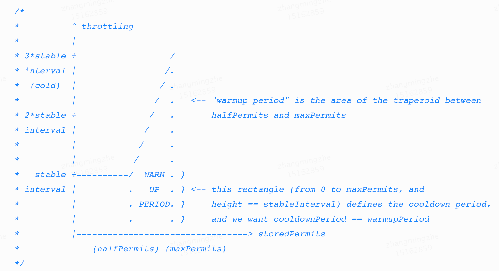

在分布式系统中，限流是保护系统稳定运行，提高系统可用性和稳定性的重要手段，了解常见的限流技术和限流工具对研发工程师来说是一项基本功。谷歌Guava工具包中的限流器在当今业界内被广泛使用，它的设计与实现非常经典，开源社区中间件[Resilience4j](https://github.com/resilience4j/resilience4j)、[Sentinel] 在限流模块的实现上都有参考Guava限流器。本文将对Guava限流器的算法原理以及实现过程进行深入解读，探秘限流器内部的“黑盒”过程，并分享一些限流场景的实践经验。

限流的核心思想是“量力而行”，即根据系统资源或业务特性来限制请求的数量或速度。限流在业务中的使用场景非常广泛，比如在秒杀场景中可以用限流来防止系统过载，在高开销接口调用场景中可以用限流来保护下游服务的稳定，在促销活动场景中可以用限流来限制每个用户的参与频次等等。

不同场景对限流的诉求也是不同的，需要使用不同的限流算法去适配场景特性。常见的限流算法大致可以分为请求数量限流算法、请求速度限流算法、系统负载限流算法三类，它们的特点如下：

*   **请求数量**限流算法：通常采用基于滑动窗口的计数算法来实现，能够满足简单的限流需求
    
*   **请求速度**限流算法：以令牌桶算法、漏桶算法为代表，限流准确度高，具有流量整形效果，是当前被使用最广的限流算法
    
*   **系统负载**限流算法：受TCP拥塞控制策略启发而产生的限流算法，通过请求延迟、系统资源使用率等指标估算系统负载，进行限流决策

1.1 Guava限流器介绍
--------------

谷歌在开源工具包Guava中提供了一个单机限流工具，GuavaRateLimiter，它基于令牌桶算法实现，主要被用于限制访问资源的速度。

Guava限流器的使用非常简单。例如我们需要将一个队列中的任务以不超过每秒两个的速度提交执行，那么我们可以通过下面案例1中的代码来实现这个需求。

```
final RateLimiter rateLimiter = RateLimiter.create(2.0); // rate = 2 permits per second

void submitTasks(List<Runnable> tasks, Executor executor) {
	  for (Runnable task : tasks) {
  	    rateLimiter.acquire(); // may wait
        executor.execute(task);
	  }
}
```


除此之外，我们还可以根据数据大小或请求权重来进行限速。例如某个业务场景要求发送数据的速度不超过每秒5KB，那么我们可以通过下面案例2中的代码来实现这个需求。

```
final RateLimiter rateLimiter = RateLimiter.create(5000.0); // rate = 5000 permits per second

void submitPacket(byte[] packet) {
    rateLimiter.acquire(packet.length);
    networkService.send(packet);
}
```


Guava限流器内置了两种模式来应对不同的限流场景，分别是**突发模式和预热模式**。在上述案例中，我们通过create方法创建的限流器是默认的突发模式，它的特点是限流器在空闲状态下会保存一部分令牌，用于后续处理突发请求，从而避免大量阻塞或拒绝。除此之外，用户也可以通过其它方法创建出预热模式的限流器，预热模式适用于大流量场景，可以让服务端从空闲状态平滑过度到高负载状态。

Guava限流器一个非常高性能的限流器，它的具有微秒级的耗时，最大支持百万级QPS的精确限流。这样的性能来源于限流器优秀的设计与实现。在本章中，我们会详细剖析Guava限流器的内部细节，打开限流“黑盒”。

2.1 令牌桶算法原理与特性
--------------

Guava限流器是基于令牌桶算法实现的。令牌桶算法是一种针对请求速度的限流算法，它的算法模型如下图所示。算法的核心就是一个令牌桶，桶内令牌数量以固定的速度增长。每个请求都需要从桶中获取到足够多的令牌后才能被放行，否则就会被阻塞或者拒绝。通过这样一个过程，用于只需要设定令牌生成速度，算法就可以通过令牌发放来限制请求通过的速度。

令牌桶算法具有两个很重要的特性：流量整形和方便处理突发流量。

流量整形是指令牌桶算法通过阻塞、拒绝等手段使请求以稳定的速度通过限流器，原本不规则的流量在经过限流器后变得平滑且均匀。流量整形效果非常有利于服务端稳定运行，类似我们在高并发系统中常用的基于消息队列实现的“削峰填谷”手段，经过整形后，服务端能够以稳定的状态接收并处理请求。

突发流量是指随机出现的、短时间的流量突刺。如果严格遵循流量整形的限制，那么服务端在遇到突发流量时会突然拒绝一大波请求，在客户端有重试机制的情况下还可能导致情况进一步恶化。因此，在服务端资源充足的条件下，限流器应该具有一些“弹性”，允许服务端临时超频处理一些突发请求。

在令牌桶算法模型中，“弹性”处理突发流量是非常容易实现的，只需要给桶中生成的令牌设置一个有效期即可。有突发流量时，限流器可以使用有效期内的剩余令牌来通过更多请求，从而临时提高服务端处理效率，避免大量请求被拒绝。

2.2 令牌桶算法的实现
------------

Guava限流器以一种非常简洁且高性能的方式实现了令牌桶算法，它的底层逻辑是令牌桶算法模型中令牌数量与时间的线性关系。如下图，空闲情况下，桶中令牌数量会以预设的速度而稳定增加。因此，我们可以根据最近一次通过请求的时间以及剩余令牌数量，计算出后续任意时间点的令牌数量（下图中的公式）。

基于上述公式，Guava就可以在请求到达时计算出当前的令牌桶状态，即桶内令牌数量。然后再根据桶内令牌数量与令牌生成速度计算出何时可以通过请求。这就是Guava限流器实现的令牌桶算法的计算过程。

令牌桶的实现代码位于SmoothRateLimiter类的reserveEarliestAvailable方法中。如下所示，方法入参是请求所需的令牌数量和当前时间，返回是可以放行请求的时间点。代码包含两个计算步骤，第一步是计算当前令牌桶状态，即根据上文线性公式计算出当前令牌桶中令牌数量，第二步是计算发放足够令牌需要的时间。对于代码中一些类属性含义，读者可参考文末附录中的类图。

```
final long reserveEarliestAvailable(int requiredPermits, long nowMicros) {
  //1.计算令牌桶中的令牌数量
  resync(nowMicros);
  
  //2.发放令牌
  long returnValue = nextFreeTicketMicros;
  double storedPermitsToSpend = min(requiredPermits, this.storedPermits);
  double freshPermits = requiredPermits - storedPermitsToSpend;
  //预计等待时间 = 桶内令牌发放时间 + 后续生成令牌所需时间
  long waitMicros = storedPermitsToWaitTime(this.storedPermits, storedPermitsToSpend) + (long) (freshPermits * stableIntervalMicros);
  this.nextFreeTicketMicros = nextFreeTicketMicros + waitMicros;
  this.storedPermits -= storedPermitsToSpend;
  return returnValue;
}

private void resync(long nowMicros) {
  if (nowMicros > nextFreeTicketMicros) {
    //桶内令牌数 = min(桶容量， 剩余令牌数 + 空闲时间内生成的令牌数)
    storedPermits = min(maxPermits, storedPermits + (nowMicros - nextFreeTicketMicros) / stableIntervalMicros);
    nextFreeTicketMicros = nowMicros;
  }
}
```


在上述令牌桶计算过程中还有一个请求阻塞等待的优化，就是方法返回的放行时间是增加等待耗时（waitMicros）之前的时间。这样做的效果是阻塞等待不会影响当前请求，而是影响后续等待时长内到达的请求。举例来说，假设有个1QPS的限流器，收到了一个需要100个令牌才能通过的请求。这种情况下两种处理方案：一是先放行这个请求让服务端处理，之后100秒内阻塞后续到达的请求，二是直接阻塞当前请求100秒后再放行。显然第一种处理方式对请求处理更加友好，能够以更小的阻塞代价达到同样的限流效果。读者也可以参考下面这段Guava源代码中的注释来理解这种“赊账”机制所带来的收益。

> GuavaRateLimiter代码中对“赊账”特性的注释描述：
>
> _Consider a RateLimiter with rate of 1 permit per second, currently completely unused, and an expensive acquire(100) request comes. It would be nonsensical to just wait for 100 seconds, and /then/ start the actual task. Why wait without doing anything? A much better approach is to /allow/ the request right away (as if it was an acquire(1) request instead), and postpone /subsequent/ requests as needed. In this version, we allow starting the task immediately, and postpone by 100 seconds future requests, thus we allow for work to get done in the meantime instead of waiting idly._

2.3 阻塞请求时间的计算
-------------

在上文令牌桶算法的实现代码中，请求阻塞时间（waitMicros）的计算除了包含了生成新令牌所需时间（freshPermits）之外，还包含了以storedPermitsToWaitTime方法计算的发放桶内令牌（storedPermitsToSpend）的时间。为什么发放桶内已有令牌还需要计算耗时呢？

实际上，桶内令牌发放时间的计算是由限流器的模式决定的。上文中有提过，Guava限流器包含突发和预热两种模式，这两种模式分别建立了不同的桶内令牌发放模型，并基于各自的模型来计算方法耗时。本小节将详细介绍这两种令牌发放模型。

### 2.3.1 突发模式

在突发模式中，Guava限流器的桶中令牌是有一个有效期的，有效期的作用是让限流器具有一定的“弹性”，可以根据空闲情况临时超额放行一些请求用于平滑处理突发流量。

```
static final class SmoothBursty extends SmoothRateLimiter {  
    @Override
    long storedPermitsToWaitTime(double storedPermits, double permitsToTake) {
      return 0L;
    }
}
```


因此，突发模式下的桶内令牌发放模型非常简单，可以直接发放，不需要计算开销。实现代码如下所示。

### **2.3.2 预热模式**

预热模式比较复杂，在预热过程中，限流器通过请求的速度会随着的流量上涨而逐渐加快，目的是让服务端平滑地从空闲状态过度到高负载状态。

在限流器预热模式下，桶内令牌是一个逻辑概念，仅用来界定限流器的冷热状态，所有发放的令牌都需要新生成的，且在预热过程中令牌还是变速生成的。因此，预热模式下的令牌发放时间需要根据预热模型的具体定义来计算。

下图即为Guava限流器所定义的预热模型，它来自Guava代码的注释。图中展示了预热过程中令牌桶中令牌数量（横轴）与限流器令牌生成的时间间隔（纵轴）的对应关系。当桶内令牌数量较多时，说明此时流量较小，限流器处于冷状态，令牌生成速度较慢，最慢为原速度的1/3（3 \* stable interval，即三倍的令牌生成间隔时间）。当流量变大时，桶内的令牌会被逐渐消耗，限流器由冷状态逐渐变为热状态，令牌生成速度逐渐增加。直到桶内剩余1/2令牌（halfPermits）时，限流器令牌生成恢复原速，进入稳定状态。

了解预热模型之后，就可以回到我们的时间计算问题了。假设当前令牌桶内的令牌数为n，请求通过需要的令牌数为m，那么计算下图中区间 \[n-m, n\]的面积，即为发放m个令牌所需的时间。如果还记得高等数学的话，这里可以直观的理解为求积分，积分的物理意义就是发放时间。

预热模式的实现代码如下所示，可以看到，它的计算过程就是求上图中的区间面积。代码以halfPermits为分界线，分别计算了左边的矩形面积与右边的梯形面积，二者之和即是预热过程中的发放令牌耗时。



至此，我们已经从理论的角度，完整地介绍了Guava限流器的算法原理和核心代码。本章将从实践的角度分享一些使用案例和新手可能碰到的问题，希望能够帮助读者更加清晰地理解整个限流决策的过程。

```
static final class SmoothWarmingUp extends SmoothRateLimiter {
    private final long warmupPeriodMicros;
    private double slope;        //预热模型中，梯形斜边的斜率
    private double halfPermits; 
  
    @Override
    long storedPermitsToWaitTime(double storedPermits, double permitsToTake) {
      double availablePermitsAboveHalf = storedPermits - halfPermits;
      long micros = 0;
      // measuring the integral on the right part of the function (the climbing line)
      // 预热期发放令牌的时间，即梯形的面积
      if (availablePermitsAboveHalf > 0.0) {
        double permitsAboveHalfToTake = min(availablePermitsAboveHalf, permitsToTake);
        micros = (long) (permitsAboveHalfToTake * (permitsToTime(availablePermitsAboveHalf)
            + permitsToTime(availablePermitsAboveHalf - permitsAboveHalfToTake)) / 2.0);
        permitsToTake -= permitsAboveHalfToTake;
      }
      // measuring the integral on the left part of the function (the horizontal line)
      // 稳定期发放令牌的时间，即矩形的面积
      micros += (stableIntervalMicros * permitsToTake);
      return micros;
    }
  
    private double permitsToTime(double permits) {
      return stableIntervalMicros + permits * slope;
    }
}
```


3.1 常见限流场景的解决方案
---------------

本小节会给出一些Guava限流器在一些场景下的使用案例，仅供读者参考。

**场景1：服务端接口限制被调用的速度**

**解决方案：** 可以使用Guava限流器突发模式，配合非阻塞方法tryAcquire限制被调用速度，无特殊需要情况下，tryAcquire超时时间建议为0。

**补充说明：** 突发模式的突发时间（maxBrustSeconds）配置可根据接口历史流量的波动情况确定，多数场景中设置1~5秒即可。突发时间不建议设置为0，可能导致一些不符合预期的拒绝行为。另外，一般情况下，不建议在服务端接口中使用限流的acquire或tryAcquire方法做阻塞等待，这样会增加请求延迟，给调用方带来不好的体验。

**场景2：客户端限制发出请求的速度**

**解决方案：** 可以使用Guava限流器突发模式，配置阻塞方法acquire限制发出请求的速度。

**补充说明：** 无特殊需求的情况下，突发时间（maxBrustSeconds）可配置为0，配合acquire的流量整形效果来让客户端发出匀速请求。另外，如果客户端存在失败重试机制，那么可能需要考虑一下重试间隔会由于限流器的阻塞而被拉长的问题。

**场景3：秒杀或大促业务场景中，保护服务端不被大流量打垮**

**解决方案：** 可以使用Guava限流器预热模式，配合非阻塞方法tryAcquire做流量限制，建议设置一个合适的tryAcquire超时时间。

**补充说明：** 预热时间长度可根据业务场景特点配置，限流阈值可通过事先的接口压测来确定。这里建议使用tryAcquire进行可超时阻塞的目的是为了保证业务中“先到先得”的公平性。

3.2 Guava限流器避坑指南
----------------

本小节列出了一些初学者在使用Guava限流器过程中可能会遇到的问题，读者可以通过这些问题加深理解Guava限流器的内部运作机制。

**踩坑1： 使用限流器后实际流量总是超过配置阈值**

**解释：** 这种情况只可能发生下突发模式下，是由2.3小节中介绍的突发流量处理机制导致的。突发模式限流器在向请求发放令牌包括存量令牌与新令牌，新令牌的生成速度等于限流速度，而超额部分的请求来自于存量令牌。在实际流量超过阈值不多的情况下，令牌桶中的令牌需要很长时间才能被耗尽。

**建议：** 一方面是我们要充分理解限流原理，帮助我们建立正确的限流效果预期。另一方面是我们应该尽量使用合理的配置来实现限流需求，限流阈值一般应该大于接口正常情况下的流量，突发时间的配置可以参考历史最大流量与平均流量的差异来确定。

**踩坑2：在客户端匀速调用的场景中，服务端使用了限流器后发现实际流量无法达到阈值上限**

**解释：** 这种情况是非常偶然的，实际是由于限流配置不当导致的。假设某个客户端以50QPS的速度发出请求，即每20ms一个，服务端的限流器配置为30QPS，且不支持突发流量（突发模式下设置突发时间为0，或者使用了预热模式）。这种情况下服务端会严格按照每30+ms一个的速度接收请求，因此，客户端在20ms之后发出第二个请求时，服务端尚未满足30ms的间隔时间，就出现了每两个请求就有一个被拒绝的现象。读者可参考下图理解这一现象。

**建议：** 在遇到这种问题时首先考虑限流阈值是否合理。其次，如果在服务端使用突发模式限流，尽量不要把突发时间（maxBrustSeconds）设置为0。如果使用预热模式限流，应该参考服务容量，配置一个足够大的限流阈值。