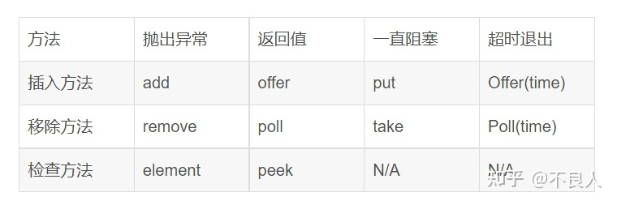
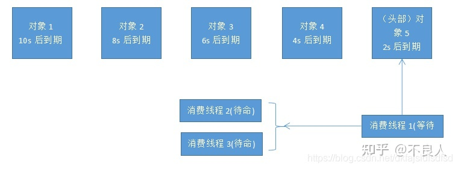
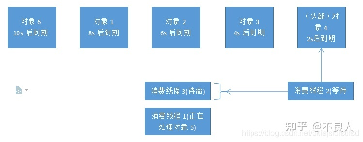
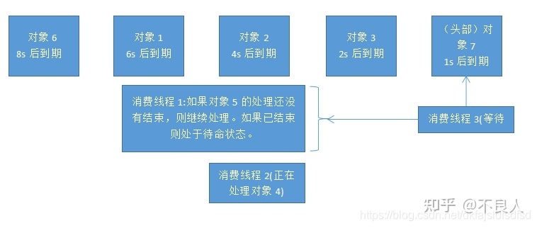
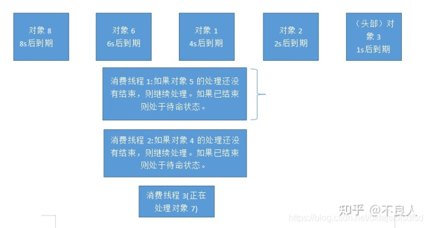
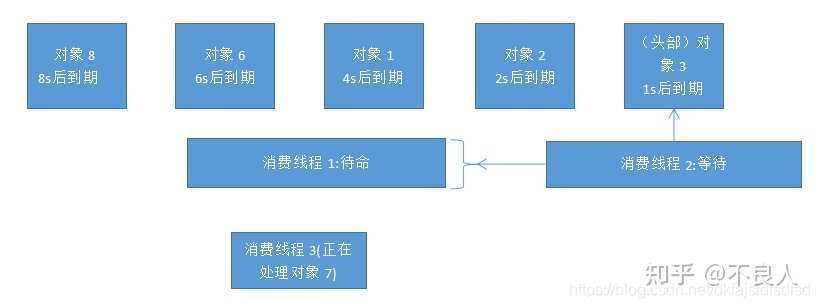

**一. DelayQueue是什么**
--------------------

DelayQueue是一个无界的BlockingQueue，用于放置实现了Delayed接口的对象，其中的对象只能在其到期时才能从队列中取走。这种队列是有序的，即队头对象的延迟到期时间最长。注意：不能将null元素放置到这种队列中。



二. DelayQueue基本原理
-----------------

DelayQueue是一个没有边界BlockingQueue实现，加入其中的元素必需实现Delayed接口。当生产者线程调用put之类的方法加入元素时，会触发Delayed接口中的compareTo方法进行排序，也就是说队列中元素的顺序是按到期时间排序的，而非它们进入队列的顺序。排在队列头部的元素是最早到期的，越往后到期时间越晚。

消费者线程查看队列头部的元素，注意是查看不是取出。然后调用元素的getDelay方法，如果此方法返回的值小０或者等于０，则消费者线程会从队列中取出此元素，并进行处理。如果getDelay方法返回的值大于0，则消费者线程wait返回的时间值后，再从队列头部取出元素，此时元素应该已经到期。

DelayQueue是Leader-Followr模式的变种，消费者线程处于等待状态时，总是等待最先到期的元素，而不是长时间的等待。消费者线程尽量把时间花在处理任务上，最小化空等的时间，以提高线程的利用效率。

以下通过队列及消费者线程状态变化大致说明一下DelayQueue的运行过程。

_**初始状态**_



因为队列是没有边界的，向队列中添加元素的线程不会阻塞，添加操作相对简单，所以此图不考虑向队列添加元素的生产者线程。假设现在共有三个消费者线程。

队列中的元素按到期时间排序，队列头部的元素2s以后到期。消费者线程１查看了头部元素以后，发现还需要2s才到期，于是它进入等待状态，2s以后醒来，等待头部元素到期的线程称为Leader线程。

消费者线程2与消费者线程3处于待命状态，它们不等待队列中的非头部元素。当消费者线程１拿到对象5以后，会向它们发送signal。这个时候两个中的一个会结束待命状态而进入等待状态。

_**2S以后**_



消费者线程１已经拿到了对象５，从等待状态进入处理状态，处理它取到的对象５，同时向消费者线程2与消费者线程3发送signal。

消费者线程2与消费者线程3会争抢领导权，这里是消费者线程2进入等待状态，成为Leader线程，等待2s以后对象4到期。而消费者线程3则继续处于待命状态。

此时队列中加入了一个新元素对象６，它10s后到期，排在队尾。

_**又2S以后**_



先看线程１，如果它已经结束了对象5的处理，则进入待命状态。如果还没有结束，则它继续处理对象5。

消费线程２取到对象4以后，也进入处理状态，同时给处于待命状态的消费线程３发送信号，消费线程３进入等待状态，成为新的Leader。现在头部元素是新插入的对象7，因为它1s以后就过期，要早于其它所有元素，所以排到了队列头部。

**_又1S后_**

一种不好的结果：



消费线程３一定正在处理对象7。消费线程１与消费线程２还没有处理完它们各自取得的对象，无法进入待命状态，也更加进入不了等待状态。此时对象3马上要到期，那么如果它到期时没有消费者线程空下来，则它的处理一定会延期。

可以想见，如果元素进入队列的速度很快，元素之间的到期时间相对集中，而处理每个到期元素的速度又比较慢的话，则队列会越来越大，队列后边的元素延期处理的时间会越来越长。

另外一种好的结果：



消费线程１与消费线程２很快的完成对取出对象的处理，及时返回重新等待队列中的到期元素。一个处于等待状态(Leader)，对象3一到期就立刻处理。另一个则处于待命状态。这样，每一个对象都能在到期时被及时处理，不会发生明显的延期。

所以，消费者线程的数量要够，处理任务的速度要快。否则，队列中的到期元素无法被及时取出并处理，造成任务延期、队列元素堆积等情况。

**三. DelayQueue能做什么**
---------------------

1.  淘宝订单业务:下单之后如果三十分钟之内没有付款就自动取消订单。
2.  饿了吗订餐通知:下单成功后60s之后给用户发送短信通知。
3.  关闭空闲连接。服务器中，有很多客户端的连接，空闲一段时间之后需要关闭之。
4.  缓存。缓存中的对象，超过了空闲时间，需要从缓存中移出。
5.  任务超时处理。在网络协议滑动窗口请求应答式交互时，处理超时未响应的请求等。

四. 简单示例
-------

### 简单定时调度任务 :

```text
package com.jht.scala.delayTask;

import java.util.concurrent.BlockingQueue;
import java.util.concurrent.DelayQueue;
import java.util.concurrent.Delayed;
import java.util.concurrent.TimeUnit;

public class DelayQueueTest {

    // 可以用来执行定时任务
    static BlockingQueue<MyTask> task = new DelayQueue<>();

    static class MyTask implements Delayed {

        String name;
        long runningTime;

        MyTask(String name,long rt) {
            this.name = name;
            this.runningTime= rt;
        }
        @Override
        public int compareTo(Delayed other) {
            long td = this.getDelay(TimeUnit.MILLISECONDS);
            long od = other.getDelay(TimeUnit.MILLISECONDS);
            return Long.compare(td,od);
        }

        @Override
        public long getDelay(TimeUnit unit) {
            return unit.convert(runningTime - System.currentTimeMillis(), TimeUnit.MILLISECONDS);
        }

        @Override
        public String toString() {
            return name + "-" + runningTime;
        }
    }

    public static void main(String[] args) throws InterruptedException {
        long now = System.currentTimeMillis();
        MyTask t1 = new MyTask("t1",now + 1000);
        MyTask t2 = new MyTask("t2",now + 2000);
        MyTask t3 = new MyTask("t3",now + 1500);
        MyTask t4 = new MyTask("t4",now + 3000);
        MyTask t5 = new MyTask("t5",now + 500);
        MyTask t6 = new MyTask("t6",now + 2500);

        task.put(t1);
        task.put(t2);
        task.put(t3);
        task.put(t4);
        task.put(t5);
        task.put(t6);

        for (int i = 0; i < 6; i++) {
            System.out.println(task.take());
        }
    }
}
```

### 多消费者定时调度任务 :

本例中先让主线程向DelayQueue添加１０个任务，任务之间的启动间隔在1~2s之间，每个任务的执行时间固定为2s，代码如下：

```text
package com.jht.scala.delayTask;

import java.util.concurrent.DelayQueue;
import java.util.concurrent.Delayed;
import java.util.concurrent.TimeUnit;
import java.util.concurrent.BlockingQueue;
import java.util.concurrent.atomic.AtomicInteger;

class DelayTask implements Delayed {
    private static long currentTime = System.currentTimeMillis();
    protected final String taskName;
    protected final int timeCost;
    protected final long scheduleTime;

    protected static final AtomicInteger taskCount = new AtomicInteger(0);

    // 定时任务之间的启动时间间隔在1~2s之间，timeCost表示处理此任务需要的时间，本示例中为2s
    public DelayTask(String taskName, int timeCost) {
        this.taskName = taskName;
        this.timeCost = timeCost;
        taskCount.incrementAndGet();
        currentTime += 1000 + (long) (Math.random() * 1000);
        scheduleTime = currentTime;
    }

    @Override
    public int compareTo(Delayed o) {
        return (int) (this.scheduleTime - ((DelayTask) o).scheduleTime);
    }

    @Override
    public long getDelay(TimeUnit unit) {
        long expirationTime = scheduleTime - System.currentTimeMillis();
        return unit.convert(expirationTime, TimeUnit.MILLISECONDS);
    }

    public void execTask() {
        long startTime = System.currentTimeMillis();
        System.out.println("Task " + taskName + ": schedule_start_time=" + scheduleTime + ",real start time="
                + startTime + ",delay=" + (startTime - scheduleTime));
        try {
            Thread.sleep(timeCost);
        } catch (InterruptedException e) {
            e.printStackTrace();
        }
    }
}

class DelayTaskComsumer extends Thread {
    private final BlockingQueue<DelayTask> queue;

    public DelayTaskComsumer(BlockingQueue<DelayTask> queue) {
        this.queue = queue;
    }

    @Override
    public void run() {
        DelayTask task = null;
        try {
            while (true) {
                task = queue.take();
                task.execTask();
                DelayTask.taskCount.decrementAndGet();
            }
        } catch (InterruptedException e) {
            System.out.println(getName() + " finished");
        }
    }
}

public class DelayQueueTest1 {

    public static void main(String[] args) {

        BlockingQueue<DelayTask> queue = new DelayQueue<DelayTask>();

        for (int i = 0; i < 10; i++) {
            try {
                queue.put(new DelayTask("work " + i, 2000));
            } catch (InterruptedException e) {
                e.printStackTrace();
            }
        }

        ThreadGroup g = new ThreadGroup("Consumers");

        for (int i = 0; i < 1; i++) {
            new Thread(g, new DelayTaskComsumer(queue)).start();
        }

        while (DelayTask.taskCount.get() > 0) {
            try {
                Thread.sleep(50);
            } catch (InterruptedException e) {
                e.printStackTrace();
            }
        }

        g.interrupt();
        System.out.println("Main thread finished");
    }
}

```

首先启动一个消费者线程。因为消费者线程处单个任务的时间为2s，而任务的调度间隔为1~2s。这种情况下，每当消费者线程处理完一个任务，回头再从队列中新取任务时，新任务肯定延期了，无法按给定的时间调度任务。而且越往后情况越严重。运行代码看一下输出：

```text
Task work 0: schedule_start_time=1554203579096,real start time=1554203579100,delay=4
Task work 1: schedule_start_time=1554203580931,real start time=1554203581101,delay=170
Task work 2: schedule_start_time=1554203582884,real start time=1554203583101,delay=217
Task work 3: schedule_start_time=1554203584660,real start time=1554203585101,delay=441
Task work 4: schedule_start_time=1554203586075,real start time=1554203587101,delay=1026
Task work 5: schedule_start_time=1554203587956,real start time=1554203589102,delay=1146
Task work 6: schedule_start_time=1554203589041,real start time=1554203591102,delay=2061
Task work 7: schedule_start_time=1554203590127,real start time=1554203593102,delay=2975
Task work 8: schedule_start_time=1554203591903,real start time=1554203595102,delay=3199
Task work 9: schedule_start_time=1554203593577,real start time=1554203597102,delay=3525
Main thread finished
Thread-0 finished
```

最后一个任务的延迟时间已经超过3.5s了。

再作一次测试，将消费者线程的个数调整为２，这时任务应该能按时启动，延迟应该很小，运行程序看一下结果：

```text
Task work 0: schedule_start_time=1554204395427,real start time=1554204395430,delay=3
Task work 1: schedule_start_time=1554204396849,real start time=1554204396850,delay=1
Task work 2: schedule_start_time=1554204398050,real start time=1554204398051,delay=1
Task work 3: schedule_start_time=1554204399590,real start time=1554204399590,delay=0
Task work 4: schedule_start_time=1554204401289,real start time=1554204401289,delay=0
Task work 5: schedule_start_time=1554204402883,real start time=1554204402883,delay=0
Task work 6: schedule_start_time=1554204404663,real start time=1554204404664,delay=1
Task work 7: schedule_start_time=1554204406154,real start time=1554204406154,delay=0
Task work 8: schedule_start_time=1554204407991,real start time=1554204407991,delay=0
Task work 9: schedule_start_time=1554204409540,real start time=1554204409540,delay=0
Main thread finished
Thread-0 finished
Thread-2 finished
```

基本上按时启动，最大延迟为3毫秒，大部分都是0毫秒。

将消费者线程个数调整成３个，运行看一下结果：

```text
Task work 0: schedule_start_time=1554204499695,real start time=1554204499698,delay=3
Task work 1: schedule_start_time=1554204501375,real start time=1554204501376,delay=1
Task work 2: schedule_start_time=1554204503370,real start time=1554204503371,delay=1
Task work 3: schedule_start_time=1554204504860,real start time=1554204504861,delay=1
Task work 4: schedule_start_time=1554204506419,real start time=1554204506420,delay=1
Task work 5: schedule_start_time=1554204508191,real start time=1554204508192,delay=1
Task work 6: schedule_start_time=1554204509495,real start time=1554204509496,delay=1
Task work 7: schedule_start_time=1554204510663,real start time=1554204510664,delay=1
Task work 8: schedule_start_time=1554204512598,real start time=1554204512598,delay=0
Task work 9: schedule_start_time=1554204514276,real start time=1554204514277,delay=1
Main thread finished
Thread-0 finished
Thread-2 finished
Thread-4 finished
```

大部分延迟时间变成1毫秒，情况好像还不如2个线程的情况。

将消费者线程数调整成5，运行看一下结果：

```text
Task work 0: schedule_start_time=1554204635015,real start time=1554204635019,delay=4
Task work 1: schedule_start_time=1554204636856,real start time=1554204636857,delay=1
Task work 2: schedule_start_time=1554204637968,real start time=1554204637970,delay=2
Task work 3: schedule_start_time=1554204639758,real start time=1554204639759,delay=1
Task work 4: schedule_start_time=1554204641089,real start time=1554204641090,delay=1
Task work 5: schedule_start_time=1554204642879,real start time=1554204642880,delay=1
Task work 6: schedule_start_time=1554204643941,real start time=1554204643942,delay=1
Task work 7: schedule_start_time=1554204645006,real start time=1554204645007,delay=1
Task work 8: schedule_start_time=1554204646309,real start time=1554204646310,delay=1
Task work 9: schedule_start_time=1554204647537,real start time=1554204647538,delay=1
Thread-2 finished
Thread-0 finished
Main thread finished
Thread-8 finished
Thread-4 finished
Thread-6 finished
```

与３个消费者线程的情况差不多。

### **结论 :**

最优的消费者线程的个数与任务启动的时间间隔好像存在这样的关系：单个任务处理时间的最大值　/ 相邻任务的启动时间最小间隔　＝　最优线程数，如果最优线程数是小数，则取整数后加１，比如1.3的话，那么最优线程数应该是2。

本例中，单个任务处理时间的最大值固定为2s。

相邻任务的启动时间最小间隔为1s。

则消费者线程数为2/1=2。

如果消费者线程数小于此值，则来不及处理到期的任务。如果大于此值，线程太多，在调度、同步上花更多的时间，无益改善性能。