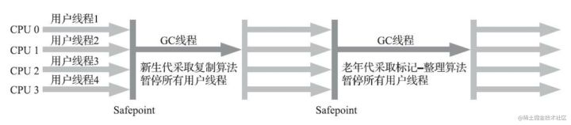
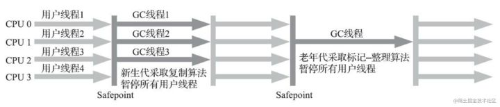
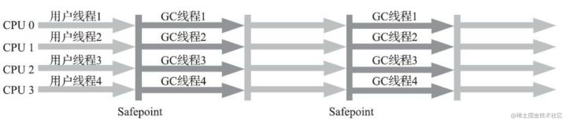
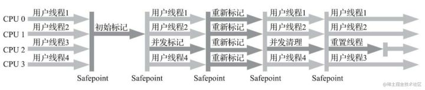
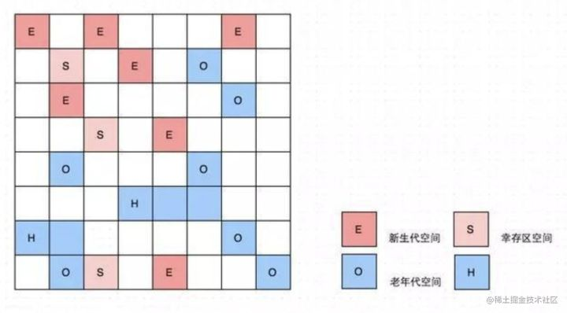
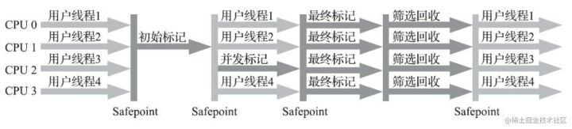
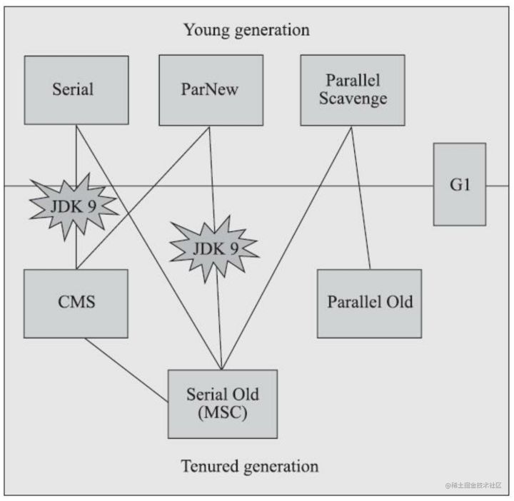
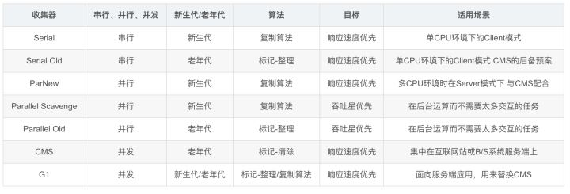

在讲述垃圾收集器之前，我们得先知道JVM中常见的垃圾收集算法有什么，具体请参考我的**[这篇博文](https://link.zhihu.com/?target=https%3A//juejin.cn/post/6996103543341973534)**。如果说收集算法是内存回收的方法论， 那垃圾收集器就是内存回收的实践者。下面就来详细概述下`Serial`、`ParNew`、`Parallel Scavenge`、`Serial Old`、`Parallel Old`、`CMS`、`G1`这七款垃圾收集器的特点及使用场景。

**基本概念**
--------

### **不同的 GC 各自代表的含义**

**Partial GC**：表示并不收集整个GC堆。

*   Young GC：只收集年轻代的GC。
*   Old GC：只收集老年代的GC。
*   Mixed GC：收集整个年轻代以及部分老年代的GC。这个是 G1 收集器特有的。 **Full GC**：收集整个堆，包括年轻代、老年代、永久代（如果存在的话）等所有部分的GC。

### **吞吐量（Throughput）**

吞吐量就是CPU用于运行用户代码的时间与CPU总消耗时间的比值，即**吞吐量 = 运行用户代码时间 /（运行用户代码时间 + 垃圾收集时间）**。

假设虚拟机总共运行了100分钟，其中垃圾收集花掉1分钟，那吞吐量就是99%。

通常来说，停顿时间越短(低延迟)就越适合需要与用户交互或需要保证服务响应质量的程序， 良好的响应速度能提升用户体验；

而高吞吐量则可以最高效率地利用处理器资源，尽快完成程序的运算任务， 主要适合在后台运算而不需要太多交互的分析任务。

### **垃圾收集器中“并发”和“并行”的概念**

并行和并发都是并发编程中的专业名词，在谈论垃圾收集器的上下文语境中， 它们可以理解为：

*   并行（Parallel）：并行描述的是多条垃圾收集器线程之间的关系，说明**同一时间有多条这样的线程在协同工作**，通常默认此时用户线程是处于等待状态。
*   并发（Concurrent）：并发描述的是垃圾收集器线程与用户线程之间的关系，说明**同一时间垃圾收集器线程与用户线程都在运行**。 由于用户线程并未被冻结，所以程序仍然能响应服务请求， 但由于垃圾收集器线程占用了一部分系统资源， 此时应用程序的处理的吞吐量将受到一定影响。

**垃圾收集器**
---------

### **Serial 收集器**

**特点：** 

*   客户端模式下的默认新生代收集器
*   单线程工作（它的“单线程”的意义并不仅仅是说明它**只会使用一个处理器或一条收集线程**去完成垃圾收集工作，更重要的是强调在它进行垃圾收集时，**必须暂停其他所有工作线程**，直到它收集结束）
*   简单而高效（与其他收集器的单线程相比）
*   对于内存资源受限的环境， 它是所有收集器里额外内存消耗（Memory Footprint）最小的
*   对于单核处理器或处理器核心数较少的环境来说，Serial收集器由于没有线程交互的开销，专心做垃圾收集自然可以获得最高的单线程收集效率

Serial/Serial Old收集器协同工作运行示意图如下：

### **ParNew 收集器**

**特点：** 

*   Serial收集器的**多线程并行版本**（除了同时使用多条线程进行垃圾收集之外， 其余的行为（包括Serial收集器可用的所有控制参数、收集算法、Stop The World、对象分配规则、回收策略等）都与Serial收集器完全一致，在实现上这两种收集器也共用了相当多的代码）
*   JDK 7之前在**服务端模式下首选的新生代收集器**（一个重要原因：除了Serial收集器外， 目前只有它能与 CMS 收集器配合工作）
*   ParNew收集器是激活CMS后（使用`-XX: +UseConcMarkSweepGC`选项） 的默认新生代收集器，也可以使用`-XX: +/-UseParNewGC`选项来强制指定或者禁用它。
*   ParNew收集器在**单核心处理器**的环境中绝对不会有比Serial收集器更好的效果
*   默认开启的收集线程数与处理器核心数量相同（可以使用`-XX: ParallelGCThreads`参数来限制垃圾收集的线程数）

ParNew/Serial Old收集器协同工作运行示意图如下：

### **Parallel Scavenge 收集器**

**特点：** 

*   新生代收集器
*   基于标记-复制算法实现
*   多线程收集器
*   吞吐量优先收集器（Parallel Scavenge收集器其他收集器不同在于：CMS等收集器的关注点是尽可能地**缩短垃圾收集时用户线程的停顿时间**， 而Parallel Scavenge收集器的目标则是**达到一个可控制的吞吐量**）
*   自适应调节策略（通过`+UseAdaptiveSizePolicy`参数激活）

**参数：** 

*   `-XX： MaxGCPauseMillis`参数：允许的值是一个大于0的毫秒数， 收集器将尽力保证内存回收花费的时间不超过用户设定值。
*   `-XX： GCTimeRatio`参数：一个大于0小于100的整数， 也就是垃圾收集时间占总时间的比率， 相当于吞吐量的倒数。 譬如把此参数设置为19， 那允许的最大垃圾收集时间就占总时间的5%（即1/(1+19)） ， 默认值为99， 即允许最大1%（即1/(1+99)） 的垃圾收集时间。
*   `+UseAdaptiveSizePolicy`参数：这是一个开关参数， 当这个参数被激活之后， 就不需要人工指定新生代的大小（-Xmn） 、 Eden与Survivor区的比例（-XX： SurvivorRatio） 、 晋升老年代对象大小（-XX：PretenureSizeThreshold） 等细节参数了， 虚拟机会根据当前系统的运行情况收集性能监控信息，**动态调整**这些参数以提供最合适的停顿时间或者最大的吞吐量。只需要把基本的内存数据设置好（如-Xmx设置最大堆），然后使用`-XX： MaxGCPauseMillis`参数（更关注最大停顿时间）或`-XX： GCTimeRatio`（更关注吞吐量） 参数给虚拟机设立一个优化目标， 那具体细节参数的调节工作就由虚拟机完成了。

### **Serial Old 收集器**

**特点：** 

*   Serial收集器的老年代版本
*   单线程收集器
*   使用标记-整理算法
*   主要在**客户端模式**下使用。如果在**服务端模式**下，它也可能有两种用途： 一种是在JDK 5以及之前的版本中与Parallel Scavenge收集器搭配使用，另外一种就是作为CMS收集器发生失败时的后备预案，**在并发收集发生Concurrent Mode Failure时使用**。

Serial/Serial Old收集器协同工作运行示意图如下：

### **Parallel Old 收集器（JDK 6中发布）**

**特点：** 

*   Parallel Scavenge收集器的老年代版本
*   多线程并发收集
*   使用标记-整理算法
*   在注重吞吐量或者处理器资源较为稀缺的场合， 都可以优先考虑**Parallel Scavenge加Parallel Old收集器**这个组合。

Parallel Scavenge/Parallel Old 收集器运行示意图如下：

### **CMS 收集器（JDK 5中发布）**

**特点：** 

*   老年代的收集器
*   使用标记-清除算法
*   第一款真正意义上支持并发的垃圾收集器，首次实现了让垃圾收集线程与用户线程（基本上）同时工作（并发收集）
*   以获取**最短回收停顿时间**为目标的收集器（低停顿）
*   常用于互联网网站或者基于浏览器的B/S系统的服务端（这类应用通常都会较为关注服务的响应速度，希望系统停顿时间尽可能短，以给用户带来良好的交互体验）

**收集流程：** 

CMS整个过程的四个步骤如下，其中初始标记、 重新标记这两个步骤仍然需要“Stop The World”。

1.  **初始标记**\-仅仅只是标记一下GC Roots能直接关联到的对象，速度很快
2.  **并发标记**\-从GC Roots的直接关联对象开始遍历整个对象图的过程，这个过程耗时较长但是不需要停顿用户线程，可以与垃圾收集线程一起并发运行
3.  **重新标记**\-为了修正并发标记期间，因用户程序继续运作而导致标记产生变动的那一部分对象的标记记录，这个阶段的停顿时间通常会比初始标记阶段稍长一些， 但也远比并发标记阶段的时间短
4.  **并发清除**\-清理删除掉标记阶段判断的已经死亡的对象， 由于不需要移动存活对象， 所以这个阶段也是可以与用户线程同时并发的

Concurrent Mark Sweep 收集器运行示意图如下：

**缺点：** 

*   CMS 收集器**对处理器资源非常敏感**。事实上，面向并发设计的程序都对处理器资源比较敏感。在并发阶段，它虽然不会导致用户线程停顿，但却会因为占用了一部分线程而导致应用程序变慢，降低总吞吐量。
*   由于CMS收集器**无法处理“浮动垃圾”**， 有可能出现“Con-current Mode Failure”失败进而导致另一次完全“Stop The World”的Full GC的产生。
*   CMS是一款基于“标记-清除”算法实现的收集器，这意味着收集结束时**会有大量空间碎片产生**，空间碎片过多时，将会给大对象分配带来很大麻烦，往往会出现老年代还有很多剩余空间， 但就是无法找到足够大的连续空间来分配当前对象， 而不得不提前触发一次Full GC的情况。

> **关于CMS收集器浮动垃圾的说明：**   
> 由于在CMS的并发标记和并发清理阶段，用户线程是还在继续运行的，程序在运行自然就还会伴随有新的垃圾对象不断产生，但这一部分垃圾对象是出现在标记过程结束以后，CMS无法在当次收集中处理掉它们， 只好留待下一次垃圾收集时再清理掉。这一部分垃圾就称为“浮动垃圾”。  
> 由于在垃圾收集阶段用户线程还需要持续运行， 那就还需要预留足够内存空间提供给用户线程使用， 因此CMS收集器不能像其他收集器那样等待到老年代几乎完全被填满了再进行收集，**必须预留一部分空间供并发收集时的程序运作使用**。  

### **G1 收集器（Garbage First）**

**特点：** 

*   将堆内存“化整为零”，开创了收集器面向局部收集的设计思路和基于Region的内存布局形式
*   面向全堆的收集器，不再需要其他新生代收集器的配合工作
*   主要面向服务端应用的垃圾收集器
*   G1 仍是遵循分代收集理论设计的， 但其堆内存的布局与其他收集器有非常明显的差异
*   G1 不再坚持固定大小以及固定数量的分代区域划分，而是把连续的Java堆划分为多个大小相等的独立Region，每一个Region都可以根据需要，扮演新生代的Eden空间、Survivor空间或者老年代空间
*   收集器能够对扮演不同角色的Region采用不同的策略去处理， 这样无论是新创建的对象还是已经存活了一段时间、熬过多次收集的旧对象都能获取很好的收集效果
*   Region中还有一类特殊的Humongous区域， 专门用来存储大对象。 **G1认为只要大小超过了一个Region容量一半的对象即可判定为大对象。**  每个Region的大小可以通过参数`-XX： G1HeapRegionSize`设定， 取值范围为1MB～32MB， 且应为2的N次幂。 而对于那些超过了整个Region容量的超级大对象，将会被存放在N个连续的Humongous Region之中， G1的大多数行为都把Humongous Region作为老年代的一部分来进行看待
*   G1收集器之所以能建立可预测的停顿时间模型， 是因为它将Region作为单次回收的最小单元， 即每次收集到的内存空间都是Region大小的整数倍， 这样可以有计划地避免在整个Java堆中进行全区域的垃圾收集
*   G1收集器去跟踪各个Region里面的垃圾堆积的“价值”大小， 价值即回收所获得的空间大小以及回收所需时间的经验值， 然后在后台维护一个优先级列表， 每次根据用户设定允许的收集停顿时间（使用参数`-XX： MaxGCPauseMillis`指定， 默认值是200毫秒），优先处理回收价值收益最大的那些Region
*   可以由用户指定期望的停顿时间是G1收集器很强大的一个功能，设置不同的期望停顿时间， 可使得G1在不同应用场景中取得关注吞吐量和关注延迟之间的最佳平衡（默认的停顿目标为两百毫秒，通常把期望停顿时间设置为一两百毫秒或者两三百毫秒会是比较合理的）

G1 收集器 Region 分区示意图如下：

G1 收集器的运作过程主要步骤如下：

*   **初始标记**：**仅仅只是标记一下GC Roots能直接关联到的对象**，并且修改TAMS指针的值，让下一阶段用户线程并发运行时，能正确地在可用的Region中分配新对象。这个阶段需要停顿线程，但耗时很短，而且是借用进行Minor GC的时候同步完成的，所以G1收集器在这个阶段实际并没有额外的停顿。
*   **并发标记**：**从GC Root开始对堆中对象进行可达性分析，递归扫描整个堆里的对象图，找出要回收的对象**，这阶段耗时较长，但可与用户程序并发执行。**当对象图扫描完成以后，还要重新处理SATB记录下的在并发时有引用变动的对象。** 
*   **最终标记**：对用户线程做另一个短暂的暂停，用于**处理并发阶段结束后仍遗留下来的最后那少量的SATB记录。** 
*   **筛选回收**： 负责更新Region的统计数据，对各个Region的回收价值和成本进行排序， 根据用户所期望的停顿时间来制定回收计划， 可以自由选择任意多个Region构成回收集，然后**把决定回收的那一部分Region的存活对象复制到空的Region中，再清理掉整个旧Region的全部空间**。这里的操作涉及存活对象的移动，是必须暂停用户线程，由多条收集器线程并行完成的。

从上述阶段的描述可以看出， G1收集器除了并发标记外， 其余阶段也是要完全暂停用户线程的，换言之， 它并非纯粹地追求低延迟， **官方给它设定的目标是在延迟可控的情况下获得尽可能高的吞吐量。** 

G1 收集器运行示意图如下：

### **G1 收集器与 CMS 收集器的异同**

*   两者都非常关注停顿时间的控制
*   G1 可以指定最大停顿时间、 分Region的内存布局、 按收益动态确定回收集
*   与CMS的“标记-清除”算法不同，**G1从整体来看是基于“标记-整理”算法实现的收集器，但从局部（两个Region之间）上看又是基于“标记-复制”算法实现**，无论如何，这两种算法都意味着G1运作期间不会产生内存空间碎片，垃圾收集完成之后能提供规整的可用内存。这种特性有利于程序长时间运行，在程序为大对象分配内存时不容易因无法找到连续内存空间而提前触发下一次收集
*   **G1和CMS都使用卡表来处理跨代指针**，但G1的卡表实现更为复杂，而且堆中每个Region，无论扮演的是新生代还是老年代角色，都必须有一份卡表，这导致**G1的记忆集（和其他内存消耗）可能会占整个堆容量的20%乃至更多的内存空间**，而CMS的卡表就相当简单，只有唯一一份， 只需要处理老年代到新生代的引用， 反过来则不需要
*   它们都使用到写屏障，CMS用写后屏障来更新维护卡表；而G1除了使用写后屏障来进行同样的（由于G1的卡表结构复杂，其实是更烦琐的）卡表维护操作外，为了实现原始快照搜索（SATB）算法，还需要使用写前屏障来跟踪并发时的指针变化情况。相比起增量更新算法，**原始快照搜索能够减少并发标记和重新标记阶段的消耗**，避免CMS那样在最终标记阶段停顿时间过长的缺点，但是在用户程序运行过程中确实会产生由跟踪引用变化带来的额外负担。

通常我们说哪款收集器要更好、要好上多少，往往是针对具体场景才能做的定量比较。 按照实践经验，目前在小内存应用上CMS的表现大概率仍然要会优于G1，而在大内存应用上，G1则大多能发挥其优势，这个优劣势的Java堆容量平衡点通常在6GB至8GB之间。当然，以上这些也仅是经验之谈，不同应用需要量体裁衣地实际测试才能得出最合适的结论。

**垃圾收集器之间如何搭配使用？**
------------------

如果两个收集器之间存在连线， 就说明它们可以搭配使用， 图中收集器所处的区域， 则表示它是属于新生代收集器抑或是老年代收集器。

自 JDK 9开始， **ParNew加CMS收集器的组合就不再是官方推荐**的服务端模式下的收集器解决方案了。 官方希望它能完全被 G1 所取代， 同时，还取消了**ParNew加Serial Old**以及**Serial加CMS**这两组收集器组合的支持。至此，ParNew和CMS只能互相搭配使用。

**垃圾收集器常用参数说明**
---------------

*   UseSerialGC：客户端模式下默认值，使用Serial+Serial old收集器组合进行回收
*   UseParNewGC：**JDK9之后不再支持**，使用ParNew+Serial old收集器组合进行回收
*   UseConcMarkSweepGC：**JDK 9之前Server模式下的默认值**，使用ParNew + CMS + Serial Old收集器组合进行回收，Serial Old收集器将作为CMS收集器出现“Concurrent Mode Failure“失败后的后备收集器使用
*   UseParallelGC：使用Parallel Scavenge + Serial Old (PS MarkSweep)收集器组合进行回收
*   UseParallelOldGC：使用Parallel Scavenge + Parallel Old收集器组合进行回收
*   SurvivorRatio：指定新生代中Eden区域与Survivor区域的容量比值，默认为8，代表Eden:Survivor=8:1
*   PretenureSizeThreshold：直接晋升到老年代的对象大小，设置这个参数后，大于这个参数的对象将直接在老年代分配
*   MaxTenuringThreshold：晋升到老年代的对象年龄。每个对象在坚持过一次Minor GC之后，年龄就增加1，当超过这个参数值时就进入老年代
*   UseG1GC：使用G1收集器，**这个是JDK 9后的Server模式默认值**
*   G1HeapRegionSize=n：设置Region大小，并非最终值
*   MaxGCPauseMillis：设置G1收集过程目标时间，默认值是200ms，不是硬性条件
*   GINewSizePercent：设置G1新生代最小值，默认值是5%
*   GIMaxNewSizePercent：设置GG1新生代最大值，默认值是60%

**总结**
------

下面对这七种垃圾收集器进行了一个总结，具体如下表所示。

