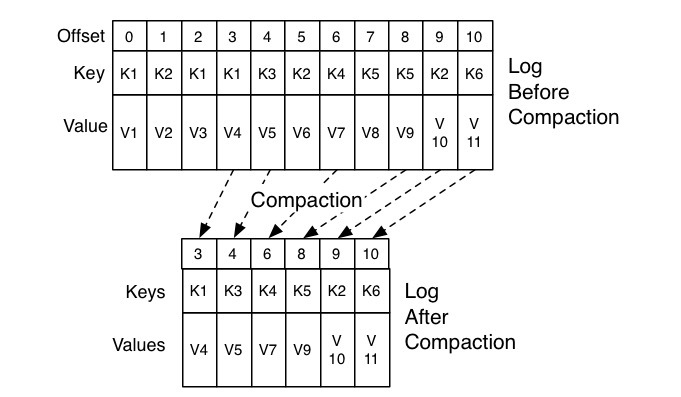

# 术语

- 消息：Record。Kafka是消息引擎嘛，这里的消息就是指Kafka处理的主要对象。
- 主题：Topic。主题是承载消息的逻辑容器，在实际使用中多用来区分具体的业务。
- 分区：Partition。一个有序不变的消息序列。每个主题下可以有多个分区。
- 消息位移：Offset。表示分区中每条消息的位置信息，是一个单调递增且不变的值。
- 副本：Replica。Kafka中同一条消息能够被拷贝到多个地方以提供数据冗余，这些地方就是所谓的副本。副本还分为领导者副本和追随者副本，各自有不同的角色划分。副本是在分区层级下的，即每个分区可配置多个副本实现高可用。
- 生产者：Producer。向主题发布新消息的应用程序。
- 消费者：Consumer。从主题订阅新消息的应用程序。
- 消费者位移：Consumer Offset。表征消费者消费进度，每个消费者都有自己的消费者位移。
- 消费者组：Consumer Group。多个消费者实例共同组成的一个组，同时消费多个分区以实现高吞吐。
- 重平衡：Rebalance。消费者组内某个消费者实例挂掉后，其他消费者实例自动重新分配订阅主题分区的过程。Rebalance是Kafka消费者端实现高可用的重要手段。


Kafka的三层消息架构：

- 第一层是主题层，每个主题可以配置M个分区，而每个分区又可以配置N个副本。
- 第二层是分区层，每个分区的N个副本中只能有一个充当领导者角色，对外提供服务；其他N-1个副本是追随者副本，只是提供数据冗余之用。
- 第三层是消息层，分区中包含若干条消息，每条消息的位移从0开始，依次递增。
- 最后，客户端程序只能与分区的领导者副本进行交互。

# 分区策略

## 为什么分区

- 提供负载均衡能力
- 支持高吞吐量
- 实现业务级的消息顺序

## 分区策略

通过实现接口`org.apache.kafka.clients.producer.Partitioner`自定义分区策略，主要实现partition方法：

```java
int partition(String topic, Object key, byte[] keyBytes, Object value, byte[] valueBytes, Cluster cluster);
```

常见的分区策略：

- Round-robin轮询策略 -- 默认策略
- 随机策略 -- 可能会出现消息倾斜
- 按消息键保序策略 -- 对于消息有顺序性要求

# 无消息丢失配置

## Producer

- 不要使用producer.send(msg)，而要使用producer.send(msg, callback)。记住，一定要使用带有回调通知的send方法。

- 设置acks = all。acks是Producer的一个参数，代表了你对“已提交”消息的定义。如果设置成all，则表明所有副本Broker都要接收到消息，该消息才算是“已提交”。这是最高等级的“已提交”定义。

- 设置retries为一个较大的值。这里的retries同样是Producer的参数，对应前面提到的Producer自动重试。当出现网络的瞬时抖动时，消息发送可能会失败，此时配置了retries > 0的Producer能够自动重试消息发送，避免消息丢失。

## Broker

- 设置unclean.leader.election.enable = false。这是Broker端的参数，它控制的是哪些Broker有资格竞选分区的Leader。如果一个Broker落后原先的Leader太多，那么它一旦成为新的Leader，必然会造成消息的丢失。故一般都要将该参数设置成false，即不允许这种情况的发生。

- 设置replication.factor >= 3。这也是Broker端的参数。其实这里想表述的是，最好将消息多保存几份，毕竟目前防止消息丢失的主要机制就是冗余。

- 设置min.insync.replicas > 1。这依然是Broker端参数，控制的是消息至少要被写入到多少个副本才算是“已提交”。设置成大于1可以提升消息持久性。在实际环境中千万不要使用默认值1。

- 确保replication.factor > min.insync.replicas。如果两者相等，那么只要有一个副本挂机，整个分区就无法正常工作了。我们不仅要改善消息的持久性，防止数据丢失，还要在不降低可用性的基础上完成。推荐设置成replication.factor = min.insync.replicas + 1。

## Consumer

- 确保消息消费完成再提交。Consumer端有个参数enable.auto.commit，最好把它设置成false，并采用手动提交位移的方式。就像前面说的，这对于单Consumer多线程处理的场景而言是至关重要的。


# 消费组

**Kafka仅仅使用Consumer Group这一种机制，却同时实现了传统消息引擎系统的两大模型**：如果所有实例都属于同一个Group，那么它实现的就是消息队列模型；如果所有实例分别属于不同的Group，那么它实现的就是发布/订阅模型。


Rebalance的触发条件有：

1. 组成员数发生变更。比如有新的Consumer实例加入组或者离开组，抑或是有Consumer实例崩溃被“踢出”组。
2. 订阅主题数发生变更。Consumer Group可以使用正则表达式的方式订阅主题，比如consumer.subscribe(Pattern.compile(“t.*c”))就表明该Group订阅所有以字母t开头、字母c结尾的主题。在Consumer Group的运行过程中，你新创建了一个满足这样条件的主题，那么该Group就会发生Rebalance。
3. 订阅主题的分区数发生变更。Kafka当前只能允许增加一个主题的分区数。当分区数增加时，就会触发订阅该主题的所有Group开启Rebalance。


Rebalance“遭人恨”的地方：

- 在Rebalance过程中，所有Consumer实例都会停止消费，等待Rebalance完成。

- Rebalance的设计是所有Consumer实例共同参与，全部重新分配所有分区。

- Rebalance太慢。

# 位移主题

老版本Consumer的位移管理是依托于Apache ZooKeeper的，它会自动或手动地将位移数据提交到ZooKeeper中保存。但是，ZooKeeper其实并不适用于这种高频的写操作，因此，Kafka社区自0.8.2.x版本开始，在新版本Consumer中正式推出了全新的位移管理机制。

**__consumer_offsets**的主要作用是保存Kafka消费者的位移信息，消息格式由Kafka自己定义。

位移主题的Key中保存3部分内容：<Group ID，主题名，分区号>。值保存了offset，以及位移提交的一些其他元数据，诸如时间戳和用户自定义的数据等。

Kafka使用**Compact策略**来删除位移主题中的过期消息，避免该主题无限期膨胀：




# 避免Rebalance

Rebalance发生的时机有三个：

- 组成员数量发生变化
- 订阅主题数量发生变化（可控）
- 订阅主题的分区数发生变化（可控）

大部分情况Rebalance都是由于第一个原因导致的。

第一类非必要Rebalance是因为未能及时发送心跳，推荐设置参数：

- 设置session.timeout.ms = 6s。
- 设置heartbeat.interval.ms = 2s。
- 要保证Consumer实例在被判定为“dead”之前，能够发送至少3轮的心跳请求，即session.timeout.ms >= 3 * heartbeat.interval.ms。

第二类非必要Rebalance是Consumer消费时间过长导致的，推荐设置参数：

- max.poll.interval.ms（设置大一些）

此外还要避免频繁的full gc。

# 位移提交

如果是手动提交，我们需要将commitSync和commitAsync组合使用才能到达最理想的效果，原因有两个：

1. 我们可以利用commitSync的自动重试来规避那些瞬时错误，比如网络的瞬时抖动，Broker端GC等。因为这些问题都是短暂的，自动重试通常都会成功，因此，我们不想自己重试，而是希望Kafka Consumer帮我们做这件事。
2. 我们不希望程序总处于阻塞状态，影响TPS。

```java
   try {
           while(true) {
                        ConsumerRecords records = 
                                    consumer.poll(Duration.ofSeconds(1));
                        process(records); // 处理消息
                        commitAysnc(); // 使用异步提交规避阻塞
            }
} catch(Exception e) {
            handle(e); // 处理异常
} finally {
            try {
                        consumer.commitSync(); // 最后一次提交使用同步阻塞式提交
	} finally {
	     consumer.close();
}
}
```


**CommitFailedException**是Consumer客户端在提交位移时出现了错误或异常，当消息处理的总时间超过预设的max.poll.interval.ms参数值时，Kafka Consumer端会抛出CommitFailedException异常。==如果要防止这种场景下抛出异常==，你需要简化你的消息处理逻辑。具体来说有4种方法。

1. **缩短单条消息处理的时间**。比如，之前下游系统消费一条消息的时间是100毫秒，优化之后成功地下降到50毫秒，那么此时Consumer端的TPS就提升了一倍。
2. **增加Consumer端允许下游系统消费一批消息的最大时长**。这取决于Consumer端参数max.poll.interval.ms的值。在最新版的Kafka中，该参数的默认值是5分钟。如果你的消费逻辑不能简化，那么提高该参数值是一个不错的办法。值得一提的是，Kafka 0.10.1.0之前的版本是没有这个参数的，因此如果你依然在使用0.10.1.0之前的客户端API，那么你需要增加session.timeout.ms参数的值。不幸的是，session.timeout.ms参数还有其他的含义，因此增加该参数的值可能会有其他方面的“不良影响”，这也是社区在0.10.1.0版本引入max.poll.interval.ms参数，将这部分含义从session.timeout.ms中剥离出来的原因之一。
3. **减少下游系统一次性消费的消息总数**。这取决于Consumer端参数max.poll.records的值。当前该参数的默认值是500条，表明调用一次KafkaConsumer.poll方法，最多返回500条消息。可以说，该参数规定了单次poll方法能够返回的消息总数的上限。如果前两种方法对你都不适用的话，降低此参数值是避免CommitFailedException异常最简单的手段。
4. **下游系统使用多线程来加速消费**。这应该算是“最高级”同时也是最难实现的解决办法了。具体的思路就是，让下游系统手动创建多个消费线程处理poll方法返回的一批消息。之前你使用Kafka Consumer消费数据更多是单线程的，所以当消费速度无法匹及Kafka Consumer消息返回的速度时，它就会抛出CommitFailedException异常。如果是多线程，你就可以灵活地控制线程数量，随时调整消费承载能力，再配以目前多核的硬件条件，该方法可谓是防止CommitFailedException最高档的解决之道。事实上，很多主流的大数据流处理框架使用的都是这个方法，比如Apache Flink在集成Kafka时，就是创建了多个KafkaConsumerThread线程，自行处理多线程间的数据消费。不过，凡事有利就有弊，这个方法实现起来并不容易，特别是在多个线程间如何处理位移提交这个问题上，更是极容易出错。在专栏后面的内容中，我将着重和你讨论一下多线程消费的实现方案。

# ！！！TODO

> Kafka多线程消费：https://www.jianshu.com/p/dc8178c82f05

