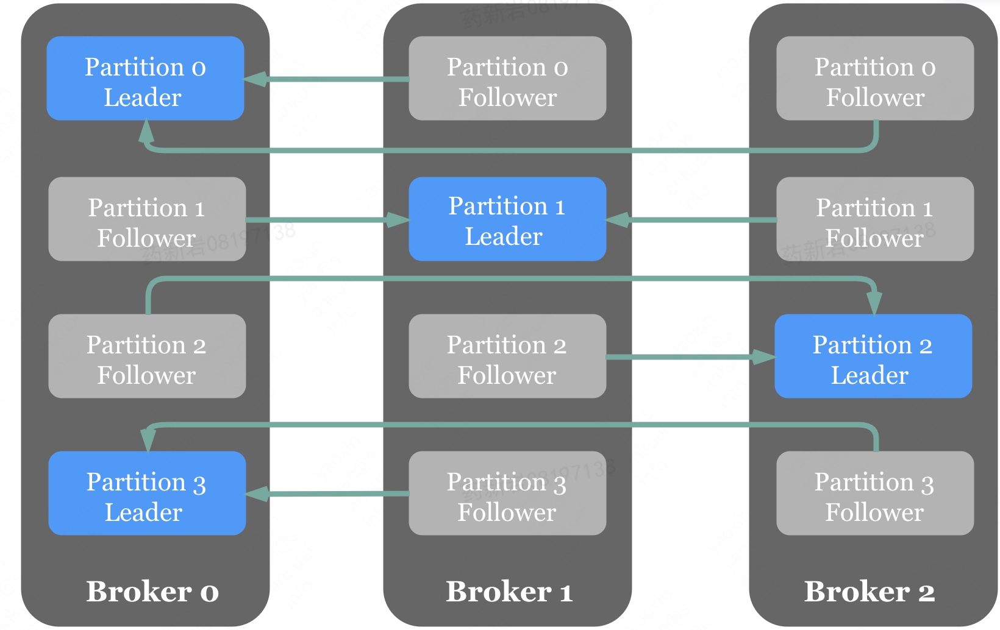
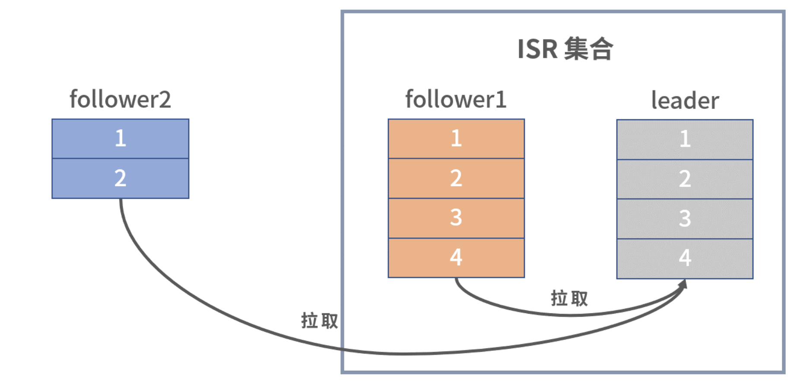
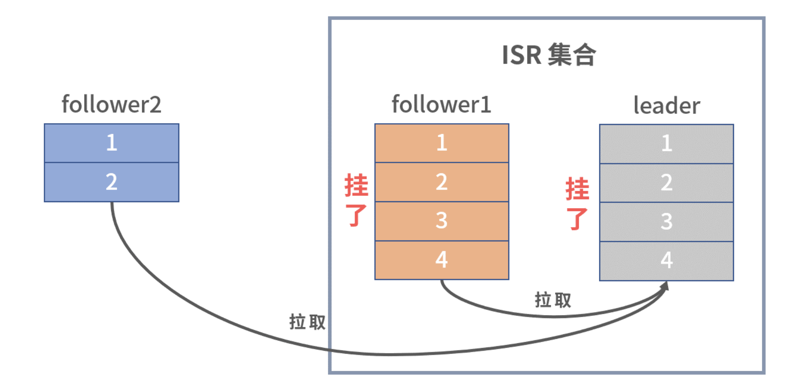
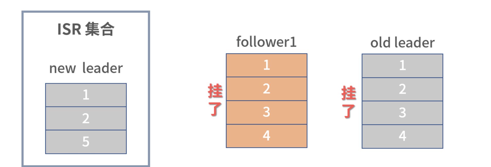
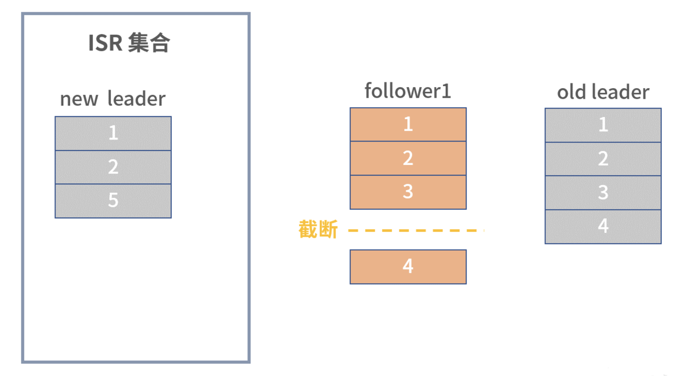
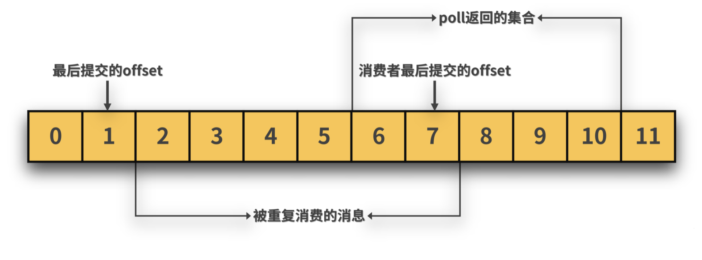
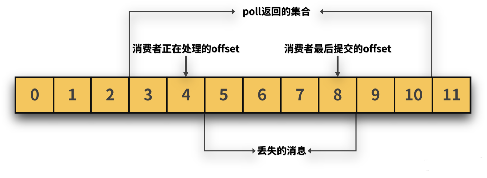

在分布式系统中，消息队列扮演了一个很重要的角色。在分布式系统中，引入一个新的组件往往会带来新的挑战，我们分别看看作用和挑战分别是什么

MQ的作用
-----

一般来说它有三类场景：**削峰填谷，模块解耦**和**异步处理**。

MQ带来的挑战
-------

我们分析一下引入消息队列会带来哪些问题呢？

其实在使用 Kafka 的时候除了担忧 Kafka 服务端宕机外，其实最怕如下这样两件事。

### 消息丢失

下游系统没收到上游系统发送的消息，造成系统间数据不一致。

比如，订单系统没有把成功状态的订单消息成功发送到消息队列里，造成下游的统计系统没有收到下单成功订单的消息，于是造成系统间数据的不一致，从而引起用户查看个人订单列表时跟实际不相符的问题。

### 消息重复

相同的消息重复发送会造成消费者消费两次同样的消息，这同样会造成系统间数据的不一致。

比如，订单支付成功后会通过消息队列给支付系统发送需要扣款的金额，如果消息发送两次一样的扣款消息，而订单只支付了一次，就会给用户带来余额多扣款的问题。

总结来说，这两个问题直接影响到业务系统间的数据一致性。那到底该如何避免这两个问题的发生呢？

Kafka 针对这两个问题有系统的解决方案，需要服务端、客户端做相应的配置以及采取一些补偿方案。

消息语义有三种，分别是：消息最多传递一次、消息最少传递一次、消息有且仅有一次传递，这三种语义分别对应：消息不重复、消息不丢失、消息既不丢失也不重复。

这里的“消息传递一次”是指生产者生产消息成功，Broker 接收和保存消息成功，消费者消费消息成功。对一个消息来说，这三个要同时满足才算是“消息传递一次”。上面所说的那三种消息语义可梳理为如下。

At most once
------------

对应消息不重复。消息最多传递一次，消息有可能会丢，但不会重复。一般运用于高并发量、高吞吐，但是对于消息的丢失不是很敏感的场景。

At least once
-------------

对应消息不丢失。消息最少传递一次，消息不会丢，但有可能重复。一般用于并发量一般，对于消息重复传递不敏感的场景。

Exactly once
------------

每条消息只会被传递一次，消息不会丢失，也不会重复。 用于对消息可靠性要求高，且对吞吐量要求不高的场景。


我们先来讨论一下 Kafka 是如何做到消息不丢失的，也就是：生产者不少生产消息，服务端不丢失消息，消费者也不能少消费消息。

先说下Kafka对消息的发送存储机制：

一个Topic对应多个partition，一个partiton分别对应1个leader和多个follower。



那具体要怎么来实现呢？下面我们就来详细讲解下。

生产端：不少生产消息
----------

以下是为了保证消息不丢失，生产端需要配置的参数和相关使用方法。

### 应用层面

要使用带回调方法的 API，具体 API 方法如下：

```java
   Future<RecordMetadata> send(ProducerRecord<K, V> record, Callback callback)
```


使用带有回调方法的 API 时，我们可以根据回调函数得知消息是否发送成功，如果发送失败了，我们要进行异常处理，比如把失败消息存储到本地硬盘或远程数据库，等应用正常了再发送，这样才能保证消息不丢失。

### 配置层面

首先，**设置参数 acks=-1**。acks 这个参数是指有多少分区副本收到消息后，生产者才认为消息发送成功了，可选的参数值有 0、1 和 -1。

*   acks=0，表示生产者不等待任何服务器节点的响应，只要发送消息就认为成功。
    
*   acks=1，表示生产者收到 leader 分区的响应就认为发送成功。
    
*   acks=-1，表示只有当 ISR（ISR 的含义后面我会详细介绍）中的副本全部收到消息时，生产者才会认为消息生产成功了。这种配置是最安全的，因为如果 leader 副本挂了，当 follower 副本被选为 leader 副本时，消息也不会丢失。但是系统吞吐量会降低，因为生产者要等待所有副本都收到消息后才能再次发送消息。
    

其次，**设置参数 retries=3**。参数 retries 表示生产者生产消息的重试次数。这里 retries=3 是一个建议值，一般情况下能满足足够的重试次数就能重试成功。但是如果重试失败了，对异常处理时就可以把消息保存到其他可靠的地方，如磁盘、数据库、远程缓存等，然后等到服务正常了再继续发送消息。

再次，**设置参数 retry.backoff.ms=300**。retry.backoff.ms 指消息生产超时或失败后重试的间隔时间，单位是毫秒。如果重试时间太短，会出现系统还没恢复就开始重试的情况，进而导致再次失败。结合我个人经验来说，300 毫秒还是比较合适的。

只要上面两个方面做到位了，就可以保证生产端的生产者不少生产消息了。

服务端：不丢失消息
---------

以下是为了保证服务端不丢消息，服务端需要配置的参数。

第一个，**设置 replication.factor >1**。replication.factor 这个参数表示分区副本的个数，这里我们要将其设置为大于 1 的数，这样当 leader 副本挂了，follower 副本还能被选为 leader 副本继续接收消息。

第二个，**设置 min.insync.replicas >1**。min.insync.replicas 指的是 ISR 最少的副本数量，原理同上，也需要大于 1 的副本数量来保证消息不丢失。

> ISR 是一个分区副本的集合，每个分区都有自己的一个 ISR 集合。但不是所有的副本都会在这个集合里，首先 leader 副本是在 ISR 集合里的，如果一个 follower 副本的消息没落后 leader 副本太长时间，这个 follower 副本也在 ISR 集合里；可是如果有一个 follower 副本落后 leader 副本太长时间，就会从 ISR 集合里被淘汰出去。也就是说，ISR 里的副本数量是小于或等于分区的副本数量的。

第三个，**设置 unclean.leader.election.enable = false**。

unclean.leader.election.enable 指是否能把非 ISR 集合中的副本选举为 leader 副本。unclean.leader.election.enable = true，也就是说允许非 ISR 集合中的 follower 副本成为 leader 副本。

如果设置成这样会有什么问题呢？下面我结合几个示意图来为你详细分析下这个问题。

假设 ISR 集合内的 follower1 副本和 ISR 集合外的 follower2 副本向 leader 副本拉取消息（如下图 1），也就是说这时 ISR 集合中就有两个副本，一个是 leader 副本，另一个是 follower1 副本，而 follower2 副本由于网络或自身机器的原因已经落后 leader 副本很长时间，已经被踢出 ISR 集合。



突然 leader 和 follower1 这两个副本挂了（如图 2所示），会导致什么样的结果出现呢？



由于 unclean.leader.election.enable = true，而现在分区的副本能正常工作的仅仅剩下 follower2 副本，所以 follower2 最终会被选为新的 leader 副本并继续接收生产者发送的消息，我们可以看到它接收了一个新的消息 5，如下图



如果这时 follower1 副本的服务恢复，又会发生什么情况呢？由于 follower 副本要拉取 leader 副本同步数据，首先要获取 leader 副本的信息，并感知到现在的 leader 副本的 LEO 比自己的还小，于是做了截断操作，这时 4 这个消息就丢了，这就造成了消息的丢失。



因此，我们一定要把 unclean.leader.election.enable 设置为 false，只有这样非 ISR 集合的副本才不会被选为分区的 leader 副本。但是这样做也降低了可用性，因为这个分区的副本没有 leader，就无法收发消息了，但是消息会发送到别的分区 leader 副本，也就是说分区的数量实际上减少了。

消费端：不能少消费消息
-----------

为了保证不丢失消息，消费者就不能少消费消息，该如何去实现呢？消费端需要做好如下的配置。

第一个，**设置 enable.auto.commit=false**。enable.auto.commit 这个参数表示是否自动提交，如果是自动提交会导致什么问题出现呢？

消费者消费消息是有两个步骤的，首先拉取消息，然后再处理消息。向服务端提交消息偏移量可以手动提交也可以自动提交。如果把参数 enable.auto.commit 设置为 true 就表示消息偏移量是由消费端自动提交，由异步线程去完成的，业务线程无法控制。如果刚拉取了消息之后，业务处理还没进行完，这时提交了消息偏移量但是消费者却挂了，这就造成还没进行完业务处理的消息的位移被提交了，下次再消费就消费不到这些消息，造成消息的丢失。因此，**一定要设置 enable.auto.commit=false，也就是手动提交消息偏移量**。

第二个，**要有手动提交偏移量的正确步骤**。enable.auto.commit=false 并不能完全满足消费端消息不丢的条件，还要有正确的手动提交偏移量的过程。具体如何操作呢？这里我们同样结合一个示意图来讲解，如下所示：



这幅图表示业务逻辑先对消息进行处理，再提交 offset，这样是能够保证不少消费消息的。但是你可以想象这样一个场景：如果消费者在处理完消息后、提交 offset 前出现宕机，待消费者再上线时，还会处理未提交的那部分消息（图中对应 2~7 这部分消息），但是这部分已经被消费者处理过了，也就是说这样做虽然避免了丢消息，但是会有重复消费的情况出现。

具体代码需要这么写：

```java
List<String> messages = consumer.poll()；
processMsg(messages);
consumer.commitOffset();
```


接下来我们讨论 Kafka 又是如何做到消息不重复的，也就是：**生产端不重复生产消息，服务端不重复存储消息，消费端也不能重复消费消息**。

生产端：不重复生产消息
-----------

生产端发送消息后，服务端已经收到消息了，但是假如遇到网络问题，无法获得响应，生产端就无法判断该消息是否成功提交到了 Kafka，而我们一般会配置重试次数，但这样会引发生产端重新发送同一条消息，从而造成消息重复的发送。

对于这个问题，Kafka 0.11.0 的版本之前并没有什么解决方案，不过**从 0.11.0 的版本开始**，Kafka 给每个生产端生成一个唯一的 ID，并且在每条消息中生成一个 sequence num，sequence num 是递增且唯一的，这样就能对消息去重，达到一个生产端不重复发送一条消息的目的。

> 在0.11之后，指定Producer幂等性的方法很简单，仅需要设置一个参数即可，即props.put(“enable.idempotence”, ture)，或props.put(ProducerConfig.ENABLE_IDEMPOTENCE_CONFIG， true)。
>
> 但是幂等性Producer只能保证单分区、单会话上的消息幂等性。如果要保证跨分区、跨会话间的幂等性，则需要使用事务型Producer，但是事务型Producer性能更差，对于吞吐量有要求不会使用。


服务端：无需特殊配制
----------

相较上面“消息不丢失”的场景，“消息不重复”的服务端无须做特别的配置，因为服务端不会重复存储消息，如果有重复消息也应该是由生产端重复发送造成的。

消费端：不能重复消费消息
------------

为了保证消息不重复，消费端就不能重复消费消息，该如何去实现呢？消费端需要做好如下配置。

**第一步，设置 enable.auto.commit=false**。跟前面一样，这里同样要避免自动提交偏移量。你可以想象这样一种情况，消费端拉取消息和处理消息都完成了，但是自动提交偏移量还没提交消费端却挂了，这时候 Kafka 消费组开始重新平衡并把分区分给另一个消费者，由于偏移量没提交新的消费者会重复拉取消息，这就最终造成重复消费消息。

**第二步，单纯配成手动提交同样不能避免重复消费，还需要消费端使用正确的消费“姿势”**。这里还是先看下图这种情况：




消费者拉取消息后，先提交 offset 后再处理消息，这样就不会出现重复消费消息的可能。但是你可以想象这样一个场景：在提交 offset 之后、业务逻辑处理消息之前出现了宕机，待消费者重新上线时，就无法读到刚刚已经提交而未处理的这部分消息（这里对应图中 5~8 这部分消息），还是会有少消费消息的情况。

具体代码如下：

```java
List<String> messages = consumer.poll();
consumer.commitOffset();
processMsg(messages);
```


关于多生产者
------

上述方案是理想情况下的，Kafka 给每个生产端生成一个唯一的 ID，只对在一个生产端内生产的消息有效，如果一个消息分别在两个生产端发送就不行了，还是会造成消息的重复发送。

对于高可用的业务，我们可以在做业务上的补偿和确认能力，从生产方到消费方要对最终的准确性做保证。

好在这种可能性比较小，因为消息的重试一般会在一个生产端内进行。

当然，对应一个消息分别在两个生产端发送的请求我们也有方案，只是要**多做一些补偿的工作**，比如，我们可以为每一个消息分配一个全局 ID，并把全局 ID 存放在远程缓存或关系型数据库里，这样在发送前可以判断一下是否已经发送过了。

关于并发消费者组
--------

涉及到并发消费相关源码，下一期单独分享

关于ISR

> **如何判断副本是否应该属于ISR**。**Follower副本的LEO落后Leader LEO的时间，是否超过了Broker端参数replica.lag.time.max.ms值**。如果超过了，副本就会被从ISR中移除。