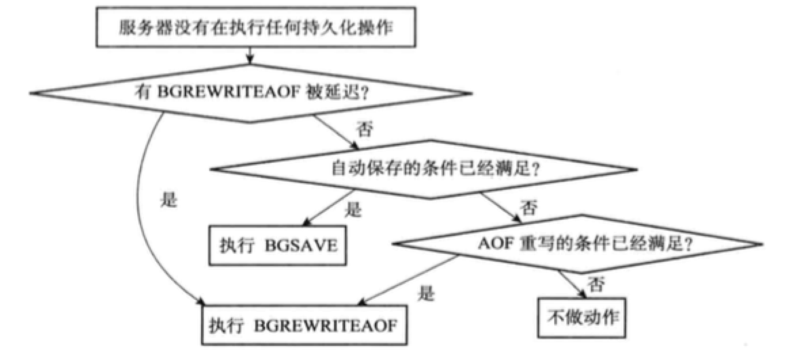

Redis服务器负责与多个客户端建立连接，处理客户端的命令请求，在数据库中保存命令产生的数据，并通过资源管理来维持服务器自身的运转。

# 14.1 命令请求的执行过程

`SET KEY VALUE`命令的执行过程：

1. 客户端向服务器发送命令请求`SET KEY VALUE`。
2. 服务器接收并处理命令请求，在数据库中设置操作，并产生命令回复`OK`。
3. 服务器将`OK`发送给客户端。
4. 客户端接收服务器返回的命令`OK`，并打印给用户。

## 发送命令请求

用户：键入命令请求

客户端：将命令请求转换为协议格式然后发送给服务器

## 读取命令请求

当连接套接字因为客户端的写入而变得可读时，服务器将调用命令请求处理器执行以下操作：

1. 读取套接字协议格式中的命令请求，并将其保存在客户端状态的输入缓冲区里。
2. 对输入缓冲区的命令请求进行分析，提取命令参数及其个数，保存到客户端状态的argv和argc属性。
3. 调用命令执行器，执行指定的命令。

## 命令执行器（1）：查找命令实现

命令执行器要做的第一件事是根据客户端状态的`argv[0]`参数，在命令表（command table）中查找参数指定的命令，并将其保存到客户端状态的`cmd`属性里。

命令表是一个字典，键是命令名字，值是一个`redisCommand`结构。命令表使用的是**大小写无关**的查找算法。

## 命令执行器（2）：执行预备操作

有了执行命令所需的命令实现函数、参数、参数个数，但程序还需要一些预备操作：

- 检查客户端状态的`cmd`指针是否为`NULL`。
- 根据`cmd`属性指向`redisCommand`结构的`arity`属性，检查命令请求的参数个数是否正确。
- 检查客户端是否通过了身份验证，未通过必须使用`AUTH`命令。
- 如果服务器打开了`maxmemory`功能，检查内存占用情况，有需要时进行内存回收。
- 如果上一次`BGSAVE`出错，且服务器打开了`stop-writes-on-bgsave-error`功能，且服务器要执行一个写命令，拒绝执行。
- 如果客户端正在用`SUBSCRIBE`订阅频道，服务器只会执行订阅相关的命令。
- 如果服务器正在进行输入载入，那么客户端发送的命令必须带有1标识才能被执行。
- 如果服务器因为Lua脚本而超时阻塞，那么服务器只会执行客户端发来的`SHUTDOWN nosave`和`SCRIPT KILL`命令。
- 如果客户端正在执行事务，那么服务器只会执行客户端发来的`EXEC`、 `DISCARD`、 `MULTI`、 `WATCH`命令，其余命令进入事务队列。
- 如果服务器打开监视器功能，要将执行的命令和参数等信息发给监视器，其后才真正执行命令。

## 命令执行器（3）：调用命令的实现函数

> client->cmd->proc(client);

相当于执行语句：

> sendCommand(client);

命令回复会保存在输出缓冲区，之后实现函数还会为套接字关联命令回复处理器，将回复返回给客户端。

##  命令执行器（5）：执行后续工作

- 如果开启了慢查询，添加新的日志。
- `redisCommand`结构的`calls`计数器+1。
- 写入AOF缓冲区。
- 同步从服务器。

## 将命令回复发送给客户端

当客户端套接字变为可写时，服务器将输出缓冲区的命令发送给客户端。发送完毕后，清空输出缓冲区。

## 客户端接收并打印命令回复

服务器：回复处理器将协议格式的命令返回给客户端。

客户端：将回复格式化成人类可读的格式，打印。

# 14.2 serverCron函数

## 更新服务器时间缓存

每次获取系统的当前时间都要执行一次系统调用，为了减少系统调用，服务器状态中保存了当前时间的缓存：

```c
struct redisServer {
  // 秒级的系统当前UNIX时间戳
  time_t unixtime;
  // 毫秒级的系统当前UNIX时间戳
  long long mstime;
};
```

`serverCron`默认会100毫秒更新一次这两个属性，所以它们的精确度并不高。对于一些高精度要求的操作，还是会再次执行系统调用。

## 更新LRU时钟

```objective-c
struct redisServer {
  // 默认10秒更新一次的时钟缓存，用于计算键的空转时长
  // INFO server可查看
  unsigned lruclock:22;
};

// 每个Redis对象都有一个lru属性，计算键的空转时长，就是用服务器的lruclock减去对象的lru时间
typedef struct redisObject {
  unsigned lru:22;
} robj;
```

## 更新服务器每秒执行命令次数

`serverCron`函数中的`trackOperationPerSecond`函数以每100毫秒一次的频率执行，该函数以抽样计算的方式，估算并记录服务器在最近一秒内处理的命令请求数量，这个值可以用过`INFO status`命令查看。

```c
struct redisServer {
  // 上一次抽样的时间
  long long ops_sec_last_sample_time;
  
  // 上一次抽样时，服务器已执行命令的数量
  long long ops_sec_last_sample_ops;
  
  // REDIS_OPS_SEC_SAMPLES 大小默认16
  // 环形数组中的每个项记录了一次抽样结果
  long long ops_sec_samples[REDIS_OPS_SEC_SAMPLES];
  
  // ops_sec_samples 数组的索引值，每次抽样后自动+1
  // 让 ops_sec_samples 数组构成一个环形数组
  int ops_sec_idx;
};
```

客户端执行`INFO`命令，服务器会调用`getOperationsPerSecond`函数，根据`ops_sec_samples`中的抽样结果，计算出`instantaneous_ops_per_sec`属性的值。

## 更新服务器内存峰值记录

```c
struct redisServer {
  // 已使用内存峰值
  size_t stat_peak_memory;
};
```

每次`serverCron`执行，程序都会查看当前的内存数量，更新`stat_peak_memory`。`INFO memory`可查看。

## 处理SIGTERM信号

启动时，Redis会为服务器进程的`SIGTERM`信号关联处理器`sigtermHandler`函数。它在接到该信号后，打开服务器状态的`shutdown_asap`标识。每次`serverCron`执行，程序都会检查该标识，并决定是否关闭服务器。

```objective-c
struct redisServer {
  // 关闭服务器的标识：1，关闭；2，不做操作。
  int shutdown_asap;
};
```

## 管理客户端资源

`serverCron`每次都会调用`clientsCron`函数，后者会对一定数量的客户端作如下检查：

- 连接是否超时
- 输入缓冲区是否超过长度，如果是，新建缓冲区

## 管理数据库资源

`serverCron`每次都会调用`databasesCron`函数，检查一部分的数据库，删除过期键，对字典进行收缩等。

## 执行被延迟的BGREWRITEAOF

服务器执行`BGSAVE`期间，会阻塞`BGREWRITEAOF`命令。

```c
struct redisServer {
  // 记录是否有BGREWRITEAOF被延迟
  int aof_rewrite_scheduled;
};
```

## 检查持久化操作的运行状态

```c
struct redisServer {
  // 记录执行BGSAVE命令的子进程ID
  // 如果服务器没有执行BGSAVE，值为-1
  pid_t rdb_child_pid;
  
  // 记录执行BGREWRITEAOF命令的子进程ID
  pid_t aof_child_pid;
};
```

`serverCron`执行时，只要两个属性有一个为-1，则执行wait3函数，检查是否有信号发来服务器进程：

- 如果有信号达到，表明新的RDB文件生成完毕，或AOF文件重写完毕，服务器需要执行相应命令的后续操作
- 没有信号就不做操作

如果两个属性都不为-1，表明服务器没有再做持久化操作，则：



## serverCron的其他操作：

- 将AOF缓冲区的内容写入AOF文件

- 关闭异步客户端（超出输入缓冲区限制）

- 增加cronloops计数器（它的唯一作用就是复制模块中实现『每执行`serverCron`函数N次就执行一次指定代码』的功能”）

# 14.3 初始化服务器

## 初始化服务器状态结构

初始化服务器的第一步就是创建一个`redisServer`类型的实例变量`server`，并为结构中的各个属性设置默认值。这个工作由`redis.c/initServerConfig`函数完成：

- 设置服务器运行id
- 为id加上结尾字符
- 设置默认的配置文件路径
- 设置默认服务器频率
- 设置服务器的运行架构，64位 or 32位
- 设置服务器的默认端口
- 设置服务器的默认RDB和AOF条件
- 初始化服务器的LRU时钟
- 创建命令表

## 载入配置选项

启动服务器时，用户可以通过配置参数或者配置文件来修改服务器的默认配置。

`redis.c/initServerConfig`函数初始化完`server`变量后，开始载入用户给定的配置。

## 初始化服务器数据结构

载入用户的配置选项之后，才能正确地初始化数据结构，由`initServer`函数负责：

- `server.clients`链表
- `server.db`数组
- `server.pubsub_channels`字典
- `server.lua`Lua环境
- `server.slowlog`

除此之外，`initServer`还：

- 为服务器设置进程信号处理器
- 创建共享对象
- 打开服务器的监听端口，并为套接字关联应答事件处理器
- 为`serverCron`函数创建时间事件
- 打开或创建的AOF文件
- 初始化后台I/O模块

## 还原数据库状态

初始化完`server`后，服务器要载入RDB或AOF文件，还原数据库状态

❑如果服务器启用了AOF持久化功能，那么服务器使用AOF文件来还原数据库状态。❑相反地，如果服务器没有启用AOF持久化功能，那么服务器使用RDB文件来还原数据库状态。

## 执行事件循环

开始执行服务器的loop。

# 导航

[目录](README.md)

上一章：[13. 客户端](ch13.md)

下一章：[15. 复制](ch15.md)
