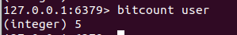

这篇文章主要通过  
[【尚硅谷】Redis 6 入门到精通 超详细 教程](https://www.bilibili.com/video/BV1Rv41177Af?from=search&seid=12829630803866647831&spm_id_from=333.337.0.0)

以及通过这篇文章的知识科普  
[Redis的学习笔记](https://zhangc233.github.io/2021/05/02/Redis/)

学习实践后汇总做下的笔记

以下的学习代码可通过如下进行下载  
[redis从入门到精通的学习代码.rar](https://download.csdn.net/download/weixin_47872288/63972841?spm=1001.2014.3001.5503)

解决功能新问题：JAVA jsp rdsms tomcat html linux jdbc [svn](https://so.csdn.net/so/search?q=svn&spm=1001.2101.3001.7020)  
解决发展性问题：strtus spring [springmvc](https://so.csdn.net/so/search?q=springmvc&spm=1001.2101.3001.7020) hibernate mybatis  
解决性能问题：NOSQL java 线程 [hadoop](https://so.csdn.net/so/search?q=hadoop&spm=1001.2101.3001.7020) nginx mq elasticsearch

NoSQL(NoSQL = Not Only SQL )，意即“不仅仅是SQL”，泛指非关系型的数据库

关系型数据库和[非关系型数据库](https://so.csdn.net/so/search?q=%E9%9D%9E%E5%85%B3%E7%B3%BB%E5%9E%8B%E6%95%B0%E6%8D%AE%E5%BA%93&spm=1001.2101.3001.7020)的定义可看我之前的文章  
[关系型数据库和非关系型数据库的详细分析](https://blog.csdn.net/weixin_47872288/article/details/121917162?spm=1001.2014.3001.5501)

**NoSQL特点**

> 1.非关系型数据库，不依赖业务逻辑数据库存储，以简单key-value存储。因此大大的增加了数据库的扩展能力  
> 2.不遵循SQL标准  
> 3.不支持ACID

适用于

*   高并发读写
*   海量数据读写
*   数据可扩展

不适用于

*   事务存储
*   复杂数据库

**NoSQL优点**  
1.缓存数据库，完全在内存中，速度快，数据结构简单  
2.减少io操作，数据库和表拆分，虽然破坏业务逻辑，即外加一个缓存数据库，提高数据库速度，也可以用专门的存储方式，以及针对不同的数据结构存储

1.1 其他数据库
---------

| 数据库   | 功能                                                         |
| -------- | ------------------------------------------------------------ |
| Memcache | NoSql数据库 /数据都在内存中，一般不持久化/// key-value模式，支持类型单一 ///一般是作为缓存数据库辅助持久化的数据库 |
| Redis    | 几乎覆盖了Memcached的绝大部分功能 /数据都在内存中，支持持久化，主要用作备份恢复 /.除了支持简单的key-value模式，还支持多种数据结构的存储，比如 list、set、hash、zset等///一般是作为缓存数据库辅助持久化的数据库 |
| MongoDB  | 高性能、开源、模式自由(schema free)的文档型数据库//数据都在内存中， 如果内存不足，把不常用的数据保存到硬盘/虽然是key-value模式，但是对value（尤其是json）提供了丰富的查询功能/支持二进制数据及大型对象/可以根据数据的特点替代RDBMS ，成为独立的数据库。或者配合RDBMS，存储特定的数据。 |

默认6379端口号 
与memcache三点不同，支持多数据类型，持久化，单线程+多路io口复用

所谓的多路io复用 
定义如下：

1.  使用一个线程来检查多个文件描述符（Socket）的就绪状态（比如调用 select 和 poll 函数，传入多个文件描述符）
2.  如果有一个文件描述符就绪，则返回，否则阻塞直到超时。
3.  得到就绪状态后进行真正的操作可以在同一个线程里执行，也可以启动线程执行（比如使用线程池）

多样的数据结构存储持久化数据  


2.1 软件安装
--------

高速缓存 可持久化 开源key-value存储系统 支持多个类型集合 不同方式的排序 实现主从操作等  
**下载redis以及编译安装**  
1.官网下载redis文件  
2.复制到/opt目录下`cp /home/gaokaoli/Downloads/redis-6.2.3.tar.gz /opt`  
3.查看是否安装了gcc编译输入`gcc --version`  
·如果没有安装gcc，则输入`yum install -y gcc`，或者是`apt-get install -y gcc`，安装了忽视这一步  


补充

*   在ubuntu安装的时候使用的是`apt-get`命令  
    
    
*   在安装过程中如果出现安装不了或者下载速度很慢  
    原因可能为没联网或者apt-get或者yum的源没有更新，导致源下载速度很慢  
    更新源包  
    [ubuntu:E: 无法定位软件包yum解决方法](https://blog.csdn.net/weixin_47872288/article/details/118519307)

更新完之后在下载速度就很快了

4.进入目录号`cd /opt/redis-6.2.3`进行`make`编译以及`make install`安装即可  
最后结果截图：  
如果make install显示出错，少了一个文件  
解决方案：

> 1.是否安装了gcc  
> 2.重新输入make distclean  
> make  
> make install


**判断是否安装成功：**   
在/usr/local/bin中ls  


**如何启动**  
1.前台打开（不推荐）  
关了之后就不能操作了

```bash
cd /usr/local/bin
redis-server

```


2.后台打开  
拷贝一份redis.conf到其他目录  
设置redis.conf的daemonize值为yes  


启动redis 以及客户端

```bash
cp /opt/redis-6.2.3/redis.conf /etc/redis.conf
cd /usr/local/bin
redis-server /etc/redis.conf

```


查看是否在运行

```bash
ps -ef |grep redis

```

退出`exit`  
关闭后台`redis-cli shutdown`或者是关闭进程号 `kill -9 进程号`


最好给redis设置一个密码  
可查看我这篇文章  
[linux中设置redis的密码](https://blog.csdn.net/weixin_47872288/article/details/121924091)

也可以在登陆的时候直接`redis-cli -a 123456`  
退出的话可以`redis-cli -a 123456 shutdown`  
666666是博主的密码

2.2 数据类型
--------

### 2.2.1 key值键位

**key值的操作：** 

*   `keys *` 查看当前库所有key
    
*   `set key value` 设置key值与value
    
*   `exists key` 判断key是否存在
    
*   `type key` 查看key是什么类型
    
*   `del key` 删除指定的key数据
    
*   `unlink key` 根据value选择非阻塞删除  
    \------仅将keys从keyspace元数据中删除，真正的删除会在后续异步操作。
    
*   `expire key 10` 10秒钟：为给定的key设置过期时间
    
*   `ttl key` 查看还有多少秒过期，-1表示永不过期，-2表示已过期
    

**库的选择：** 

*   `select` 命令切换数据库
*   `dbsize` 查看当前数据库的key数量
*   `flushdb` 清空当前库
*   `flushall` 通杀全部库

### 2.2.2 string字符串

*   一个key对应一个value
*   二进制安全的，即可包含任何数据
*   value最多可以是512m

参数设置：

*   `set key value` 设置key值
*   `get key` 查询key值
*   `append key value` 将给定的value追加到原值末尾
*   `strlen key` 获取值的长度
*   `setnx key value` 只有在key不存在的时候，设置key值
*   `incr key` 将key值存储的数字增1，只对数字值操作，如果为空，新增值为1
*   `decr key` 将key值存储的数字减1，只对数字值操作，如果为空，新增值为1
*   `decr key` 将key值存储的数字减1
*   `incrby/decrby key <步长>` 将key值存储的数字增减如步长

**补充：**   
原子操作  
不会被打断，从开始到结束  
单线程不会被打断  
多线程很难说，被打断的就不是原子操作

补充额外的字符串参数：

*   `mset key value key value..`同时设置一个或者多个key-value
*   `mget key key...`同时获取一个或多个value
*   `msetnx key value key value..`同时设置一个或者多个key-value.当且仅当所有给定key都不存在
*   `getrange key <起始位置> <结束位置>` 获取key的起始位置和结束位置的值
*   `setrange key <起始位置> value` 将value的值覆盖起始位置开始
*   `setex key <> value` 设置键值的同时,设置过期时间
*   `getset key value` 用新值换旧值

### 2.2.3 list列表

常用命令:

*   `lpush/rpush key value value...`从左或者右插入一个或者多个值(头插与尾插)
    
*   `lpop/rpop key` 从左或者右吐出一个或者多个值(值在键在,值都没,键都没)
    
*   `rpoplpush key1 key2` 从key1列表右边吐出一个值,插入到key2的左边
    
*   `lrange key start stop` 按照索引下标获取元素(从左到右)
    
*   `lrange key 0 -1` 获取所有值
    
*   `lindex key index` 按照索引下标获得元素
    
*   `llen key` 获取列表长度
    
*   `linsert key before/after value newvalue` 在value的前面插入一个新值
    
*   `lrem key n value` 从左边删除n个value值
    
*   `lset key index value` 在列表key中的下标index中修改值value
    

### 2.2.4 set集合

字典，哈希表  
自动排重且为无序的  
常用命令:

*   `sadd key value value...` 将一个或者多个member元素加入集合key中,已经存在的member元素被忽略
*   `smembers key` 取出该集合的所有值
*   `sismember key value` 判断该集合key是否含有改值
*   `scard key` 返回该集合的元素个数
*   `srem key value value` 删除集合中的某个元素
*   `spop key` 随机从集合中取出一个元素
*   `srandmember key n` 随即从该集合中取出n个值，不会从集合中删除
*   `smove <一个集合a><一个集合b>value` 将一个集合a的某个value移动到另一个集合b
*   `sinter key1 key2` 返回两个集合的交集元素
*   `sunion key1 key2` 返回两个集合的并集元素
*   `sdiff key1 key2` 返回两个集合的差集元素（key1有的，key2没有）

### 2.2.5 hash哈希

键值对集合，特别适合用于存储对象类型  
常用命令：

*   `hset key field value` 给key集合中的filed键赋值value
*   `hget key1 field` 集合field取出value
*   `hmset key1 field1 value1 field2 value2` 批量设置hash的值
*   `hexists key1 field` 查看哈希表key中，给定域field是否存在
*   `hkeys key` 列出该hash集合的所有field
*   `hvals key` 列出该hash集合的所有value
*   `hincrby key field increment` 为哈希表key中的域field的值加上增量1 -1
*   `hsetnx key field value` 将哈希表key中的域field的值设置为value，当且仅当域field不存在

例如 hset user:1000 id 1

### 2.2.6 Zset有序集合

没有重复元素的字符串集合，按照相关的分数进行排名，排名从低到高，排名可重复

有序集合 zset 与普通集合 set 非常相似，是一个没有重复元素的字符串集合

常用命令：

*   `zadd key score1 value1 score2 value2` 将一个或多个member元素及其score值加入到有序key中
*   `zrange key start stop (withscores)` 返回有序集key，下标在start与stop之间的元素，带withscores，可以让分数一起和值返回到结果集。
*   `zrangebyscore key min max(withscores)` 返回有序集key，所有score值介于min和max之间（包括等于min或max）的成员。有序集成员按score的值递增次序排列
*   `zrevrangebyscore key max min （withscores）`同上，改为从大到小排列
*   `zincrby key increment value` 为元素的score加上增量
*   `zrem key value` 删除该集合下，指定值的元素
*   `zcount key min max` 统计该集合，分数区间内的元素个数
*   `zrank key value` 返回该值在集合中的排名，从0开始

2.3 配置文件详解
----------

#bind 127.0.0.1 -::1 //给本地远程注释，可以远程  
protected-mode no //保护模式改为no，可以远程访问  
daemonize yes //后台启动为yes  
pidfile /var/run/redis\_6379.pid //保存进程号的路径

访问密码的查看和取消  
将其注释去掉  


或者使用命令行  


设置之后没一次的输入redis-cli进入的时候  
还需要敲auth 123456才可进行访问

做了配置之后要重启  
通过kil进程进行重启

2.4 发布和订阅
---------

发布和订阅消息  
客户端可以订阅任意频道的消息  
打开一个客户端进行发布  
subscribe channel1  


打开另一个客户端进行订阅  
publish channel1 hello  


2.5 新数据类型
---------

### 2.5.1 Bitmaps

1.合理使用操作位可以有效地提高内存使用率和开发使用率  
2.本身是一个字符串，不是数据类型，数组的每个单元只能存放0和1，数组的下标在Bitmaps叫做偏移量  
3.节省空间，一般存储活跃用户比较多

命令参数：  
**1.设置值**

```bash
setbit key offset value

```


第一次初始化bitmaps，如果偏移量比较大，那么整个初始化过程执行会比较慢，还可能会造成redis的堵塞

**2.getbit取值**

```bash
getbit key offset 

```

获取bitmaps中某个偏移量的值  
获取键的第offset位的值

**3.bitcount 统计数值**

```bash
bitcount key （start end）

```

统计字符串从start 到end字节比特值为1的数量  


redis的setbit设置或清除的是bit位置，而bitcount计算的是byte的位置

**4.bitop**  
复合操作，交并非异或，结果保存在destkey

```bash
bitop and(or/not/xor）destkey key

```

这个key放两个key1 key2

### 2.5.2 HyperLogLog

1.统计网页中页面访问量  
2.只会根据输入元素来计算基数，而不会储存输入元素本身，不能像集合那样，返回输入的各个元素  
3.基数估计是在误差可接受的范围内，快速计算（不重复元素的结算）

命令参数：  
**1.添加指定的元素到hyperloglog中**

```bash
pfadd key element

```

列如 pfadd progame “java”  
成功则返回1，不成功返回0

**2.计算key的近似基数**

```bash
pfcount key 

```

即这个key的键位添加了多少个不重复元素

**3.一个或多个key合并后的结果存在另一个key**

```bash
pfmerge destkey sourcekey sourcekey

```

### 2.5.3 Geographic

提供经纬度设置，查询范围，距离查询等

命令参数：  
**1.添加地理位置（经度纬度名称）**  
当坐标超出指定的范围，命令会返回一个错误  
已经添加的数据，无法再添加

```bash
geoadd key longitude latitude member

```

例如 geoadd china:city 121.47 31.23 shanghai

**2.获取指定地区的坐标值**

```bash
geopos key member 

```

例如 geopos china:city shanghai

**3.获取两个位置之间的直线距离**

```bash
geodist key member1 member2 (m km ft mi)

```

**4.以给定的经纬度为中心，找出某一半径的内元素**

```bash
georadius key longitude latitude radius (m km ft mi)

```

在xml中配置

```xml

    <dependencies>
        <dependency>
            <groupId>redis.clients</groupId>
            <artifactId>jedis</artifactId>
            <version>3.6.1</version>
        </dependency>
    </dependencies>

```

在类中定义

```java

public class JedisDemo1 {
    public static void main(String[] args) {
        
        Jedis jedis = new Jedis("192.168.242.110", 6379);
        
        String ping = jedis.ping();
        System.out.println(ping);
    }
}

```

结果显示为：  


原因可能是：

*   防火墙要关闭，`systemctl stop/disable firewalld.service`
    
*   设置可远程访问，注释掉bind，`#bind 127.0.0.1 -::1` ，可远程访问
    
*   设置保护模式为no，`protected-mode no`  
    在上面的配置文件中有提及  
    
    

之后的结果为  


或者这样测试也可  
代码如下：

```java
public class JedisDemo1 {

    public static void main(String[] args) {

        Jedis jedis = new Jedis("192.168.242.110", 6379);

        System.out.println(jedis.getClient().getPort());
        System.out.println("连接本地的Redis服务器成功");
        
        System.out.println("服务正在运行：" + jedis.ping());

    }
}

```


配合上面的数据类型，添加数据的代码演示

```java
Jedis jedis = new Jedis("127.0.0.1", 6379);
        Set<String> keys = jedis.keys("*");
        for(String key:keys){
            System.out.println("key");
        }

```

3.1 类型测试
--------

key的测试代码如下

```java
jedis.set("k1", "v1");
jedis.set("k2", "v2");
jedis.set("k3", "v3");
Set<String> keys = jedis.keys("*");
System.out.println(keys.size());
for (String key : keys) {
System.out.println(key);
}
System.out.println(jedis.exists("k1"));
System.out.println(jedis.ttl("k1"));                
System.out.println(jedis.get("k1"));

```

String测试代码

```java
jedis.mset("str1","v1","str2","v2","str3","v3");
System.out.println(jedis.mget("str1","str2","str3"));

```

或者通过如下代码测试

`mset`可以添加多个key-value  
`mget`则是取出相对应多个key

```java

@Test
public void demo1() {
    
    Jedis jedis = new Jedis("172.22.109.205",6379);

    
    jedis.set("name","lucy");

    
    String name = jedis.get("name");
    System.out.println(name);

    
    jedis.mset("k1","v1","k2","v2");
    List<String> mget = jedis.mget("k1", "k2");
    System.out.println(mget);

    Set<String> keys = jedis.keys("*");
    for(String key : keys) {
        System.out.println(key);
    }
    jedis.close();
}

```

测试结果如下  


List测试代码

关键代码如下:

```java
List<String> list = jedis.lrange("mylist",0,-1);
for (String element : list) {
System.out.println(element);
}

```

完整代码

> 通过lpush放到左边  
> lrange取出全部  
> 输出的时候都是从右边到左边

```java

@Test
public void demo2() {
    
    Jedis jedis = new Jedis("172.22.109.205",6379);

    jedis.lpush("key1","lucy","mary","jack");
    List<String> values = jedis.lrange("key1", 0, -1);
    System.out.println(values);
    jedis.close();
}

```

截图如下  


Set测试代码

```java
jedis.sadd("orders", "order01");
jedis.sadd("orders", "order02");
jedis.sadd("orders", "order03");
jedis.sadd("orders", "order04");
Set<String> smembers = jedis.smembers("orders");
for (String order : smembers) {
System.out.println(order);
}
jedis.srem("orders", "order02");

```

完整代码如下

> key可以对应多个value  
> sadd添加多个key-value  
> smembers输出多个value  
> srem则是删除

```java

@Test
public void demo3() {
    
    Jedis jedis = new Jedis("172.22.109.205",6379);

    jedis.sadd("names","lucy");
    jedis.sadd("names","mary");

    Set<String> names = jedis.smembers("names");
    System.out.println(names);
    jedis.close();
}

```

截图如下  


Hash测试代码

```java
jedis.hset("hash1","userName","lisi");
System.out.println(jedis.hget("hash1","userName"));

Map<String,String> map = new HashMap<String,String>();
map.put("telphone","13810169999");
map.put("address","atguigu");
map.put("email","abc@163.com");

jedis.hmset("hash2",map);
List<String> result = jedis.hmget("hash2", "telphone","email");
for (String element : result) {
System.out.println(element);
}

```

代码演示：

```java

@Test
public void demo4() {
    
    Jedis jedis = new Jedis("172.22.109.205",6379);

    jedis.hset("users","age","20");
    String hget = jedis.hget("users", "age");
    System.out.println(hget);
    jedis.close();
}

```

截图如下  


Zset测试代码

```java
jedis.zadd("zset01", 100d, "z3");
jedis.zadd("zset01", 90d, "l4");
jedis.zadd("zset01", 80d, "w5");
jedis.zadd("zset01", 70d, "z6");
 
Set<String> zrange = jedis.zrange("zset01", 0, -1);
for (String e : zrange) {
System.out.println(e);
}

```

代码演示

```java

@Test
public void demo5() {
    
    Jedis jedis = new Jedis("172.22.109.205",6379);

    jedis.zadd("china",100d,"shanghai");

    Set<String> china = jedis.zrange("china", 0, -1);
    System.out.println(china);

    jedis.close();
}

```

截图如下  


3.2 Jedis实例-手机验证码
-----------------

**要求：** 

> 1、输入手机号，点击发送后随机生成6位数字码，2分钟有效  
> 2、输入验证码，点击验证，返回成功或失败  
> 3、每个手机号每天只能输入3次

思路：

1.  生成随机6位数字验证码：Random
2.  验证码在2分钟内有效：把验证码放到redis里面，设置过期时间120秒
3.  判断验证码是否一致：从redis获取验证码和输入的验证码进行比较
4.  每个手机每天只能发送3次验证码：incr每次发送后+1，大于2的时候，提交不能发送

**生成六位的验证码：** 

```java

public static String getCode() {
    Random random = new Random();
    String code = "";
    for(int i=0;i<6;i++) {
        int rand = random.nextInt(10);
        code += rand;
    }
    return code;
}

```

**验证码只能发送三次：**   
验证码只能发送三次，通过incr进行

```java

public static void verifyCode(String phone) {
    
    Jedis jedis = new Jedis("172.22.109.205",6379);

    
    
    String countKey = "VerifyCode"+phone+":count";
    
    String codeKey = "VerifyCode"+phone+":code";

    
    String count = jedis.get(countKey);
    if(count == null) {
        
        
        jedis.setex(countKey,24*60*60,"1");
    } else if(Integer.parseInt(count)<=2) {
        
        jedis.incr(countKey);
    } else if(Integer.parseInt(count)>2) {
        
        System.out.println("今天发送次数已经超过三次");
        jedis.close();
    }

    
    String vcode = getCode();
    jedis.setex(codeKey,120,vcode);
    jedis.close();
}

```

**验证码验证相同与否：**   
验证码的key 与code是否相等

```java

public static void getRedisCode(String phone,String code) {
    
    Jedis jedis = new Jedis("172.22.109.205",6379);
    
    String codeKey = "VerifyCode"+phone+":code";
    String redisCode = jedis.get(codeKey);
    
    if(redisCode.equals(code)) {
        System.out.println("成功");
    }else {
        System.out.println("失败");
    }
    jedis.close();
}

```

**完整功能代码展示**

```java
public class PhoneCode {

    public static void main(String[] args) {
        
        verifyCode("13678765435");

        
        
    }

    
    public static void getRedisCode(String phone,String code) {
        
        Jedis jedis = new Jedis("172.22.109.205",6379);
        
        String codeKey = "VerifyCode"+phone+":code";
        String redisCode = jedis.get(codeKey);
        
        if(redisCode.equals(code)) {
            System.out.println("成功");
        }else {
            System.out.println("失败");
        }
        jedis.close();
    }

    
    public static void verifyCode(String phone) {
        
        Jedis jedis = new Jedis("172.22.109.205",6379);

        
        
        String countKey = "VerifyCode"+phone+":count";
        
        String codeKey = "VerifyCode"+phone+":code";

        
        String count = jedis.get(countKey);
        if(count == null) {
            
            
            jedis.setex(countKey,24*60*60,"1");
        } else if(Integer.parseInt(count)<=2) {
            
            jedis.incr(countKey);
        } else if(Integer.parseInt(count)>2) {
            
            System.out.println("今天发送次数已经超过三次");
            jedis.close();
            return;
        }

        
        String vcode = getCode();
        jedis.setex(codeKey,120,vcode);
        jedis.close();
    }

    
    public static String getCode() {
        Random random = new Random();
        String code = "";
        for(int i=0;i<6;i++) {
            int rand = random.nextInt(10);
            code += rand;
        }
        return code;
    }
}

```

测试结果如下

```java
127.0.0.1:6379> flushdb
OK
127.0.0.1:6379> keys *
(empty array)
127.0.0.1:6379> keys *
1) "VerifyCode13678765435:code"
2) "VerifyCode13678765435:count"
127.0.0.1:6379> get VerifyCode13678765435:code
"590532"
127.0.0.1:6379> get VerifyCode13678765435:count
"1"


```


不超时的结果为  


超时之后的结果为  


关于springboot的内容可看我之前的文章  
[springboot从入门到精通（全）](https://blog.csdn.net/weixin_47872288/article/details/119514865)

创建一个工程为Spring Initializr  


**1.整合依赖文件**  
springboot和连接池

```xml

<dependency>
<groupId>org.springframework.boot</groupId>
<artifactId>spring-boot-starter-data-redis</artifactId>
</dependency>


<dependency>
<groupId>org.apache.commons</groupId>
<artifactId>commons-pool2</artifactId>
<version>2.6.0</version>
</dependency>

```

**2.application.properties配置redis配置**  
主要是配置其ip地址端口号的一些关键信息  
其他信息是超时时间，最大连接数等

```xml
#Redis服务器地址
spring.redis.host=172.22.109.205
#Redis服务器连接端口
spring.redis.port=6379
#Redis数据库索引（默认为0）
spring.redis.database= 0
#连接超时时间（毫秒）
spring.redis.timeout=1800000
#连接池最大连接数（使用负值表示没有限制）
spring.redis.lettuce.pool.max-active=20
#最大阻塞等待时间(负数表示没限制)
spring.redis.lettuce.pool.max-wait=-1
#连接池中的最大空闲连接
spring.redis.lettuce.pool.max-idle=5
#连接池中的最小空闲连接
spring.redis.lettuce.pool.min-idle=0

```

**3.添加redis配置类**  
`@EnableCaching`开启缓存类  
`@Configuration`配置类

```java
@EnableCaching
@Configuration
public class RedisConfig extends CachingConfigurerSupport {

    @Bean
    public RedisTemplate<String, Object> redisTemplate(RedisConnectionFactory factory) {
        RedisTemplate<String, Object> template = new RedisTemplate<>();
        RedisSerializer<String> redisSerializer = new StringRedisSerializer();
        Jackson2JsonRedisSerializer jackson2JsonRedisSerializer = new Jackson2JsonRedisSerializer(Object.class);
        ObjectMapper om = new ObjectMapper();
        om.setVisibility(PropertyAccessor.ALL, JsonAutoDetect.Visibility.ANY);
        om.enableDefaultTyping(ObjectMapper.DefaultTyping.NON_FINAL);
        jackson2JsonRedisSerializer.setObjectMapper(om);
        template.setConnectionFactory(factory);

        template.setKeySerializer(redisSerializer);

        template.setValueSerializer(jackson2JsonRedisSerializer);

        template.setHashValueSerializer(jackson2JsonRedisSerializer);
        return template;
    }

    @Bean
    public CacheManager cacheManager(RedisConnectionFactory factory) {
        RedisSerializer<String> redisSerializer = new StringRedisSerializer();
        Jackson2JsonRedisSerializer jackson2JsonRedisSerializer = new Jackson2JsonRedisSerializer(Object.class);

        ObjectMapper om = new ObjectMapper();
        om.setVisibility(PropertyAccessor.ALL, JsonAutoDetect.Visibility.ANY);
        om.enableDefaultTyping(ObjectMapper.DefaultTyping.NON_FINAL);
        jackson2JsonRedisSerializer.setObjectMapper(om);

        RedisCacheConfiguration config = RedisCacheConfiguration.defaultCacheConfig()
                .entryTtl(Duration.ofSeconds(600))
                .serializeKeysWith(RedisSerializationContext.SerializationPair.fromSerializer(redisSerializer))
                .serializeValuesWith(RedisSerializationContext.SerializationPair.fromSerializer(jackson2JsonRedisSerializer))
                .disableCachingNullValues();
        RedisCacheManager cacheManager = RedisCacheManager.builder(factory)
                .cacheDefaults(config)
                .build();
        return cacheManager;
    }
}

```

**4.测试类**

通过注入`RedisTemplate`类  
调用这个类的`opsForValue().set`设置属性，以及`opsForValue().get`获取属性

```java
@RestController
@RequestMapping("/redisTest")
public class RedisTestController {
    @Autowired
    private RedisTemplate redisTemplate;

    @GetMapping
    public String testRedis() {
        
        redisTemplate.opsForValue().set("name","学习java可看码农研究僧的博客地址，https://blog.csdn.net/weixin_47872288");
        
        String name = (String)redisTemplate.opsForValue().get("name");
        return name;
    }
}

```

测试结果如下  


通过输入[http://localhost:8080/redisTest](http://localhost:8080/redisTest)  


*   单独的隔离操作
*   事务中的所有命令都会序列化
*   按顺序执行
*   执行的过程中，不会被其他命令请求所打断

**Redis事务三大特性：** 

*   单独的隔离操作（不会被打断）
*   没有隔离级别
*   不保证原子性

对比一下sql的事务特性，为acid，一致性，隔离性，原子性，持久性

而redis的事务特性没有隔离，因为都是单独的隔离而不会被打断，而且也不保证原子性，错了等待不到消息不会进行回滚

串联多个命令防止别的命令插队

主要的三个命令：multi、exec和discard


| 命令    | 功能                               |
| ------- | ---------------------------------- |
| multi   | 组队阶段，还未执行                 |
| exec    | 执行阶段，将multi的队列放进 exec中 |
| discard | 放弃multi在队列中的值              |

输入multi的时候下一个会出现tx，代表是事务

**事务的成功：**   


**事务的错误处理：** 

5.1 悲观锁和乐观锁
-----------

*   悲观锁：不能同时进行多人，执行的时候先上锁。传统的关系型数据库里边就用到了很多这种锁机制，比如行锁，表锁等，读锁，写锁等，都是在做操作之前先上锁
*   乐观锁：通过版本号一致与否，即给数据加上版本，同步更新数据以及加上版本号。不会上锁，判断版本号，可以多人操作，类似生活中的抢票。每次去拿数据的时候都认为别人不会修改，所以不会上锁，但是在更新的时候会判断一下在此期间别人有没有去更新这个数据，可以使用版本号等机制。乐观锁适用于多读的应用类型，这样可以提高吞吐量。Redis就是利用这种check-and-set机制实现事务的


通过具体案例演示悲观锁和乐观锁

在执行multi之前，执行命令`watch`  
具体格式如下

```bash
watch key1 [key2]

```

具体代码格式如下

```java
127.0.0.1:6379> flushdb
OK
127.0.0.1:6379> set add 100
OK
127.0.0.1:6379> watch add
OK
127.0.0.1:6379> multi
OK
127.0.0.1:6379(TX)> incrby add 20
QUEUED
127.0.0.1:6379(TX)> exec
1) (integer) 120
127.0.0.1:6379> 

```

`flushdb`是清空数据库


但如果在另一个服务器上，输入exec，会显示出错  
因为用的是乐观锁，被修改了之后版本会发生改变

5.2 事务的秒杀示例
-----------

解决计数器和人员记录的事务操作


**主要的实现功能是**  
在redis存入商品数，设定秒杀时间，提供用户秒杀窗口，用户秒杀成功，redis中商品数-1，用户信息也存入redis中(为了相同用户只能秒杀一次)

*   新建maven工程，导入主要的目录
*   导入前端的界面（jsp界面以及jquery包）  
    主要的jsp界面如下  
    代码逻辑如下：通过表单，点击一个按钮，之后功能实现传输到实现的逻辑上。为了凸显逻辑，在表单中只有一个隐藏的商品和一个按钮框

```html
<%@ page language="java" contentType="text/html; charset=UTF-8"
    pageEncoding="UTF-8"%>
<!DOCTYPE html PUBLIC "-//W3C//DTD HTML 4.01 Transitional//EN" "http://www.w3.org/TR/html4/loose.dtd">
<html>
<head>
<meta http-equiv="Content-Type" content="text/html; charset=UTF-8">
<title>Insert title here</title>
</head>
<body>
<h1>iPhone 13 Pro !!!  1元秒杀！！！
</h1>


<form id="msform" action="${pageContext.request.contextPath}/doseckill" enctype="application/x-www-form-urlencoded">
	<input type="hidden" id="prodid" name="prodid" value="0101">
	<input type="button"  id="miaosha_btn" name="seckill_btn" value="秒杀点我"/>
</form>

</body>
<script  type="text/javascript" src="${pageContext.request.contextPath}/script/jquery/jquery-3.1.0.js"></script>
<script  type="text/javascript">
$(function(){
	$("#miaosha_btn").click(function(){	 
		var url=$("#msform").attr("action");
	     $.post(url,$("#msform").serialize(),function(data){
     		if(data=="false"){
    			alert("抢光了" );
    			$("#miaosha_btn").attr("disabled",true);
    		}
		} );    
	})
})
</script>
</html>

```

*   主要的web.xml（配置主要的配置文件位置和名称）

```xml
<?xml version="1.0" encoding="UTF-8"?>
<web-app xmlns="http://java.sun.com/xml/ns/javaee"
           xmlns:xsi="http://www.w3.org/2001/XMLSchema-instance"
           xsi:schemaLocation="http://java.sun.com/xml/ns/javaee
		  http://java.sun.com/xml/ns/javaee/web-app_2_5.xsd"
           version="2.5">

    <servlet>
        <description></description>
        <display-name>doseckill</display-name>
        <servlet-name>doseckill</servlet-name>
        <servlet-class>com.atguigu.SecKillServlet</servlet-class>
    </servlet>
    <servlet-mapping>
        <servlet-name>doseckill</servlet-name>
        <url-pattern>/doseckill</url-pattern>
    </servlet-mapping>
</web-app>

```

*   点击按钮之后，会到一个主页面中  
    通过一个随机数生成一个用户id，以及获取一个商品的id进行秒杀，秒杀的功能逻辑在其他文件中

```java

public class SecKillServlet extends HttpServlet {
	private static final long serialVersionUID = 1L;

    public SecKillServlet() {
        super();
    }

	protected void doPost(HttpServletRequest request, HttpServletResponse response) throws ServletException, IOException {

		String userid = new Random().nextInt(50000) +"" ;
		String prodid =request.getParameter("prodid");
		
		
		boolean isSuccess= SecKill_redisByScript.doSecKill(userid,prodid);
		response.getWriter().print(isSuccess);
	}

}

```

*   具体秒杀的实现功能如下

传过来的参数有用户账号uid（这个形参是通过上面的random的实参传进来的，保证每个用户都不一样），商品id名称（商品id此处已经在jsp界面上写死了，只有一个商品秒杀）

具体的核心步骤以及思路：

1.  先判断这两个有一个为空，则返回false
2.  通过jedis来连接服务器的redis
3.  用户库存的名称和数量为后台服务器redis给出，通过`set 用户名称 数量`
4.  判断库存的数量是否为0，为0代表还没开始，结束其jedis连接
5.  在判断用户是不是有所重复，通过java代码模块的`sismember`，判断现在订单的id与服务器id是否有重复的，有重复就结束它的jedis连接
6.  判断商品数量是否为0，为0就结束jedis的连接
7.  核心代码也就是库存数减1个，用户数加1个，多个用户来秒杀库存

```java
public class SecKill_redis {

	public static void main(String[] args) {
		Jedis jedis =new Jedis("172.22.109.205",6379);
		System.out.println(jedis.ping());
		jedis.close();
	}

	
	public static boolean doSecKill(String uid,String prodid) throws IOException {
		
		if(uid == null || prodid == null) {
			return false;
		}

		
		Jedis jedis = new Jedis("172.22.109.205",6379);

		
		
		String kcKey = "sk:"+prodid+":qt";
		
		String userKey = "sk:"+prodid+":user";

		
		String kc = jedis.get(kcKey);
		if(kc == null) {
			System.out.println("秒杀还没有开始，请等待");
			jedis.close();
			return false;
		}

		
		if(jedis.sismember(userKey, uid)) {
			System.out.println("已经秒杀成功了，不能重复秒杀");
			jedis.close();
			return false;
		}
		
		
	    
		
		if(Integer.parseInt(kc)<=0) {
			System.out.println("秒杀已经结束了");
			jedis.close();
			return false;
		}


		
		jedis.decr(kcKey);
		
		jedis.sadd(userKey,uid);

		System.out.println("秒杀成功了..");
		jedis.close();
		return true;
	}
}

```

但是这部分代码有个缺陷，是没有同时按下去的，一步一步进行点击不会出错，但是如果遇到了[高并发](https://so.csdn.net/so/search?q=%E9%AB%98%E5%B9%B6%E5%8F%91&spm=1001.2101.3001.7020)的数据，就会出现bug

5.3 高并发测试
---------

通过使用ab工具进行测试

具体下载方式通过联网进行下载  
可以使用命令`apt install apache2-utils`或者是`apt install httpd-tools`，如果apt-get不能安装，换成yum（系统版本问题）


其具体参数设计，主要有几个比较重要

*   \-n 请求次数
*   \-c 当前请求次数的并发请求
*   \-T 设计的类型，可以是post，get
*   \-p 提交的参数

具体的命令格式可以是  
下面这个ip地址是window的。

```java
ab -n 2000 -c 200 -k -p ~/postfile -T application/x-www-form-urlencoded http://172.22.109.30:8081/Seckill/doseckill

```

\-p 后面的是文件，通过gedit或者vim postfile， 模拟表单提交参数,以&符号结尾，存放当前目，`内容：prodid=0101&`  
\-T 是前端界面中  


之后执行命令会出现超卖的问题  
数量会直接显示负值

关于这个问题会出现连接超时的问题以及商品遗留问题

5.4 问题解决
--------

解决出现的超卖问题以及连接超时问题以及商品的遗留问题

### 5.4.1 增加连接池

节省每次连接redis服务带来的消耗，把连接好的实例反复利用

具体其连接参数如下：

*   `MaxTotal`：控制一个pool可分配多少个jedis实例，通过pool.getResource()来获取；如果赋值为-1，则表示不限制；如果pool已经分配了MaxTotal个jedis实例，则此时pool的状态为exhausted。
*   `maxIdle`：控制一个pool最多有多少个状态为idle(空闲)的jedis实例；
*   `MaxWaitMillis`：表示当borrow一个jedis实例时，最大的等待毫秒数，如果超过等待时间，则直接抛JedisConnectionException；
*   `testOnBorrow`：获得一个jedis实例的时候是否检查连接可用性（ping()）；如果为true，则得到的jedis实例均是可用的；

解决连接超时问题

可以设置一个连接池，进行计数等  
具体连接池的代码如下

```java
public class JedisPoolUtil {
	private static volatile JedisPool jedisPool = null;

	private JedisPoolUtil() {
	}

	public static JedisPool getJedisPoolInstance() {
		if (null == jedisPool) {
			synchronized (JedisPoolUtil.class) {
				if (null == jedisPool) {
					JedisPoolConfig poolConfig = new JedisPoolConfig();
					poolConfig.setMaxTotal(200);
					poolConfig.setMaxIdle(32);
					poolConfig.setMaxWaitMillis(100*1000);
					poolConfig.setBlockWhenExhausted(true);
					poolConfig.setTestOnBorrow(true);  
				 
					jedisPool = new JedisPool(poolConfig, "172.22.109.205", 6379, 60000 );
				}
			}
		}
		return jedisPool;
	}

	public static void release(JedisPool jedisPool, Jedis jedis) {
		if (null != jedis) {
			jedisPool.returnResource(jedis);
		}
	}

}

```

之后再核心主题类，通过创建连接池再来获取数据

```java


JedisPool jedisPoolInstance = JedisPoolUtil.getJedisPoolInstance();
Jedis jedis = jedisPoolInstance.getResource();

```

### 5.4.2 增加乐观锁

解决超卖问题

通过设置一个乐观锁  
监视并且使用三个常用命令  
通过判断版本号，判断是否有更改kckey的混乱使用

具体秒杀的过程通过事务来解决

```java


jedis.watch(kcKey);


Transaction multi = jedis.multi();


multi.decr(kcKey);
multi.sadd(userKey,uid);


List<Object> results = multi.exec();

if(results == null || results.size()==0) {
	System.out.println("秒杀失败了....");
	jedis.close();
	return false;
}


System.out.println("秒杀成功了..");
jedis.close();
return true;

```

### 5.4.3 增加lua脚本

增加了乐观锁之后，确实可以解决高并发问题，不会出现超卖的问题  
但是由于增加了乐观锁之后，假设一个人买了之后，版本改变了，下一个人都不能买了，所以出现了商品遗留的问题，都卖不出

商品遗留问题

解决该问题通过引入lua脚本  
具体lua脚本，嵌入式脚本语言，很多应用程序、游戏使用LUA作为自己的嵌入式脚本语言，以此来实现可配置性、可扩展性

*   将复杂的或者多步的redis操作，写为一个脚本，一次提交给redis执行，减少反复连接redis的次数，提升性能。
*   LUA脚本是类似redis事务，有一定的原子性，不会被其他命令插队，可以完成一些redis事务性的操作，但是注意redis的lua脚本功能，只有在Redis 2.6以上的版本才可以使用。
*   利用lua脚本淘汰用户，解决超卖问题。
*   redis 2.6版本以后，通过lua脚本解决争抢问题，实际上是redis 利用其单线程的特性，用任务队列的方式解决多任务并发问题。

通过单线程任务排队的机制解决多个任务的高并发问题

具体lua脚本的逻辑代码如下

```lua
local userid=KEYS[1]; 
local prodid=KEYS[2];
local qtkey="sk:"..prodid..":qt";
local usersKey="sk:"..prodid.":usr'; 
local userExists=redis.call("sismember",usersKey,userid);
if tonumber(userExists)==1 then 
  return 2;
end
local num= redis.call("get" ,qtkey);
if tonumber(num)<=0 then 
  return 0; 
else 
  redis.call("decr",qtkey);
  redis.call("sadd",usersKey,userid);
end
return 1;

```

与java代码结合在一起如下

```java
public class SecKill_redisByScript {
	
	private static final  org.slf4j.Logger logger =LoggerFactory.getLogger(SecKill_redisByScript.class) ;

	public static void main(String[] args) {
		JedisPool jedispool =  JedisPoolUtil.getJedisPoolInstance();
 
		Jedis jedis=jedispool.getResource();
		System.out.println(jedis.ping());
		
		Set<HostAndPort> set=new HashSet<HostAndPort>();

	
	}
	
	static String secKillScript ="local userid=KEYS[1];\r\n" + 
			"local prodid=KEYS[2];\r\n" + 
			"local qtkey='sk:'..prodid..\":qt\";\r\n" + 
			"local usersKey='sk:'..prodid..\":usr\";\r\n" + 
			"local userExists=redis.call(\"sismember\",usersKey,userid);\r\n" + 
			"if tonumber(userExists)==1 then \r\n" + 
			"   return 2;\r\n" + 
			"end\r\n" + 
			"local num= redis.call(\"get\" ,qtkey);\r\n" + 
			"if tonumber(num)<=0 then \r\n" + 
			"   return 0;\r\n" + 
			"else \r\n" + 
			"   redis.call(\"decr\",qtkey);\r\n" + 
			"   redis.call(\"sadd\",usersKey,userid);\r\n" + 
			"end\r\n" + 
			"return 1" ;
			 
	static String secKillScript2 = 
			"local userExists=redis.call(\"sismember\",\"{sk}:0101:usr\",userid);\r\n" +
			" return 1";

	public static boolean doSecKill(String uid,String prodid) throws IOException {

		JedisPool jedispool =  JedisPoolUtil.getJedisPoolInstance();
		Jedis jedis=jedispool.getResource();

		 
		String sha1=  jedis.scriptLoad(secKillScript);
		Object result= jedis.evalsha(sha1, 2, uid,prodid);

		  String reString=String.valueOf(result);
		if ("0".equals( reString )  ) {
			System.err.println("已抢空！！");
		}else if("1".equals( reString )  )  {
			System.out.println("抢购成功！！！！");
		}else if("2".equals( reString )  )  {
			System.err.println("该用户已抢过！！");
		}else{
			System.err.println("抢购异常！！");
		}
		jedis.close();
		return true;
	}
}

```

关于这部分内容可看官网的解释  
[官网](http://www.redis.io/)

具体Redis 提供了2个不同形式的持久化方式

*   RDB（Redis DataBase）
*   AOF（Append Of File）

6.1 RDB
-------

在指定的`时间间隔内`将内存中的`数据集快照`写入磁盘

**具体的备份流程如下：**   
Redis会单独创建（fork）一个子进程来进行持久化，会先将数据写入到 一个临时文件中，待持久化过程都结束了，再用这个临时文件替换上次持久化好的文件。 整个过程中，主进程是不进行任何IO操作的，这就确保了极高的性能

*   如果需要进行大规模数据的恢复，且对于数据恢复的完整性不是非常敏感，那RDB方式要比AOF方式更加的高效。
*   RDB的缺点是最后一次持久化后的数据可能丢失。

数据如果有变化的，会在`/usr/local/bin`目录下生成一个dum.rdb的文件

**关于fork进程**

Fork的作用是复制一个与当前进程一样的进程。新进程的所有数据（变量、环境变量、程序计数器等） 数值都和原进程一致，但是是一个全新的进程，并作为原进程的子进程

*   在Linux程序中，fork()会产生一个和父进程完全相同的子进程，但子进程在此后多会exec系统调用，出于效率考虑，Linux中引入了“写时复制技术”
*   一般情况父进程和子进程会共用同一段物理内存，只有进程空间的各段的内容要发生变化时，才会将父进程的内容复制一份给子进程。


关于redis.conf配置文件的部分解释

*   save 3600  
    save 300 10  
    save 60 10000  
    大概意思如下：save 秒钟 写操作次数，60秒传10000次的写操作。  
    不设置save指令，或者给save传入空字符串

关于save和bgsave的比较

`save` ：save时只管保存，其它不管，全部阻塞。手动保存。不建议。  
`bgsave`：Redis会在后台异步进行快照操作， 快照同时还可以响应客户端请求。  
可以通过lastsave 命令获取最后一次成功执行快照的时间

*   `stop-writes-on-bgsave-error yes` 关闭写入磁盘操作。比如当Redis无法写入磁盘的话，直接关掉Redis的写操作
*   `rdbcompression yes` 对于存储到磁盘中的快照，可以设置是否进行压缩存储，如果你不想消耗CPU来进行压缩的话，可以设置为关闭此功能。推荐yes.
*   `rdbchecksum yes` 增加数据校验，增加大约10%的性能消耗，如果希望获取到最大的性能提升，可以关闭此功能
*   `dbfilename dump.rdb` 在redis.conf中配置文件名称，默认为dump.rdb
*   `dir ./` 默认为Redis启动时命令行所在的目录下

具体rdb的备份  
因为是临时文件，如果redis关闭之后，rdb的东西就会不见  
所以通过mv 更改其名字之后`mv dump.rdb d.rdb`  
在启动之前 又更改回来名字即可，mv d.rdb dump.rdb\`（启动Redis, 备份数据会直接加载）

总结

**优点：** 

*   适合大规模的数据恢复
*   对数据完整性和一致性要求不高更适合使用
*   节省磁盘空间
*   恢复速度快

**缺点：** 

*   Fork的时候，内存中的数据被克隆了一份，大致2倍的膨胀性需要考虑
*   虽然Redis在fork时使用了写时拷贝技术,但是如果数据庞大时还是比较消耗性能。
*   在备份周期在一定间隔时间做一次备份，所以如果Redis意外down掉的话，就会丢失最后一次快照后的所有修改。


6.2 AOF
-------

以日志的形式来记录每个写操作（增量保存），将Redis执行过的所有写指令记录下来(读操作不记录)， 只许追加文件但不可以改写文件

*   redis启动之初会读取该文件重新构建数据，换言之，redis 重启的话就根据日志文件的内容将写指令从前到后执行一次以完成数据的恢复工作

关于redis.conf配置文件的部分解释  
AOF的备份机制和性能虽然和RDB不同, 但是备份和恢复的操作同RDB一样，都是拷贝备份文件，需要恢复时再拷贝到Redis工作目录下，启动系统即加载

默认是不开启AOF，开启RDB  
可以在redis.conf中配置文件名称，默认为 `appendonly.aof`  
AOF文件的保存路径，同RDB的路径一致

*   `appendonly no`，改为yes

插入其数据的时候，在日志里面会看到数据的添加  
如果直接在日志添加一些无法识别的数据，启动redis会启动不了  
可以通通过/usr/local/bin/`redis-check-aof--fix appendonly.aof`进行恢复  
在当前目录下有`redis-check-aof`这个文件

*   同步频率机制  
    `appendfsync always` 始终同步，每次Redis的写入都会立刻记入日志；性能较差但数据完整性比较好  
    `appendfsync everysec` 每秒同步，每秒记入日志一次，如果宕机，本秒的数据可能丢失。  
    `appendfsync no` redis不主动进行同步，把同步时机交给操作系统

关于Rewrite压缩  
AOF采用文件追加方式，文件会越来越大为避免出现此种情况，新增了重写机制, 当AOF文件的大小超过所设定的阈值时，Redis就会启动AOF文件的内容压缩， 只保留可以恢复数据的最小指令集.可以使用命令`bgrewriteaof`

**重写的机制：**   
❤重要❤  
AOF文件持续增长而过大时，会fork出一条新进程来将文件重写(也是先写临时文件最后再rename  
redis4.0版本后的重写，是指上就是把rdb 的快照，以二级制的形式附在新的aof头部，作为已有的历史数据，替换掉原来的流水账操作

*   `no-appendfsync-on-rewrite：`  
    缓存，yes ,不写入aof文件只写入缓存，用户请求不会阻塞，但是在这段时间如果宕机会丢失这段时间的缓存数据。（降低数据安全性，提高性能）  
    磁盘，no，还是会把数据往磁盘里刷，但是遇到重写操作，可能会发生阻塞。（数据安全，但是性能降低）

**什么时候重写：** 

Redis会记录上次重写时的AOF大小，默认配置是当AOF文件大小是上次rewrite后大小的一倍且文件大于64M时触发

重写虽然可以节约大量磁盘空间，减少恢复时间。但是每次重写还是有一定的负担的，因此设定Redis要满足一定条件才会进行重写。

*   `auto-aof-rewrite-percentage`：设置重写的基准值，文件达到100%时开始重写（文件是原来重写后文件的2倍时触发）
*   `auto-aof-rewrite-min-size`：设置重写的基准值，最小文件64MB。达到这个值开始重写。

**重写流程：**   
（1）bgrewriteaof触发重写，判断是否当前有bgsave或bgrewriteaof在运行，如果有，则等待该命令结束后再继续执行。  
（2）主进程fork出子进程执行重写操作，保证主进程不会阻塞。  
（3）子进程遍历redis内存中数据到临时文件，客户端的写请求同时写入aof\_buf缓冲区和aof\_rewrite\_buf重写缓冲区保证原AOF文件完整以及新AOF文件生成期间的新的数据修改动作不会丢失。  
（4）1).子进程写完新的AOF文件后，向主进程发信号，父进程更新统计信息。2).主进程把aof\_rewrite\_buf中的数据写入到新的AOF文件。  
（5）使用新的AOF文件覆盖旧的AOF文件，完成AOF重写  


总结  
优点：

*   备份机制更稳健，丢失数据概率更低
*   可读的日志文本，通过操作AOF稳健，可以处理误操作

缺点：

*   比起RDB占用更多的磁盘空间。
*   恢复备份速度要慢。
*   每次读写都同步的话，有一定的性能压力。
*   存在个别Bug，造成恢复不能


6.3 总结
------

*   RDB持久化方式能够在指定的时间间隔能对你的数据进行快照存储
*   AOF持久化方式记录每次对服务器写的操作,当服务器重启的时候会重新执行这些命令来恢复原始的数据,AOF命令以redis协议追加保存每次写的操作到文件末尾.
*   Redis还能对AOF文件进行后台重写,使得AOF文件的体积不至于过大
*   只做缓存：如果你只希望你的数据在服务器运行的时候存在,你也可以不使用任何持久化方式.
*   同时开启两种持久化方式
*   在这种情况下,当redis重启的时候会优先载入AOF文件来恢复原始的数据, 因为在通常情况下AOF文件保存的数据集要比RDB文件保存的数据集要完整.
*   RDB的数据不实时，同时使用两者时服务器重启也只会找AOF文件。那要不要只使用AOF呢？
*   建议不要，因为RDB更适合用于备份数据库(AOF在不断变化不好备份)， 快速重启，而且不会有AOF可能潜在的bug，留着作为一个万一的手段。

主机数据更新后根据配置和策略， 自动同步到备机的master/slaver机制，Master以写为主，Slave以读为主  


**主要的功能有：** 

*   读写分离，性能扩展
*   容灾快速恢复

**具体主从的复制原理：**   
从机主动发送

*   Slave启动成功连接到master后，从机slave会发送一个sync命令
*   Master接到命令启动后台的存盘进程，同时收集所有接收到的用于修改数据集命令， 在后台进程执行完毕之后，master将传送整个数据文件到slave,以完成一次完全同步

1.  全量复制：而slave服务在接收到数据库文件数据后，将其存盘并加载到内存中。（刚开始从机连接主机，主机一次给）
2.  增量复制：Master继续将新的所有收集到的修改命令依次传给slave,完成同步 （主机修改了数据会给予从机修改的数据同步，叫做增量复制）

断开之后重新连接，只要是重新连接master,一次完全同步（全量复制)将被自动执行，rdb的数据就会给从机。  
主机负责写，从机负责读

具体如何搭建  
redis.conf文件

本身redis.conf文件中就有include的代码模块  
所以在命令行中直接输入`include 绝对路径`，就可引入  
具体文件的内容修改如下  
开启`daemonize yes` 后台启动  
Appendonly 关掉或者换名字，也就是不要AOF的追加，只要RDB持久化

实现一主两从

步骤如下：

也就是3个配置文件

1.  新建一个`redis6379.conf`文件  
    代码格式如下

```java
include /myredis/redis.conf
pidfile /var/run/redis_6379.pid
port 6379
dbfilename dump6379.rdb

```

其他两个文件同理，只需要修改其pid进程号以及端口号，生成的rdb文件名

2.  启动三台服务器  
    分别是`redis-server 配置文件`  
    以及登录进入`redis-cli -p 端口号`
    
3.  登录进入之后，查看其主机运行的情况：`info replication`  
    其都是主机，而没有从机
    
4.  为了显示一主两从  
    再登录进入的从机上输入：`slaveof <ip><port>`  
    在6380和6381上执行: `slaveof 127.0.0.1 6379`
    

情况1：一主两仆  
主机挂掉，执行shutdown  
从机`info replication`还是显示其主机是挂掉的哪个

如果从机挂掉，执行shutdown  
主机开始写数据，从机在开启的时候，恢复数据的时候是从主机从头开始追加的

情况2：薪火相传  
上一个Slave可以是下一个slave的Master，Slave同样可以接收其他 slaves的连接和同步请求，那么该slave作为了链条中下一个的master, 可以有效减轻master的写压力,去中心化降低风险。

从机的大哥是另一台从机的意思  
用 `slaveof <ip><port>` ，中途变更转向:会清除之前的数据，重新建立拷贝最新的  
风险是一旦某个slave宕机，后面的slave都没法备份  
主机挂了，从机还是从机，无法写数据了

情况3：反客为主  
当一个master宕机后，后面的slave可以立刻升为master，其后面的slave不用做任何修改  
可以使用命令：`slaveof no one` 将从机变为主机

7.1 哨兵模式
--------

主要是为了监控主机宕机之后，从机可以立马变为主机，就和上面的反客为主一样，不用手动设置  
能够后台监控主机是否故障，如果故障了根据投票数自动将从库转换为主库


再目录中新建一个文件`sentinel.conf`，文件格式不能出错  
文件内容为

```java
sentinel monitor mymaster 127.0.0.1 6379 1

```

代码的含义为 `sentinel`哨兵，监控，一个id（别名），ip加端口号  
其中mymaster为监控对象起的服务器名称， 1 为至少有多少个哨兵同意迁移的数量。

启动哨兵模式通过redis的bin目录下  
命令如下：`redis-sentinel /sentinel.conf`

具体哪个从机会变成主机  
其判定规则主要为  
（顺序依次往下，优先级》偏移量》runid）

*   优先级在redis.conf中默认：slave-priority 100，值越小优先级越高
*   偏移量是指获得原主机数据最全的，也就是数据越多，变主机的机会越大
*   每个redis实例启动后都会随机生成一个40位的runid


在这里也有个缺点就是复制会有延时  
由于所有的写操作都是先在Master上操作，然后同步更新到Slave上，所以从Master同步到Slave机器有一定的延迟，当系统很繁忙的时候，延迟问题会更加严重，Slave机器数量的增加也会使这个问题更加严重。

7.2 java代码结合
------------

主要是ip端口号的连接

以及主机名称`new JedisSentinelPool("mymaster",sentinelSet,jedisPoolConfig);`

```java
private static JedisSentinelPool jedisSentinelPool=null;

public static  Jedis getJedisFromSentinel(){
    if(jedisSentinelPool==null){
        Set<String> sentinelSet=new HashSet<>();
        sentinelSet.add("192.168.11.103:26379");

        JedisPoolConfig jedisPoolConfig =new JedisPoolConfig();
        jedisPoolConfig.setMaxTotal(10); 
        jedisPoolConfig.setMaxIdle(5); 
        jedisPoolConfig.setMinIdle(5); 
        jedisPoolConfig.setBlockWhenExhausted(true); 
        jedisPoolConfig.setMaxWaitMillis(2000); 
        jedisPoolConfig.setTestOnBorrow(true); 

        jedisSentinelPool=new JedisSentinelPool("mymaster",sentinelSet,jedisPoolConfig);
        return jedisSentinelPool.getResource();
    }else{
        return jedisSentinelPool.getResource();
    }
}


```

容量不够，并发写操作等问题  
通过引入集群，也就是可以多个主机可以操作

另外，主从模式，薪火相传模式，主机宕机，导致ip地址发生变化，应用程序中配置需要修改对应的主机地址、端口等信息。  
之前通过代理主机来解决，但是redis3.0中提供了解决方案。就是无中心化集群配置。

所谓的代理主机  


所谓的无中心化集群  


**集群的定义：**   
Redis 集群实现了对Redis的水平扩容，即启动N个redis节点，将整个数据库分布存储在这N个节点中，每个节点存储总数据的1/N。  
Redis 集群通过分区（partition）来提供一定程度的可用性（availability）： 即使集群中有一部分节点失效或者无法进行通讯， 集群也可以继续处理命令请求

**搭建集群的步骤：** 

1.  将rdb,aof文件都删除掉
2.  配置基本的redis.conf文件  
    文件定义大致如下：  
    比前面的文件多了三个

开启集群  
节点名字  
超时时间

```java
include /myredis/redis.conf
pidfile "/var/run/redis_6391.pid"
port 6391
dbfilename "dump6391.rdb"
cluster-enabled yes
cluster-config-file nodes-6391.conf
cluster-node-timeout 15000

```

再打开vi或者vim的时候可以输入这种命令 进行一键修改`%s/6379/6380`，将其6379修改为6380

3.  将其服务都启动，会有节点node出现，确保所有的节点都出现后，配置其集群
4.  到redis的src目录中  
    执行该命令

```java
redis-cli --cluster create --cluster-replicas 1 192.168.242.110:6379 192.168.242.110:6380 192.168.242.110:6381 192.168.242.110:6389 192.168.242.110:6390 192.168.242.110:6391

```

ip一定要真实ip，不能是localhost或者127.0.0.1  
 --replicas 1 采用最简单的方式配置集群，一台主机，一台从机，正好三组。

集群的启动要多加一个`- c`的参数，而且哪一个启动都可以，`redis-cli -c -p 6379`  
如果以普通方式登  
可能直接进入读主机，存储数据时，会出现MOVED重定向操作。所以，应该以集群方式登录登录进入之后，可以通过查看集群信息，`cluster nodes`

redis cluster 如何分配这六个节点  
一个集群至少要有三个主节点。

选项 --cluster-replicas 1 表示我们希望为集群中的每个主节点创建一个从节点。

分配原则尽量保证每个主数据库运行在不同的IP地址，每个从库和主库不在一个IP地址上。

故障  
如果某个主机宕机了，从机上位变主机，之前那个主机上线之后，就会变成从机

那如果主从都宕机了，也就是负责该服务的主从都宕机了  
就看具体的配置

`cluster-require-full-coverage`

*   为yes ，那么 ，整个集群都挂掉
*   为no ，那么，该插槽数据全都不能使用，也无法存储。

8.1 slots
---------

一个 Redis 集群包含 16384 个插槽（hash slot）， 数据库中的每个键都属于这 16384 个插槽的其中一个，  
集群使用公式 CRC16(key) % 16384 来计算键 key 属于哪个槽， 其中 CRC16(key) 语句用于计算键 key 的 CRC16 校验和 。  
集群中的每个节点负责处理一部分插槽。 举个例子， 如果一个集群可以有主节点， 其中：  
节点 A 负责处理 0 号至 5460 号插槽。  
节点 B 负责处理 5461 号至 10922 号插槽。  
节点 C 负责处理 10923 号至 16383 号插槽

在redis-cli每次录入、查询键值，redis都会计算出该key应该送往的插槽，如果不是该客户端对应服务器的插槽，redis会报错，并告知应前往的redis实例地址和端口

*   查询集群中的值，`CLUSTER KEYSLOT k1`
*   查询卡槽中key的数量，`CLUSTER COUNTKEYSINSLOT 12706`
*   查询指定卡槽返回key的数量，`CLUSTER GETKEYSINSLOT 5474 2`

如果在集群中录入值，录一个值，会根据计算进入到某个主从的卡槽值  
如果传输多个值，要使用到分组的技术，在用mset 同时设置多个值的时候，需要把这些key放到同一个组中，不然会报错。可以通过{}来定义组的概念，从而使key中{}内相同内容的键值对放到一个slot中去

8.2 java代码结合
------------

即使连接的不是主机，集群会自动切换主机存储。主机写，从机读。  
无中心化主从集群。无论从哪台主机写的数据，其他主机上都能读到数据

```java
public class JedisClusterTest {
    public static void main(String[] args) {
        HostAndPort hostAndPort = new HostAndPort("192.168.242.110", 6381);
        JedisCluster jedisCluster = new JedisCluster(hostAndPort);
        jedisCluster.set("k5","v5");
        String k5 = jedisCluster.get("k5");
        System.out.println(k5);
    }
}


```

8.3 优势劣势
--------

优势：

*   实现扩容
*   分摊压力
*   无中心配置相对简单

劣势：

*   多键操作是不被支持的
*   多键的Redis事务是不被支持的。lua脚本不被支持
*   由于集群方案出现较晚，很多公司已经采用了其他的集群方案，而代理或者客户端分片的方案想要迁移至redis cluster，需要整体迁移而不是逐步过渡，复杂度较大。

9.1 缓存穿透
--------

key对应的数据在数据源并不存在，每次针对此key的请求从缓存获取不到，请求都会压到数据源，从而可能压垮数据源。比如用一个不存在的用户id获取用户信息，不论缓存还是数据库都没有，若黑客利用此漏洞进行攻击可能压垮数据库

通俗的来说：访问的数据缓存找不到，一直转而发送到数据库  


解决方案：  
一个一定不存在缓存及查询不到的数据，由于缓存是不命中时被动写的，并且出于容错考虑，如果从存储层查不到数据则不写入缓存，这将导致这个不存在的数据每次请求都要到存储层去查询，失去了缓存的意义

（1）对空值缓存：如果一个查询返回的数据为空（不管是数据是否不存在），我们仍然把这个空结果（null）进行缓存，设置空结果的过期时间会很短，最长不超过五分钟  
（2）设置可访问的名单（白名单）：  
使用bitmaps类型定义一个可以访问的名单，名单id作为bitmaps的偏移量，每次访问和bitmap里面的id进行比较，如果访问id不在bitmaps里面，进行拦截，不允许访问。  
（3）采用布隆过滤器：(布隆过滤器（Bloom Filter）是1970年由布隆提出的。它实际上是一个很长的二进制向量(位图)和一系列随机映射函数（哈希函数）。布隆过滤器可以用于检索一个元素是否在一个集合中。它的优点是空间效率和查询时间都远远超过一般的算法，缺点是有一定的误识别率和删除困难。)  
将所有可能存在的数据哈希到一个足够大的bitmaps中，一个一定不存在的数据会被 这个bitmaps拦截掉，从而避免了对底层存储系统的查询压力。  
（4）进行实时监控：当发现Redis的命中率开始急速降低，需要排查访问对象和访问的数据，和运维人员配合，可以设置黑名单限制服务

总结如下：

1.  设置空值缓存，而且设置超时时间
2.  通过bitmap的位运算进行存储，数据量比较小
3.  实时监控，将其禁止访问

9.2 缓存击穿
--------

key对应的数据存在，但在redis中过期，此时若有大量并发请求过来，这些请求发现缓存过期一般都会从后端DB加载数据并回设到缓存，这个时候大并发的请求可能会瞬间把后端DB压垮

也就是一个key过期，一直访问数据库


解决方案：  
key可能会在某些时间点被超高并发地访问，是一种非常“热点”的数据。这个时候，需要考虑一个问题：缓存被“击穿”的问题。

（1）预先设置热门数据：在redis高峰访问之前，把一些热门数据提前存入到redis里面，加大这些热门数据key的时长  
（2）实时调整：现场监控哪些数据热门，实时调整key的过期时长  
（3）使用锁：先判断值是否为空再让他进来与否

总结如下：

1.  设置热门的key，加大时长过期
2.  实时监控调整

9.3 缓存雪崩
--------

key对应的数据存在，但在redis中过期，此时若有大量并发请求过来，这些请求发现缓存过期一般都会从后端DB加载数据并回设到缓存，这个时候大并发的请求可能会瞬间把后端DB压垮。

缓存雪崩与缓存击穿的区别在于这里针对很多key缓存，前者则是某一个key正常访问


解决方案：  
（1）构建多级缓存架构：[nginx](https://so.csdn.net/so/search?q=nginx&spm=1001.2101.3001.7020)缓存 + redis缓存 +其他缓存（ehcache等）  
（2）使用锁或队列：  
用加锁或者队列的方式保证来保证不会有大量的线程对数据库一次性进行读写，从而避免失效时大量的并发请求落到底层存储系统上。不适用高并发情况  
（3）设置过期标志更新缓存：  
记录缓存数据是否过期（设置提前量），如果过期会触发通知另外的线程在后台去更新实际key的缓存。  
（4）将缓存失效时间分散开：  
比如我们可以在原有的失效时间基础上增加一个随机值，比如1-5分钟随机，这样每一个缓存的过期时间的重复率就会降低，就很难引发集体失效的事件。

总结如下：

1.  设置多个级别的缓存架构，时间来得及缓冲
2.  使用锁的机制
3.  设置一个过期时间标志来通知
4.  将过期时间分散，比如5分钟、5.01分钟等

9.4 分布式锁
--------

由于分布式系统多线程、多进程并且分布在不同机器上，这将使原单机部署情况下的并发控制锁策略失效，单纯的Java API并不能提供分布式锁的能力。为了解决这个问题就需要一种跨JVM的互斥机制来控制共享资源的访问

也就是在这个机器上了锁，另外一个机器也要可以识别到这个锁，也就是共享锁，都是同一把锁

解决方案如下：

1.  基于数据库实现分布式锁
2.  基于缓存（Redis等）
3.  基于Zookeeper

每一种分布式锁解决方案都有各自的优缺点：

1.  性能：redis最高
2.  可靠性：zookeeper最高

这里，我们就基于redis实现分布式锁

*   setnx 上锁，通过del 解释
*   锁一直没有释放，可以通过设置过期时间来自动释放

但是如果上锁之后就断电了

解决方法为

可以边上锁边设置过期时间，通过命令`set users 10 nx ex 12`，nx为上锁，ex为过期时间

*   ttl查看过期时间还有多久


结合java代码具体的实现如下  
也就是湖区锁之后，也加入一个时间限制

```java
@GetMapping("testLock")
public void testLock(){
    
    Boolean lock = redisTemplate.opsForValue().setIfAbsent("lock", "111",3,TimeUnit.SECONDS);
    
    if(lock){
        Object value = redisTemplate.opsForValue().get("num");
        
        if(StringUtils.isEmpty(value)){
            return;
        }
        
        int num = Integer.parseInt(value+"");
        
        redisTemplate.opsForValue().set("num", ++num);
        
        redisTemplate.delete("lock");

    }else{
        
        try {
            Thread.sleep(100);
            testLock();
        } catch (InterruptedException e) {
            e.printStackTrace();
        }
    }
}


```

### 9.4.1 UUID防止误删

上面代码操作可能会出现，在解锁的时候刚好设置的时间结束了  
而导致锁解错了


为此应该多一个判断是否是你的锁，虽然是共享锁，都是一样的，但是可以上锁之后在设置时间，还要给每个用户的这把锁都来一个uuid

具体UUID可看我之前的文章  
[java之UUID.randomUUID().toString()详细解析（全）](https://blog.csdn.net/weixin_47872288/article/details/119573423)

具体代码如下

```java
@GetMapping("testLock")
public void testLock(){
	String uuid = UUID.randomUUID().toString();
    
    Boolean lock = redisTemplate.opsForValue().setIfAbsent("lock", uuid,3,TimeUnit.SECONDS);
    
    if(lock){
       ...
        String lockUuid = (String)redisTemplate.opsForValue().get("lock");
        if(uuid.equals(lockUuid)){
             
        	redisTemplate.delete("lock");
        }
    }else{
       ...
    }
}


```

### 9.4.2 lua脚本保证原子性

问题又来了  
如果在判断它的uuid相等之后，正准备解锁，发现又误解他人锁  
所以引入lua脚本保证它的原子性


代码如下

```java
@GetMapping("testLockLua")
public void testLockLua() {
    
    String uuid = UUID.randomUUID().toString();
    
    String skuId = "25"; 
    String locKey = "lock:" + skuId; 

    
    Boolean lock = redisTemplate.opsForValue().setIfAbsent(locKey, uuid, 3, TimeUnit.SECONDS);

    
    
    
    if (lock) {
        
        
        Object value = redisTemplate.opsForValue().get("num");
        
        if (StringUtils.isEmpty(value)) {
            return;
        }
        
        int num = Integer.parseInt(value + "");
        
        redisTemplate.opsForValue().set("num", String.valueOf(++num));
        
        
        String script = "if redis.call('get', KEYS[1]) == ARGV[1] then return redis.call('del', KEYS[1]) else return 0 end";
        
        DefaultRedisScript<Long> redisScript = new DefaultRedisScript<>();
        redisScript.setScriptText(script);
        
        
        
        redisScript.setResultType(Long.class);
        
        redisTemplate.execute(redisScript, Arrays.asList(locKey), uuid);
    } else {
        
        try {
            
            Thread.sleep(1000);
            
            testLockLua();
        } catch (InterruptedException e) {
            e.printStackTrace();
        }
    }
}


```

关于lua的解释如下  


总结如下：

1.  加锁

```java

String uuid = UUID.randomUUID().toString();
Boolean lock = this.redisTemplate.opsForValue()
      .setIfAbsent("lock", uuid, 2, TimeUnit.SECONDS);

```

2.  lua释放锁

```java

String script = "if redis.call('get', KEYS[1]) == ARGV[1] then return redis.call('del', KEYS[1]) else return 0 end";

DefaultRedisScript<Long> redisScript = new DefaultRedisScript<>();

redisScript.setResultType(Long.class);
redisScript.setScriptText(script);
redisTemplate.execute(redisScript, Arrays.asList("lock"),uuid);

```

3.  重试

```java
Thread.sleep(500);
testLock();

```

### 9.4.3 总结

为了确保分布式锁可用，我们至少要确保锁的实现同时满足以下四个条件：  
同一时间只有一个人有锁，而且开锁解锁都是同一个人，不会死锁

*   互斥性。在任意时刻，只有一个客户端能持有锁。
*   不会发生死锁。即使有一个客户端在持有锁的期间崩溃而没有主动解锁，也能保证后续其他客户端能加锁。
*   解铃还须系铃人。加锁和解锁必须是同一个客户端，客户端自己不能把别人加的锁给解了。
*   加锁和解锁必须具有原子性

10.1 ACL
--------

ACL是Access Control List（访问控制列表）的缩写，该功能允许根据可以执行的命令和可以访问的键来限制某些连接。

 在Redis 5版本之前，Redis 安全规则只有密码控制 还有通过rename 来调整高危命令比如 flushdb ， KEYS\* ， shutdown 等。Redis 6 则提供ACL的功能对用户进行更细粒度的权限控制：

（1）接入权限:用户名和密码

（2）可以执行的命令

（3）可以操作的 KEY

*   `acl list`命令展现用户权限列表
*   `acl cat`，查看添加权限指令类别
*   `acl whoami`命令查看当前用户
*   `acl set user`命令创建和编辑用户ACL

10.2 IO多线程
----------

IO多线程其实指客户端交互部分的网络IO交互处理模块多线程，而非执行命令多线程。Redis6执行命令依然是单线程

 Redis 6 加入多线程,但跟 Memcached 这种从 IO处理到数据访问多线程的实现模式有些差异。Redis 的多线程部分只是用来处理网络数据的读写和协议解析，执行命令仍然是单线程。之所以这么设计是不想因为多线程而变得复杂，需要去控制 key、lua、事务，LPUSH/LPOP 等等的并发问题

另外，多线程IO默认也是不开启的，需要再配置文件中配置

```java
io-threads-do-reads yes

io-threads 4

```