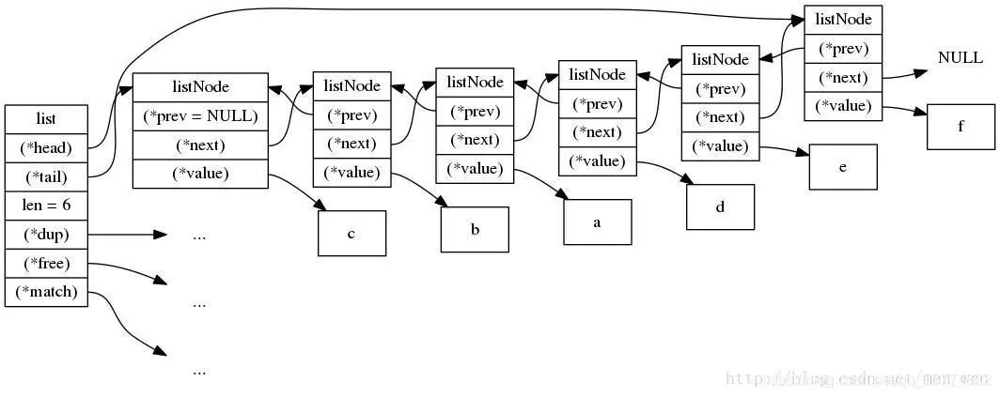
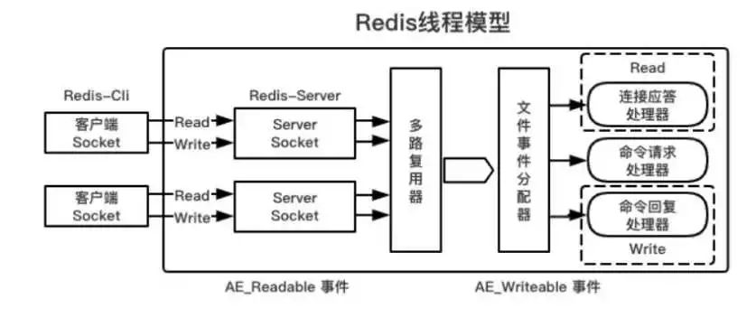
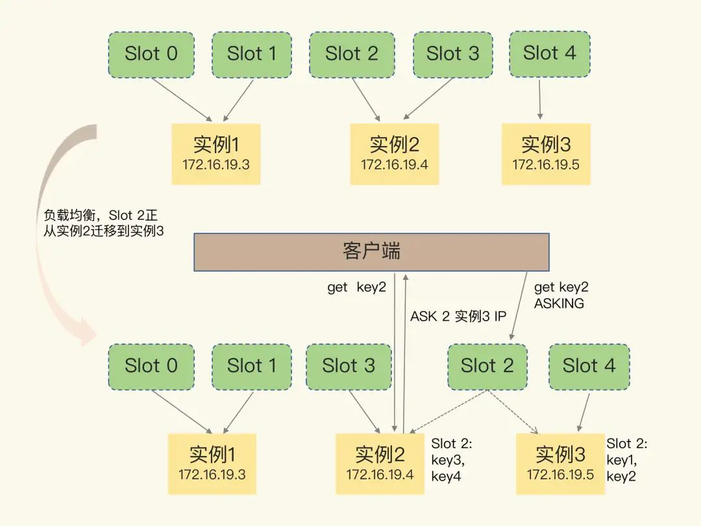

# 基础架构&redis数据结构

0写在开头

作为Key/Value键值数据库，Redis的应用非常广泛。在之前多年的工作生涯中，我也只是关注了零散的技术点，没有对Redis建立起一套整体观，但只有建立了系统整体观，才能更好地定位问题和解决问题，更重要的是应付面试。

刚好，极客时间推出了一门《Redis核心技术与实战》课程，于是我就入手了，这是我的学习总结，化繁为简，只留重点，分享与你。  

## 1 KV数据库的基本架构

为了建立系统观，最好的方法就是对其总体架构和关键模块有一个全局认知，因此这门课在最开始便给出了一个简单的KV数据库的基本架构，它包括了：

**（1）访问框架**

**（2）索引模块**

**（3）操作模块**

**（4）存储模块**


SimpleKV - 来自极客时间

为了支持更加丰富的业务场景，其实 Redis 对这些组件或者功能进行了扩展，或者说是进行了精细优化，从而满足了功能和性能等方面的要求。

下图展示了从SimpleKV到Redis的变化：


SimpleKV to Redis - 来自极客时间

上图中展示了几点变化：

一是Redis主要使用**网络框架来进行访问**，使得Redis可以作为一个独立的基础网络服务；

二是Redis数据模型中的**value类型更加丰富**，可以提供更多的接口；

三是Redis扩展了**持久化模块**，提供日志（AOF）和快照（RDB）。

四是Redis提供了**集群的支持**，使得HA和可扩展成为可能。  

## 2 Redis的数据结构

Redis之所以“快”，**一方面因为它是内存数据库**，所有操作都在内存上完成，内存的访问速度本来就快。**另一方面则是因为高效的数据结构**，使得操作键值效率较高。

总体来说，Redis使用了一个用来保存每个Key/Value的全局哈希表结构，其中Value类型又包括了支持集合类型的双向链表、压缩列表、跳表等五大底层结构。

**K/V的组织结构：全局哈希表**  

Redis使用了一个全局维度的哈希表来保存所有的Key/Value，**每个哈希表本质上都是一个数组，这个数组的每个元素称为一个哈希桶**。

哈希桶中的元素保存的并不是Value本身，而是**指向Value的指针**，如下图所示：


由数据结构的知识可以知道，**哈希表的时间复杂度为O(1)，因此它非常适合快速查找的场景**。

**哈希冲突及其解决**

当往哈希表中写入的数据变的很多时，哈希冲突问题就会出现。所谓哈希冲突，就是两个Key的哈希值正好落到了同一个哈希桶中（哈希桶的个数毕竟通常少于Key的个数）。

因此，和我们在数据结构课程学到的一致，**Redis也采用了链式哈希来解决哈希冲突**。所谓链式哈希，就是同一个哈希桶中的多个元素用一个链表来保存，它们之间依次用指针连接，如下图所示：


但是，**如果哈希表里写入的数据越来越多，哈希冲突链也会进而变得很长，**从而导致这个链条上得元素查找耗时长，效率降低。

因此，**Redis还会对哈希表做rehash操作**。所谓rehash，就是增加现有的哈希桶的数量，让逐渐增多的entry元素能够在更多的桶之间分散保存，减少单个桶中的元素数量，从而减少单个桶中的冲突。

在具体操作中，Redis会开辟一个新的哈希表（比如：大小为之前的两倍），然后把之前哈希表的数据重新映射到新的哈希表，最后释放之前的哈希表。

**_画外音：_**_是不是跟.NET中的集合类型动态扩容的思想类似？_


But，在拷贝之前哈希表数据到新哈希表时，涉及到数据量过大，有可能会造成Redis的线程阻塞，从而无法服务其他的请求。因此，**Redis采用了渐进式哈希的解决方案**。

==简单来说，所谓渐进式哈希就是不一次性把老哈希表中的数据迁移完，而是在每次处理一个请求时，从老哈希表中的第一个索引位置开始，顺带着将这个索引位置上的所有entries拷贝到新哈希表中；等下一个请求时，再顺带拷贝下一个索引位置的entries。如此，便**将一次性的大量拷贝的开销，分摊到多次处理请求的过程中，避免了耗时的操作 和 服务的中断**。==

渐进式哈希的示例流程如下图所示：


此外，渐进式rehash执行时，除了根据键值对的操作来进行数据迁移，**Redis本身还会有一个定时任务在执行rehash**，如果没有键值对操作时，这个定时任务会周期性地（例如每100ms一次）搬移一些数据到新的哈希表中，这样可以缩短整个rehash的过程。

**底层数据结构概览**

Redis的Key/Value是通过哈希表进行组织的，对于String类型，找到哈希桶就可以直接CRUD了，因此O(1)就是String类型的操作复杂度了。

但是，对于集合类型来说，还需要进一步操作。在此之前，我们先了解一下都有哪些底层数据结构。

我们所熟知的String、List、Hash、Sorted Set 和 Set其实只是Redis中数据的保存形式，而**一般所说的数据结构其实是它们的底层实现**。

如下图所示，Redis的底层数据结构一共有6种，其和常见数据类型的对应关系已经清晰地体现在了下面这张图片里（给个赞）。


Redis数据类型与底层数据结构 - 来自极客时间  

除了String类型的底层实现只有一种，即简单动态字符串。其余数据类型（List、Hash、Sorted Set和Set）都有两种底层实现，他们又被称为**集合类型**，即**一个键对应了一个集合的数据**。

**底层数据结构复杂度**

通过上面的描述，我们可以知道哈希表的复杂度是O(1)，而数组 和 双向链表 也很常见，其复杂度基本是O(N)。学习过数据结构课程的都知道，O(N)的操作效率并不高，因此Redis引入了压缩列表 和 跳表。虽然压缩列表和跳表并不为我们所熟知，但它俩却是对整数数组和双向链表所做的优化。


首先，来看压缩列表，压缩列表也类似于一个数组，但和数组不同的是，**压缩列表在表头有三个字段，分别表示列表长度、列表尾的偏移量 和 列表中entry的个数。压缩列表在表尾还有一个字段，表示列表结束**，如下图所示：  

由上图可知，在压缩列表中定位第一个和最后一个元素，只需要通过表头三个字段即可直接定位，无须遍历一次，因此查找首元素和尾元素的复杂度为O(1)。而需要查找其他元素时，就只能遍历查找了，此情景的复杂度退化为O(N)。  

然后，来看跳表。**跳表是在链表的基础之上，增加了多级索引，通过索引位置的几个跳转，实现数据的快速定位**。一个具体的查找案例，如下图所示：


从上图可以看到，这个查找过程其实是在多级索引上跳来跳去，最后定位到具体的要查找的元素。我们常听到，没有什么不是一顿火锅解决不了的事情，如果不行，那就两顿。对于跳表来说，没有什么不是增加索引解决不了的查询，如果不够快，那就再加一级索引。

当数据量非常大时，跳表的查找复杂度就是O(logN)，学过数据结构的都知道，它比O(N)效率要高。因此，我们也可以知道Sorted Set类型在数据元素较少时采用压缩列表，而一旦超过阈值，就会转为跳表结构来保证查询效率不受影响。


# Redis列表


## 1 上一篇的遗留问题

上一篇总结了一个KV数据库的基本架构 和 Redis的底层数据结构概览，重点总结了Sorted Set的两个数据结构的切换，但没有介绍List的两个数据结构的切换，因此本文试着总结一下。

这里先直接给出答案：


从上图可以看到，当List的数据满足下面两个条件时，就会使用压缩列表，否则使用双向链表。  

（1）列表对象保存的所有字符串元素的长度都小于64字节；

（2）列表对象保存的元素数量小于512个；

这两个参数其实也是可以在redis.conf中修改的：

```
`list-max-ziplist-value 64`   
`list-max-ziplist-entries 512` 

```

## 2 Redis 3.2之前的实现

由上一篇已经知道，List类型的底层实现包括了 双向链表 和 压缩列表，但这是在Redis的3.2版本之前的底层实现。而从Redis 3.2版本开始，Redis修改了List的底层实现，将压缩列表 和 双向链表 结合，我们称它为 quickList 快速列表。


从第一节的内容我们已经知道，**当创建一个新的List时，Redis会优先使用压缩列表，然后在有需要的时候，再转成双向链表**。

Redis为什么要这么设计呢？

因为，双向链表的内存占用 比 压缩列表 多，而压缩列表的设计初衷就在于 **节约内存**。众所周知，Redis之所以快的原因之一就是**它是内存数据库**，所有操作都在内存上完成，因此对于内存的占用有要求。



双向链表


压缩列表

**画外音：** 在Redis 3.2 之前，我们也可以通过命令来验证：

```
`192.168.80.100:6379> rpush testkey "edison" "andy" "leo"`  
`3`  
`192.168.80.100:6379> object encoding testkey`  
`ziplist`  
`192.168.80.100:6379> rpush testkey "wwwwwwwwwwwwwwwwwwwwwwwwwwwwwwwwwwwwwwwwwwwwwwwwwwwwwwwwwwwww"`  
`4`  
`192.168.80.100:6379> object encoding testkey`  
`linkedlist`


```

那么，压缩列表为什么占用内存少呢？

其实从上面的图和下面的源码也可以看出来，压缩列表并没有维护双向指针prev 和 next，而只是存储了上一个entry的长度 和 下一个entry的长度，通过长度来推算下一个entry在哪里。

```
`typedef struct zlentry {     压缩列表节点`  
 `unsigned int prevrawlensize, prevrawlen;     prevrawlen是前一个节点的长度，prevrawlensize是指prevrawlen的大小，有1字节和5字节两种`  
 `unsigned int lensize, len;   len为当前节点长度 lensize为编码len所需的字节大小`  
 `unsigned int headersize;    // 当前节点的header大小`  
 `unsigned char encoding; // 节点的编码方式`  
 `unsigned char *p;   // 指向节点的指针`  
`} zlentry;`

```

这是一种典型的“**时间换空间**”的方法，即牺牲读取的性能，换取极致的存储空间。由于压缩列表存储在一段连续的内存上，所以它的存储效率还是蛮高的。

但是，此种设计只适合在字段个数、值比较小的时候，一旦长度过长，压缩列表的设计（利于读取但不利于修改的初衷）会**导致修改和删除操作需要频繁的申请和释放内存，可能会导致大量的数据拷贝，拖慢Redis的整体性能**。  

因此，Redis选择了在达到阈值时，切换数据结构为双向链表。

## 3 Redis 3.2之后的实现

在Redis 3.2及之后，Redis选择了结合压缩列表 和 双向链表的优点，形成了一个新的底层实现：quicklist 快速列表。

**==快速列表是一个压缩列表组成的双向链表，每个节点使用压缩列表来保存数据**。换句话说，快速列表中保存了一个个小的压缩列表。其结构如下图所示：  ==


为了进一步节约空间，Redis 还会对压缩列表进行压缩存储（一种无损压缩算法LZF），这取决压缩深度的参数设置，我们可以选择不压缩（默认值不压缩） 也可以 选择压缩中间节点。

**画外音：** 两端节点一般不被压缩，因为当一个链表很长时，最频繁访问的就是两端的数据，根据“二八定律”，两端数据不压缩，而将中间数据压缩，从而节省空间，但又保证读取效率。

此外，对于每个压缩列表的大小，也是可以通过在redis.conf中的参数来设置的：

```
`list-max-ziplist-size -2`


```

参数可选值从-1到-5，其含义如下：

1) -5：每个quicklist节点上的ziplist大小不能超过64kb。

2) -4：每个quicklsit节点上的ziplist大小不能超过32kb。

3) -3：每个quicklsit节点上的ziplist大小不能超过16kb。

4) -2：每个quicklsit节点上的ziplist大小不能超过8kb。

5) -1：每个quicklsit节点上的ziplist大小不能超过4kb。

**画外音：** 在Redis 3.2 之后，我们也可以通过命令来验证：  

```
`192.168.80.100:6379> rpush testkey "edison" "andy" "leo"`  
`3`  
`192.168.80.100:6379> object encoding testkey`  
`quicklist`  
`192.168.80.100:6379> rpush testkey "wwwwwwwwwwwwwwwwwwwwwwwwwwwwwwwwwwwwwwwwwwwwwwwwwwwwwwwwwwwww"`  
`4`  
`192.168.80.100:6379> object encoding testkey`  
`quicklist`


```

综述，**快速列表的本质其实是对压缩列表的一次封装，使用小块的压缩列表来组织，既可以保证内存占用较小，也可以保证操作性能**。

本文总结了Redis的List类型在何时使用压缩列表，何时使用双向链表，以及快速列表的基本概念。当然，更多的内容还是需要自行去搜索学习，意犹未尽的童鞋也可以去分析源码。最后，如果你对其他集合类型也有此类问题，你可以参考下面附录中的内容，而至于Why，则可以自行百度搜索了解。

Anyway，对于Redis集合类型的底层思想采用了两种数据结构的设计思想是值得我们学习借鉴的，它其实充分体现了软件设计中的Tradeoff（权衡）思想。对于Redis来说，即在主体目标是保证性能的大约束前提下，权衡多方因素如操作时间和空间占用，以达到较为稳定的运行表现。对于软件设计来说，也需要在时间 vs 空间，新技术 vs 老技术，优雅 vs 效率，轻度设计 vs 重度设计等之间做权衡，一个问题总会有多种解决方案可以实现，在特定的时间段，永远没有最完美的设计，只有较合适的设计。在实际中，它可能结合了多种因素的考虑，不断地去粗取精，迭代为更好的设计。


# Redis IO

## 1 Redis的单线程认知

**一个基本事实**

我们通常说的Redis单线程，主要是指：**Redis 6.0 之前版本的 网络I/O 和 键值对读写 是由一个线程来完成的。** 

除了网络I/O  和 键值对读写 之外的其他功能，大多都是由额外的线程执行的。比如：持久化、异步删除、集群数据同步 等操作。

> **Note：** Redis 6.0之后对网络I/O改为使用多线程，但是，仍然使用单线程处理 键值对的读写操作。

**Why 单线程？**

因为 **多线程开发会不可避免的带来并发控制的问题**。

系统中通常会存在被多线程同时访问的共享资源，比如一个共享的数据结构。而当多个线程要修改这个共享资源的时候，为了保证共享资源的正确性，就需要有额外的机制进行保证。  

以Redis为例，它提供了List数据类型，我们可以拿它来做队列，入队（LPOP）和出队（LPUSH）就是两个基本操作。如果采用多线程设计，那么当两个线程同一时间一个操作LPOP一个操作LPUSH，为了保证队列长度的正确性，Redis就需要保证串行执行。而要保证串行执行，可能就需要一些额外的开销，比如我们常见的加锁。但在Redis的使用场景下，简单地加锁可能并不能得到理想的效果，会导致大部分线程在等待获取互斥锁，并行变串行，从而降低吞吐率。此外，多线程开发一般也还会引入同步源于来保护共享资源的并发访问，这也会降低系统代码的易调试性和可维护性。  

综上所述，为了避免这些问题，尽可能保证简单高效，Redis直接采用了单线程模式。  

## 2 Redis的单线程效率  

我们都知道，Redis公开出来的数据：Redis使用单线程也可以达到每秒10万级的处理能力。

> 前提条件：在一定的服务器配置下才能达到。

**Why 这么高效？**

核心原因有两个：

（1）**Redis的大部分操作都在内存上完成 + 采用了高效的数据结构**

> eg. 哈希表、跳表 等。如果你对数据结构还不熟悉，可以阅读 Redis学习总结（1）。

（2）**Redis采用了多路复用机制**，使其在网络I/O操作中能够并发处理大量的客户端请求，从而实现高吞吐率。  



其中，原因（2）是Redis单线程高效率的重点，**它避免了accept() 和 send()/recv() 潜在的网络I/O操作的阻塞点**。  

如果不想了解细节，那么知道这几个核心的原因就够了。

而要理解多路复用模型的优势，就得了解一下基本的IO模型。

## 3 基本的IO模型  

在网络处理程序中，都会存在一些潜在的阻塞点，比如：常见服务端Socket程序中的accept() 和 recv() 函数。比如服务端监听到一个客户端有连接请求，但是一直没有能够成功建立连接，就会阻塞在accept()函数中，导致其他客户端无法和服务端建立连接，这就可能会导致服务端的线程阻塞。

那么，有没有不阻塞的IO模型？

别急，我们从阻塞IO模型看起。我们也不看什么原理，举例子-买火车票场景来理解。


**阻塞式IO模型**  

老周去火车站买票，排队三天买到一张退票。  
开销：在车站吃喝拉撒睡 3天，其他事一件没干。

**非阻塞式IO**模型****  

老周去火车站买票，隔12小时去火车站问有没有退票，三天后买到一张票。

开销：往返车站6次，路上6小时，其他时间做了好多事。

**IO多路复用**模型****  

对于IO多路复用，不同的操作系统平台有不同的系统调用实现，主要以select/poll 和 epoll 最为人知。

（1）select/poll  

老周去火车站买票，委托黄牛，然后每隔6小时电话黄牛询问，黄牛三天内买到票，然后老李去火车站交钱领票。  
开销：往返车站2次，路上2小时，黄牛手续费100元，打电话17次。

（2）epoll

老周去火车站买票，委托黄牛，黄牛买到后即通知老李去领，然后老李去火车站交钱领票。  
开销：往返车站2次，路上2小时，黄牛手续费100元，无需打电话。

**信号驱动IO**模型****  

老周去火车站买票，给售票员留下电话，有票后，售票员电话通知老李，然后老李去火车站交钱领票。  
开销：往返车站2次，路上2小时，免黄牛费100元，无需打电话。

**异步IO**模型****  

老周去火车站买票，给售票员留下电话，有票后，售票员电话通知老李并快递送票上门。  
开销：往返车站1次，路上1小时，免黄牛费100元，无需打电话。  

**Redis IO模型**

Redis在设计中基于Linux的IO多路复用机制实现了自己的IO模型，如下图所示：


上图中的多个FD就是多个套接字（Socket），Redis的网络框架通过调用epoll让内核监听这些套接字。此时，Redis线程不会阻塞在某一个特定的监听 或 已连接的套接字上。因此，**Redis可以同时和多个客户端连接并处理请求，从而提升并发性**。  

正如刚刚的例子中提到，黄牛买到票后会通知老周去领票，为了在请求到达时能够通知到Redis线程，epoll提供了基于事件的回调机制，即针对不同事件的发生，调用响应的处理函数。

> **Note：** 比如 连接请求对应Accept事件，读取数据对应 Read事件。Redis会分别对这两个事件注册 accept 和 get 回调函数。

这些事件会被放进一个事件队列，Redis单线程会对该队列不断地进行处理：如果Linux内核监听到有实际请求时，就会触发对应事件，然后Linux内核就会回调Redis对应的函数开始处理。

因此，Redis不用一直阻塞等待是否有实际请求发生，避免CPU资源浪费，进而提高吞吐率。  

> **Note：** IO 模型的演进，其实就是时代的变化，倒逼着操作系统将更多的功能加到自己的内核。


# Redis持久化


## 1 Redis的持久化机制

一旦Redis服务器宕机，内存中的数据会全部丢失**。** 如果单靠从后端DB中恢复，一来会给DB带来巨大的压力，二来从DB拉取数据性能较低会导致应用程序响应变慢。因此，Redis的数据持久化很重要，而且不能从后端DB中恢复。


Redis提供的数据持久化机制只要包括两个：

（1）**AOF（Append Only File）日志**

（2）**RDB 快照**  

在Redis 4.0之后，新增了**混合持久化**机制，它将AOF 和 RDB的优点结合了起来。

## 2 AOF日志

所谓AOF，即Append Only File，意思是只会追加写的文件。在Redis中，AOF日志最大的特点就是**写后日志**，即Redis执行命令将数据写入内存后才记录日志。

> **延伸：** MySQL使用的是WAL日志，即Write Ahead Log 写前日志。例如redo log，它记录的是修改后的数据。不过，AOF却是记录的命令，这些命令是以文本形式保存的。

**AOF中存了什么东西？**

刚刚说到，AOF记录的是Redis接收的命令，这些命令都是以文本形式保存的。

例如，下图展示了一个AOF日志的内容：  


**解读：** "\*3" 表示命令有三个部分组成，"3 set"表示这部分有三个字节，即"set"命令有三个字节。同理，后续"7 testkey"表示该部分有七个字节，即"testkey"命令有七个字节。第三部分同理，不再赘述。

**AOF的优点是什么？**

Redis在向AOF中记录日志时，为了避免额外的开销，不会对写入的命令进行语法检查。因此，如果采用先写日志方式，那么日志中就有可能会记录错误的命令，导致Redis在使用AOF恢复数据的时候，可能会出错。

因此，AOF采用后写日志，只有命令成功执行之后才会被记录到日志中。否则，系统就会向客户端报错。所以，**AOF的优点主要就在于可以避免记录错误命令的情况****，并且由于是写后日志，因此****它也不会阻塞当前的写操作**。  

**AOF的缺点是什么？**

AOF有两个潜在的风险点：

一是如果将Redis作为DB用的话（当然一般情况很少这样选型），如果某个命令因为服务器宕机没有记入日志，那么Redis无法用AOF日志进行数据恢复。换句话说，**Redis接收的****命令及其相应数据有丢失的风险**。

二是如果在写AOF日志到磁盘时磁盘写压力过大，会导致写盘很慢，由于AOF日志也是在主线程中执行，因此可能会导致后续的操作无法执行。换句话说，**AOF日志可能会给下一个操作带来阻塞的风险**。

**如何规避AOF的潜在风险？**

从刚刚的介绍中可以了解到，AOF的两个潜在的风险点都和AOF写回磁盘的时机有关，换句话说，要想规避风险，只要能**控制一个写命令执行完成后AOF日志写回磁盘的时机** 就能解决。

==在Redis中，AOF机制提供了三个配置项供我们选择：==

（1）**Always**，即同步写回：每个命令执行完，立马同步将日志写到磁盘；

_画外音>此选项可以做到基本不丢数据，但是性能较差，会影响主线程性能。_

（2）**Everysec**，即每秒写回：每个命令执行完，只是先将日志写到AOF文件的内存缓冲区，每隔一秒钟再把缓冲区中的内容写到磁盘；

_画外音>此选项可以减少对主线程性能的影响，但是如果发生宕机，仍然存在命令操作丢失的风险。_

（3）**No**，即不主动控制何时写回，由操作系统来控制写回：每个命令执行完，先将日志写到AOF文件的内存缓冲区，由操作系统决定何时将缓冲区的内容写回磁盘。

_画外音>此选项性能较好，但回收策略就变成了黑盒子，且宕机时可能会出现数据丢失较多的风险。_

这三种写回时机策略的优缺点总结在下图中：  


可以看到，这三种策略在可靠性上是从高到低，而在性能上则是从低到高。这和关系型数据库的隔离级别项是类似的，安全性越高，则性能越低。

一般情况下，**允许数据有一点丢失，又希望性能还不错的话，请选择****Everysec策略**。这也是系统设计中最常见的原则-trade off（权衡取舍），我们需要在多个指标之间做取舍。  

**如何保持Redis的高性能？**

我们都知道Redis具有较高的性能，那么，对于AOF日志来说，它是否有可能拖累Redis性能？答案是可能的，如果写入的日志文件过大，就有可能拖累性能。

> **Note：** 日志文件过大不仅对写回磁盘时造成性能影响，在使用日志进行故障恢复时也有影响。因为，Redis的单线程设计，日志中的命令只能一条一条按顺序执行，“重放”过程会变慢。

==那么，日志文件过大该怎么破？==

**AOF提供了****重写机制**，即如果AOF需要一次记录的命令太多，Redis会进行重写：Redis根据现状创建一个新的AOF文件，它会读取所有键值对，然后对每一个键值对用一条命令记录它的写入。  

==换句话说，**重写机制就是在给AOF日志文件做瘦身，具体实现其实就是将旧日志中的多条命令换成一条新的命令**，即“多变一”。下图就展示了这样的一个实例：  ==


从上图中可以看出，重写后的日志较旧日志节省了好几条命令的空间，这对于有可能会被修改成百上千次的key/value来说，能节省的空间当然就更大了。  

其次，AOF的重写机制是由后台子进程（bgrewriteaof）来执行的，它不会影响主线程，进而避免阻塞主线程导致性能下降。

AOF的非阻塞重写过程如下图所示：  


从上图中可以看出，当AOF重写的时候Redis会先fork出一个后台子进程，它会执行一次内存拷贝用于接下来的重写。然后，Redis会使用两个日志（正在使用的AOF日志 和 新的AOF重写日志）来保证在重写过程中，新写入的数据不会丢失。  

用蒋德钧老师的八个字概括AOF重写的过程：“**一个拷贝，两处日志**”。  

==**AOF重写何时被触发？**==

在Redis中，有两个配置项在控制AOF重写的触发时机。

如果AOF文件大小同时超出下面这两个配置项时，会自动触发AOF重写。

```
`auto-aof-rewrite-min-size:`   
`表示运行AOF重写时文件的最小大小，默认为64MB`  
`auto-aof-rewrite-percentage: `  
`表示比上次重写后的日志文件体量增加了多少百分比，默认为100%`

```

## 3 RDB内存快照  

RDB（Redis DataBase）内存快照是Redis提供的第二个持久化机制，它既能避免数据丢失，又能更快地恢复数据。

所谓内存快照，就是指内存中的数据在某一个时刻的状态记录，它类似于照片。在Redis中，这些照片是就后缀为RDB的文件。

**与AOF的对比**

==与AOF相比，RDB记录的是某一个时刻的数据（二进制的形式）而不是操作命令，因此，在做数据恢复的时候，我们可以直接将RDB文件读入内存就可以完成恢复。==

这样一来，就可以避免AOF的缺点：需要按照顺序逐一重新执行操作命令所带来的低效的性能问题。

_画外音>但是内存快照也并不是最优选项。_

**全量快照与增量快照**

当Redis中数据并不多时，我们可以直接做RDB的全量快照，这样一次性就记录了所有的数据，一个都不少。

但是，当数据量越来越大之后，做全量快照的过程中写入磁盘的时间会逐渐增大，全量数据越多，RDB文件就会越大，往磁盘上写数据的时间开销也就越大。

因为，Redis的单线程模型（这里仅探讨6.0之前的Redis单线程版本）决定了开发者需要避免阻塞主线程的所有操作。当全量数据越大，RDB快照的写入操作就越有概率会阻塞主线程。

因此，Redis也提供了增量快照，即一次全量快照之后，后续的快照只需要对修改的数据进行快照记录，就可以避免每次全量快照的开销。  

**RDB文件如何生成？**

Redis提供了两个命令 save 和 bgsave 来生成RDB文件，其中：  

（1）save 在主线程上执行，会导致主线程阻塞；（不建议使用）  

（2）bgsave 会在一个后台子进程中专门用于写入RBD文件，它不会引起主线程阻塞；（它也是Redis RDB生成的**默认配置**）

_画外音>为什么是子进程而不是子线程？因为Redis就是一个进程，而且是一个只有单线程的进程，一般也将其单线程称为主线程。_

下图展示了bgsave的执行过程：


因此，我们可以通过bgsave命令来做全量快照操作。  

**RDB做快照时数据能修改吗？**

刚刚提到，RDB做快照和拍照类似，当你拍照的时候，也是希望在那一瞬间不希望被拍的人乱动。数据，也是同理。

但是，如果在给数据做快照时，数据不能被修改，那无疑等同于停服，会给业务造成一定影响。

幸运的是，Redis早已经帮我们想好了这个问题，**Redis借助了OS提供的****写时复制（Copy-On-Write, COW）技术****，支持在执行RDB快照生成的期间，正常处理写操作**。

下面通过一幅图来介绍COW技术：


总结一下，Redis支持快照期正常处理写操作大概有两个核心步骤：  

（1）如果主线程是读取操作，那么主线程和bgsave子进程互不影响；

（2）如果主线程是修改操作，那么主线程打算修改一个key/value时，这个数据就会生成一个副本，主线程会对这个副本进行修改（而不是原来的位置）。同时，bgsave子进程可以把原来位置的数据继续写入RDB文件。

有了这两个核心步骤，Redis在生成RBD文件时既保证了数据完整性，同时又允许对数据做修改，还避免了对正常业务的影响。

**多久做一次快照合适？**

和拍照类似，“连拍”可以抓住某一时刻连续的单个场景。对数据而言，也是如此，如果快照的间隔变短，那么丢失的数据量也不会很多。

那么，问题来了，多久做一次RDB快照比较合适？

首先，我们需要有一个基本认知：==**虽然bgsave不会阻塞主线程，但是如果频繁地执行全量快照，也会带来一定的性能问题**。==

（1）频繁执行全量快照，磁盘压力会变大！因为，多个快照会竞争优先的磁盘带宽，前一个快照还没有做完，后一个又开始了...  

（2）虽然bgsave本身不会阻塞主线程，但是fork这个bgsave的创建过程会阻塞主线程！

其次，我们在一次全量快照之后即可做多次增量快照，因此这里说的快照频率一般情况下是指增量快照的间隔时间。

最后，在增量快照操作的间隔期间，Redis需要记住哪些数据被修改了，这也会带来额外的空间开销问题，如下图所示：


因此，虽然RDB较AOF具有恢复速度快的优点，但是快照的频率不太好控制，因此如果频率太低，两次快照之间可能会有较多数据丢失的风险；如果频率太高，会产生较多额外的开销。  

## ！4 混合持久化  

在Redis 4.0之后，新增了**混合持久化**机制，它将AOF 和 RDB的优点结合了起来。

> **Note：** 
>
> Redis 4.0通过以下配置即可开启混合持久化（前提条件：先开启AOF）：
>
> \# aof‐use‐rdb‐preamble yes
>
> Redis 5.0及之后已经默认开启了混合持久化，使用以下命令可以验证：
>
> \> config get aof-use-rdb-preamble  
> 1) "aof-use-rdb-preamble"  
> 2) "yes"

简单来说，它的执行策略包括以下两个核心步骤：

（1）**RDB内存快照以一定的频率执行**；

（2）**在两次快照之间使用AOF记录所有的修改命令操作**；

混合持久化的执行过程也可以用一幅图展现：


那么，它所具有的优势也就体现了出来：  

（1）不用频繁地生成快照，避免频繁fork子进程操作对主线程的影响；

（2）AOF日志只用于两次快照间的命令记录，不需记录所有操作，即避免了日志文件过大，也避免了重写的开销。

如此，它就有点“鱼和熊掌兼得”的味道，即**利用了RDB文件的快速恢复性 + AOF只记录操作命令的简单性**。它也成为了Redis 5.0及之后版本的默认持久化选项。


# Redis主从


## 1 Redis的数据同步机制概览

对于Redis来说，其高可用性是由两方面来保证的：

一方面是**数据尽量少丢失**，前一篇总结推文提到的AOF和RDB实现了。

另一方面是**服务尽量少中断**，Redis则是靠增加副本冗余量即同一份数据保存在多个实例上来实现的。

对于多副本模式，Redis和关系型数据库一样，提供了**主从库模式**来保证数据副本的一致性。主从库之间采用的是**读写分离**的方式，即读操作可以被主库/从库接收，但是写操作只能先被主库接收执行然后才由主库同步给从库。


那么问题来了，为啥要用读写分离实现？

因为，如果每次的修改请求都发到不同的实例上，要保证数据的一致性，**就需要涉及到加锁和协商是否完成修改等操作，这会带来****很大的性能开销**。而如果所有的修改都只在主库上进行，就无需协调三个实例，只需要同步给从库，进而保持数据一致性。

## 2 Redis主从库同步流程详解

假设现在我们有两个实例，分别是主库实例1（172.16.19.3）和实例2（172.16.19.5），我们的目标就是让实例2成为实例1的从库，并进行数据同步。

**第一次同步过程**

在实战中，只需要实例2的shell中执行以下命令就可以将实例2作为实例1的从库，并从实例1上复制数据。  

```
`replicaof 172.16.19.3 6369`  

```

虽然就这一个命令真简单，而**在这背后，Redis偷偷摸摸地进行了三个阶段的操作**，如下图所示：


**阶段1：** 从库向主库发送==psync命令==，表示进行数据同步。该命令格式如下所示：

```
`# 命令格式：psync runID offset`  
`# psync ? -1 `  
`# 其中？代表从库并不知道主库的runID，-1表示第一次复制`  

```

主库收到psync命令确认后，会向从库发送一个FULLERSYNC的响应命令，并带上主库的runID和目前的复制进度offset。

```
`# 命令格式：FULLERSYNC runID offset`  
`# FULLERSYNC代表全量复制，一般用于第一次数据同步`  

```

**阶段2：** 主库通过发送RDB文件给从库，从库收到后在本地完成数据加载。  

需要注意的点：

（1）主库会首先执行一次bgsave（bgsave不会阻塞主线程）生成RDB文件，然后才发送给从库。

（2）从库会首先清空已有的数据，然后再加载RDB数据，因为在同步之前可能保存了其他数据，不清除的话可能会数据不一致。

（3）主库在同步数据给从库中产生的写操作会用专门的replication buffer记录，然后在第三个阶段同步过去。

**阶段3：** 主库将第二阶段执行过程收到的新的写操作命令，同步给从库。

在实现中，主库会将新收到的写操作放到**replication buffer**中记录下来，然后将这些操作修改发给从库，从库收到后再重新执行一遍这些操作。  

以上三个阶段完成之后，主从库就算完成了一次数据同步。

**为什么用RDB不用AOF？**

Redis主库在向从库同步数据时使用的RDB文件，那么问题来了：

AOF记录的操作命令更全，相比RDB丢失的数据更少，**为什么主库用RDB不用AOF呢？**

一来RDB读取速度相对较快，从库可以快速完成RDB的读取，然后再去消费replication buffer的数据完成一次同步。而如果使用AOF，其体积大读取速度慢，且需要更大空间的replication buffer，对于一个主节点多个从节点来说的话，内存的占用就会更大；

二来AOF是Append追加模式，同时读写需要考虑并发安全问题，并且AOF是文本文件，体积较大，浪费网络带宽。

**主从级联模式降低主库压力**

主从库同步过程中，主库需要完成两个耗时的操作：生成RDB文件 和 传输RDB文件。现实场景中，从库一般都会有多个，如果都要和主库同步的话，会造成主库的性能压力 和 网络压力。

> 因为主库需要fork子进程来生成RDB文件，这个fork操作是会阻塞主线程处理正常请求的，虽然后续的bgsave过程不会阻塞主线程。
>
> 此外，传输RDB文件也会占用主库服务器的网络带宽。

**Redis提供了主从级联模式，也就是所谓的“主-从-从”模式。**   

在主-从-从模式下，新增的从库可以设置从 集群中的某一个从库 中进行数据同步，从而避免每次都从主库进行同步，降低主库的资源消耗，保证系统的稳定性。

比如，在实际中通常会手动选择一个 内存配置较高的 从库 来作为同步源，其他新的从库加入后可以从这个从库中同步，建立主从关系。例如，下面的命令就可以实现新增从库和某一个从库建立主从关系：

```
`replicaof 所选从库ID 6379`  

```

具体的示意图如下图所示：


**全量同步后的增量同步**

主从库通过FULLERSYNC进行全量复制同步 + 主从级联模式分担主库压力 之后，Redis的主从库之间就会一直维护一个长连接来进行增量的命令操作同步，这个过程又被称之为“**基于长连接的命令传播**”。

> 为何选择长连接？因为可以避免频繁建立连接的开销。

虽然长连接很方便，但也存在一个风险点：**主从库网络断了 或 阻塞了**。这个风险可能导致的问题就是：主从库之间数据无法保持一致，**客户端可能从读库读到过时的数据**。

当然，Redis早就已经为我们想好了解决方案，不过得分为两个版本来看：

**Redis 2.8之前**，如果出现了网络闪断，**Redis主从库间会重新进行一次全量复制**。当然，全量复制就意味着有很大的开销。  

**Redis 2.8之后**，如果出现了网络闪断，**Redis主从库间会采用增量复制的方式继续同****步**。可以看到，增量复制肯定比全量复制开销要小得多。

这里的增量复制的核心要点就在于Redis引入了**repl\_backlog\_buffer**缓冲区，现在我们就来看看这个repl\_backlog\_buffer到底是个啥东东。

==repl\_backlog\_buffer是一个**环形缓冲区**，**主库会记录自己写到的位置，从库则会记录自己已经读到的位置**。下图展示了repl\_backlog\_buffer的示意图：==


可以看到，正常情况下，主从库的偏移量基本相等。随着主库不断接收新的写操作，它在缓冲区中的写位置会逐步偏离起始位置。对主库来说，对应的偏移量就是 master\_repl\_offset，只要主库的新写操作越多，这个值也就越大。同理，从库在复制完写操作命令后，它在缓冲区中的读位置也开始逐步偏移起始位置。对从库来说，其对应的已复制偏移量就是 slave\_repl\_offset。

当网络闪断异常情况下，主库可能会接收到新的写操作命令，因此，可以看出，主库的偏移量master\_repl\_offset > 从库的偏移量slave\_repl\_offset。那么，此时就只需要**把 master\_repl\_offset 和 slave\_repl\_offset 之间的命令操作同步给从库**就ok了。

综上所述，增量同步的过程整体如下：  


**repl\_backlog\_buffer扩展**

在增量复制过程中，需要注意的点：repl\_backlog\_buffer是一个环形缓冲区，**在缓冲区被写满了之后，主库再次写入时就会覆盖掉之前写入的操****作**。

那么问题来了，如果从库读取的速度很慢，就有可能出现从库读取到了不一致的数据。

如何解决？

Redis提供了一个 **r****epl\_backlog\_size** 的参数，它与缓冲区的空间大小紧密相关。**在实际中，一般其设置为：repl\_backlog\_size = 缓冲区空间大小 \* 2**，这样可以降低由于读库消费速度慢导致的数据不一致。

> 缓冲空间的计算公式是：
>
> 缓冲空间大小 = 主库写入命令速度 \* 操作大小 - 主从库间网络传输命令速度 \* 操作大小

But，如果并发请求量特别大，两倍的缓冲区空间都不够用，主从库仍然存在不一致的风险，那么此时，可能需要根据Redis所在服务器的性能指标（主要是内存资源）再增加一些 repl\_backlog\_size 值。

本文总结了Redis主从库读写分离模式数据同步的总体机制 及 基本流程，了解了全量同步 和 增量同步的过程，涉及了 主从级联模式 和 repl\_backlog\_buffer缓冲区。

# Redis哨兵

## 1 Redis的哨兵机制概览

对于Redis来说，主从库模式下，如果主库发生故障了，就会影响到从库的同步，对于系统服务来说是不可接受的。


那么问题来了，如何解决主库挂掉的情况？

Redis在主从集群中为我们提供了 **哨兵机制**，它有效实现了主从库自动切换，避免了从库无法正常同步的问题。

**啥是哨兵？**

**哨兵（Sentinel）是一个****运行在特殊模式下的Redis进程**，主从库实例运行的同时，它也在运行。


我们可以通过如下命令启动哨兵实例：

```
`# 第一种方式`  
`redis-sentinel path/to/sentinel.conf`  
`# 第二种方式`  
`redis-server path/to/sentinel.conf --sentinel`
```

以上两种方式，都必须指定一个哨兵的配置文件sentinel.conf，如果不指定，将无法启动sentinel。哨兵默认监听26379端口，所以运行前必须确定该端口没有被别的进程占用，当然你也可以改为监听其他端口。

关于sentinel.conf可以自行百度搜索，这里不再赘述。

**哨兵机制基本流程**  

对于哨兵来说，它的职责主要有三个：**监控、选主（选择主库）和 通知**。


**Step1** 哨兵进程在运行时会定期向所有的主从库发送ping命令，检测它们的健康状态。如果某个从库没有在规定时间响应，哨兵就将其标记为“下线状态”，而如果主库没有在规定时间响应，哨兵就会**判定主库下线**，从而启动第二步。

**Step2** 哨兵进程在判定主库下线之后，就会开始**自动切换主库**的流程，哨兵会按照一定的规则选择一个从库作为新主库。

**Step3** 哨兵进程会将新主库的信息**通给其他从库和客户端**，让这些从库执行replicaof命令，和新主库建立连接 和 进行数据复制。  

在这三个步骤中，如何判定主库下线 和 如何选择主库 比较复杂，下面我们就来学习下。

**哨兵如何判断主库下线？**  

哨兵判断主库下线的方式有 **主观下线 和 客观下线** 两种。

所谓主观下线，就是哨兵使用ping命令进行健康监测，如果响应超时，就会将其标记为“主观下线”。如果是从库，检测一般可能就到此为止了。如果是主库，哨兵会比较谨慎的认为，是不是自己的主观误判了，还会对其进行一次客观下线的判断。

> **Note：** 所谓误判，就是主库实际并没有下线，但是哨兵误以为它下线了。误判一般会发生在集群网络压力较大、网络拥塞，或者是主库本身压力较大的情况下。

所谓客观下线，就是哨兵集群多个实例一起来判断。具体来说就是，只有大多数的哨兵都判断主库已经主观下线了，主库才会被标记为客观下线。其判断原则就是少数服从多数，这也是为何分布式系统都会要求部署奇数个实例的原因，方便投票决策。


**哨兵如何选出新的主库？**  

哨兵选择新主库的过程可以概括为“**筛选+打分**”，大体上来看有以下两个步骤：

**Step1** 哨兵会从多个从库（假设从库实例数量>=2）中按照**一定的筛选条件**，把不符合条件的从库过滤掉。

**Step2** 哨兵再按照**一定的规则**，给剩下的从库逐个打分，最终将得分最高的从库选为新主库。

下图形象地展示了上面的过程：


了解了基本过程，那么问题来了：  

一定的筛选条件都有哪些呢？一定的打分规则又是哪些呢？  

首先，筛选条件如下：

**（1）从库当前的网络连接状况**

**（2）从库之前的网络连接状况**

**（3）从库与主库之间的断联次数是否超过了阈值**

可以使用Redis哨兵的配置项 down-after-millseconds，它指的是我们认定主从库断联的最大连接超时时间，如果在 down-after-millseconds 时间内主从节点没有联系上，那么就认为主从节点断联了。而实践中，一般还会判断主从节点断联的次数是否超过了N次（比如10次），如果超过了N次，就说明某个从库的网络状况的确是不好，不适合作为新主库。

> **Note：** 要保证所有哨兵实例的配置是一致的，尤其是主观下线的判断值 down-after-milliseconds。否则，可能导致哨兵集群一直没有对有故障的主库形成共识，也就有可能没有及时切换主库，最终的结果就是集群服务不稳定。

其次，打分规则如下，共计三轮打分，其中某一轮能选出得分最高的从库，那么它就会变成主库，不会全部三轮执行完。

**（1）优先级最高的从库得分高**

可以通过配置项 slave-priority 给配置不同的从库设置不同的优先级，实践中一般会确保高配置的从库优先成为主库。  

**（2）和旧主库同步程度最接近的从库得分高**

如上一篇所述，从库的 slave\_repl\_offset 偏移量 一般会等于或接近于 主库的 master\_repl\_offset 偏移量，而如果某个从库的这个值最接近于主库的，那么就可以被选为新主库。

**（3）ID号小的从库得分高**

如果前两轮都没有选出来，那么可能有多个从库（一般>=2）评分打得难分难舍，那么第三轮就比较直接暴力了，直接选择ID号最小的为新主库。  

**哨兵实例个数建议**  

为了减低误判率，在实践中通常会部署多个哨兵实例组成一个集群，**一般情况下，都会部署3个哨兵实例**。

如果希望再次提升判断准确度，那么建议使用5个哨兵实例。

==在确定好新主库后，多个哨兵实例会进行投票仲裁，选举一个 Leader 出来，由它负责实际的主从切换，即由它来完成新主库的选择以及通知从库与客户端。==

> **Note：** 哨兵成为Leader的必要条件：
>
> a：获得哨兵实例中半数以上的票数；
>
> b：得到的票数要达到哨兵配置文件中的quorum阀值。

## 2 Redis哨兵集群概览  

为了实现主从切换，Redis引入了哨兵。而为了避免哨兵故障后无法进行主从切换 和 减少误判率，Redis又引入了哨兵集群。

==哨兵集群需要一些重要的核心机制来支撑它的运行，这些核心机制包括：==

**（1）基于pub/sub机制的哨兵集群组成过程**

**（2）基于INFO命令的主从列表（帮助哨兵和从库建立连接）**

**（3）基于哨兵自身的pub/sub功能（帮助哨兵和客户端之间的事件通知）**

**基于pub/sub机制的哨兵集群组成过程**

==在配置哨兵集群时，哨兵之间其实并不知道彼此，而哨兵之间可以互相发现其实是归功于pub/sub（发布/订阅）机制。==

简单说来，就是当一个哨兵和主库建立了连接（如下面所示的配置项）后，就可以向主库发布一个自己的连接信息（如IP和端口），也可以从主从订阅一个其他哨兵的连接信息

```
`# sentinel monitor <master-name> <ip> <redis-port> <quorum>`  
`sentinel monitor mymaster 192.168.220.20 6379 1`
```

当所有哨兵都通过主库发布和订阅之后，哨兵集群之间就完成了互相发现的过程。

在实现中，Redis是通过**频道**的形式，对这些消息进行分门别类的管理。和MQ的topic类似，只有订阅了同一个频道的应用，才能通过发布的消息进行信息交换。

在Redis主从集群中，主库上有一个名为==“\_\_sentinel\_\_:hello”==的频道，不同哨兵就是通过它来相互发现，实现互相通信的。

具体的流程可以从下图中展示出来：


**基于INFO命令的主从列表**

哨兵除了彼此之间建立起连接形成集群外，还需要和从库建立连接，因为哨兵还需要对从库进行心跳检测。

那么问题来了，哨兵如何和从库建立连接呢？

答案是：**哨兵向主库发送 INFO 命令来完成的**。主库在接收到哨兵的INFO命令后会返回从库列表，接下来哨兵就可以从从库列表中获得连接信息从而和从库建立起连接。

整个过程如下图所示：


**基于pub/sub的客户端通知机制**

在实际使用中，哨兵还需要将主从切换后的新主库信息 以及 主从切换过程中的信息 发送给客户端。

前面提到，哨兵本质上是一个运行在特定模式下的Redis实例，这个特定模式指的是哨兵不服务具体的请求，只执行监控、选主 和 通知的任务。**每个哨兵也是有pub/sub机制的，客户端可以从哨兵提供的多个频道中订阅消息，从而获取一些关键信息**，如新主库 和 主从切换的进度 等信息。

下图展示了一些关键的事件频道：  


有了这些事件通知，客户端不仅可以在主从切换后得到新主库的连接信息，还可以监控到主从库切换过程中发生的各个重要事件。这样，客户端就可以知道主从切换进行到哪一步了，有助于了解切换进度。


# Redis集群

## 1 Redis的纵向扩展与横向扩展

对于Redis来说，其扩展性也可以分为两类：纵向扩展（scalce up） 与 横向扩展（scale out）。


**纵向扩展**

所谓纵向扩展，就是给单台Redis实例升级资源配置，如CPU、内存、磁盘等。  

其优点在于简单+直接，但缺点也很明显：

首先，单台Redis实例的数据量增大后，如果使用RDB持久化，**在fork子进程时可能会导致主线程的阻塞（因为数据量很大）**。  

其次，纵向扩展也会**受到硬件和成本的限制**，你没办法扩展到无穷大吧？

**横向扩展**

所想横向扩展，就是增加Redis实例的个数，如原来使用一个Redis实例，现在使用三个。

其优点刚好就破解了纵向扩展的缺点，**不用担心硬件和成本的限制，只需要增加实例个数就可以了**。  

**在面向百万、千万级别的用户规模时，横向扩展的 Redis 切片集群会是一个好的选择**。

## 2 Redis Cluster切片集群机制

在 Redis 3.0 之前，Redis 官方并没有提供切片集群方案，但是，其实当时业界已经有了一些切片集群的方案。从 Redis 3.0 开始，官方提供了一个名为 **Redis Cluster** 的方案，用于实现切片集群，进而帮助我们实现横向扩展。

使用Redis Cluster不难，我们需要了解其实现机制，帮助我们理解其思想。总体来说，它主要解决了引入切片之后的两个核心问题：

（1）数据切片后，在多个实例之间如何分布？

（2）客户端怎么确定想要访问的数据在哪个实例上？

下面一个一个来看Redis Cluster是怎么解决的。

**数据分片和实例的对应分布关系**

Redis Cluster 方案采用**哈希槽（Hash Slot）**，来处理数据和实例之间的映射关系。

在 Redis Cluster 方案中，一个切片集群共有 **16384 个**哈希槽，这些哈希槽类似于数据分区，每个键值对都会根据它的 key，被映射到一个哈希槽中。


==可以看出，哈希槽其实就是一个抽象层，将key的分布与具体的Redis实例解耦，有利于Redis数据的均衡分布。==

哈希槽的映射过程主要有两步：  

**Step1.**根据键值对的 key，按照CRC16 算法计算一个 16 bit 的值；

**Step2.**再用这个 16bit 值对 16384 取模，得到 0~16383 范围内的模数，每个模数代表一个相应编号的哈希槽。

那么问题来了，哈希槽又是如何与实例对应上的呢？

Redis Cluster提供了两种，一种是由Redis自动平均分配（使用==cluster create==命令创建集群），即每个实例可以分配到16384/N个哈希槽（N为实例个数），另一种是由管理员手动分配（使用==cluster meet==命令创建集群）。

**需要注意的是：如果是手动分配，需要需要把 16384 个槽都分配完，否则 Redis 集群无法正常工作。**

```
`# 手动分配哈希槽示例`  
`> redis-cli -h 172.16.19.3 –p 6379 cluster addslots 0,1`  
`> redis-cli -h 172.16.19.4 –p 6379 cluster addslots 2,3`  
`> redis-cli -h 172.16.19.5 –p 6379 cluster addslots 4`

```

最后，数据、哈希槽、Redis实例三者之间的关系可以用下图表示：  


**客户端定位数据所在的实例**

Redis 实例会把自己的哈希槽信息发给和它相连接的其它实例，来完成哈希槽分配信息的扩散。当实例之间相互连接后，每个实例就有所有哈希槽的映射关系了。

**客户端收到哈希槽信息后，把哈希槽信息在本地缓存**。当客户端请求键值对时，会**先计算键所对应的哈希槽，然后再给相应的实例发送请求**。

不过，实际场景中，Redis实例 和 哈希槽 的对应关系并不是一成不变的，而是会随着实例个数的增减而变化，比如Redis Cluster会重新分配哈希槽以确保负载均衡。

因此，Redis Cluster 方案提供了一种**重定向机制**，它提供了两个核心命令 MOVED 和 ASK。

**（1）MOVED命令**

当客户端把一个键值对的操作请求发给一个实例时，如果这个实例上并没有这个键值对映射的哈希槽，那么，这个实例就会给客户端返回下面的 MOVED 命令响应结果，这个结果中就包含了新实例的访问地址。

```
`GET hello:key`  
`(error) MOVED 13320 172.16.19.5:6379`

```

它表示客户端请求的key在另外一台实例172.16.19.5的哈希槽13320上，换句话说，原来的13320已经挪到172.16.19.5上了。于是，客户端就会向172.16.19.5发起键值对请求，然后更新本地缓存的哈希槽分配。

整体流程如下图所示：  


**（2）ASK命令**  

MOVED命令是针对某个哈希槽数据已经完全转移到新实例的情况，但如果是部分数据完成了转移，其他数据仍然在迁移中，这时Redis还不能直接返回MOVED命令进行客户端重定向，它选择的是返回ASK命令，如下代码所示：  

```
`GET hello:key`  
`(error) ASK 13320 172.16.19.5:6379`

登录后复制


```

它表示的是客户端需要先给172.16.19.5发送一个 ASKING 命令。这个命令的意思是，让这个实例允许执行客户端接下来发送的命令。然后，客户端再向这个实例发送 GET 命令，以读取数据。

整体流程如下图所示：  



==和 MOVED 命令不同，ASK 命令并不会更新客户端本地缓存的哈希槽分配信息。换句话说，ASK命令只是让客户端给新实例发一次数据请求，ASK 命令并不会让客户端后续所有命令都发到新实例，当然，它更不能更新客户端本地缓存。==

> **对比总结：** 
>
> MOVE命令是在数据迁移完毕后被响应，客户端会更新本地缓存。 
>
> ASK命令是在数据迁移中被响应，不会让客户端更新缓存。

3Redis Cluster配置说明

Redis Cluster配置说明如下：

```
`# 是否开启 cluster，yes 表示开启，no 表示普通的 redis 实例`  
`cluster-enabled yes`  
`# 该文件列出了集群中的其他节点，它们的状态、持久变量等内容。由于某些消息接收，此文件通常会被重写并刷新到磁盘上。`  
`# 保存集群中其他节点信息的文件，默认为 nodes.conf ，需要为每个节点设置单独的文件名。`  
`# 该文件无需手动配置，Redis Cluster 自动维护`  
`cluster-config-file nodes.conf`  
`# 节点互连超时时间，毫秒为单位。如果超时，则认为此节点不可用，将由其从节点进行故障转移，也就是由其从节点成为主节点。`  
`# 这个参数控制 Redis Cluster 中的其他重要内容。`  
`# 如果主节点超时，则主节点对查询服务也不再响应。`  
`cluster-node-timeout 5000`  
`# 当前节点是从节点且在故障转移时使用`  
`# 如果设置为零，则副本将始终认为自己有效，因此将始终尝试对主节点进行故障转移，无论主节点和副本节点之间断开连接有多久。`  
`# 如果设置为正数，Redis 会计算当前从节点是否可以进行故障转移。计算公式为：(cluster-node-timeout 配置的毫秒数 * cluster-slave-validity-factor)`  
`# 例如 cluster-node-timeout 配置为 5000，cluster-slave-validity-factor 配置为 10，如果当前从节点和主节点断开时间超过 50 秒，则不可用于故障转移。`  
`# 请注意，如果没有能够对主节点进行故障转移的从节点，则任何非零值都可能导致当前 Redis Cluster 示例不可用。`  
`# 在这种情况下，只有当原始主节点重新加入集群时，集群才会恢复可用。`  
`cluster-slave-validity-factor 10`  
`# 从节点自动迁移时使用`  
`# 当一个主节点有多个从节点，而另外一个主节点没有从节点时，Cluster 会自动进行从节点迁移。`  
`# 这个配置就是用来设置当一个主节点最少有多少个从节点时，其余的从节点可以迁移到别的主节点。`  
`cluster-migration-barrier 1`  
`# 设置为 yes 表示有一个主节点不可用且没有对应的从节点进行故障转移时，则整个集群不可用。`  
`# 设置为 no 表示有一个主节点不可用且没有对应的从节点进行故障转移时，整个集群仍然可用，此时由其他主节点提供服务，当然下线主节点对应的哈希槽是不可用的`  
`# 默认为 yes，建议设置为 no`  
`cluster-require-full-coverage yes`  
`# 默认是no，当集群认为有节点出现故障时，该故障可能是因为网络分区导致该节点与集群隔离开，或者该节点无法得到集群大多数节点的认同时，`  
`# 此时该故障节点将会拒绝任何读写请求，这样的好处是将阻止客户端从该节点读取到不一致的数据。`  
`# 该参数也可以被配置为yes，即使该节点故障也允许读操作，这在应用要求优先进行读取操作但是可以阻止不一致性写入的情况下比较有用，`  
`# 当Redis集群仅有少量切片情况下且没有从节点执行故障转移时可以考虑使用。`  
`cluster-allow-reads-when-down no`

```

本文介绍了Redis纵向扩展与横向扩展的基本概念，总结了Redis Cluster切片集群的实现机制，聚焦了两个核心问题背后的解决方法，有助于我们更好地使用Redis Cluster切片集群以满足大用户量的业务场景。


# 主线程、子进程和后台线程的联系与区别

从操作系统的角度来看，进程一般是指资源分配单元，例如一个进程拥有自己的堆、栈、 虚存空间(页表)、文件描述符等；而线程一般是指 CPU 进行调度和执行的实体。了解了进程和线程的区别后，我们再来看下什么是主进程和主线程。==如果一个进程启动后，没有再创建额外的线程，那么，这样的进程一般称为主进程或主线程。==


Redis 启动以后，本身就是一个进程，它会接收客户端发送的请求，并 处理读写操作请求。而且，接收请求和处理请求操作是 Redis 的主要工作，Redis 没有再依赖于其他线程，所以，我一般把完成这个主要工作的 Redis 进程，称为主进程或主线程。

在主线程中，我们还可以使用 fork 创建子进程，或是使用 pthread_create 创建线程。

Redis 中用 fork 创建的子进程有哪些：

==创建 RDB 的后台子进程，同时由它负责在主从同步时传输 RDB 给从库; 通过无盘复制方式传输 RDB 的子进程; bgrewriteaof 子进程。==

然后，我们再看下 Redis 使用的线程。从 4.0 版本开始，Redis 也开始使用 pthread_create 创建线程，这些线程在创建后，一般会自行执行一些任务，例如执行异步 删除任务。相对于完成主要工作的主线程来说，我们一般可以称这些线程为后台线程。关 于 Redis 后台线程的具体执行机制，我会在第 16 讲具体介绍。


