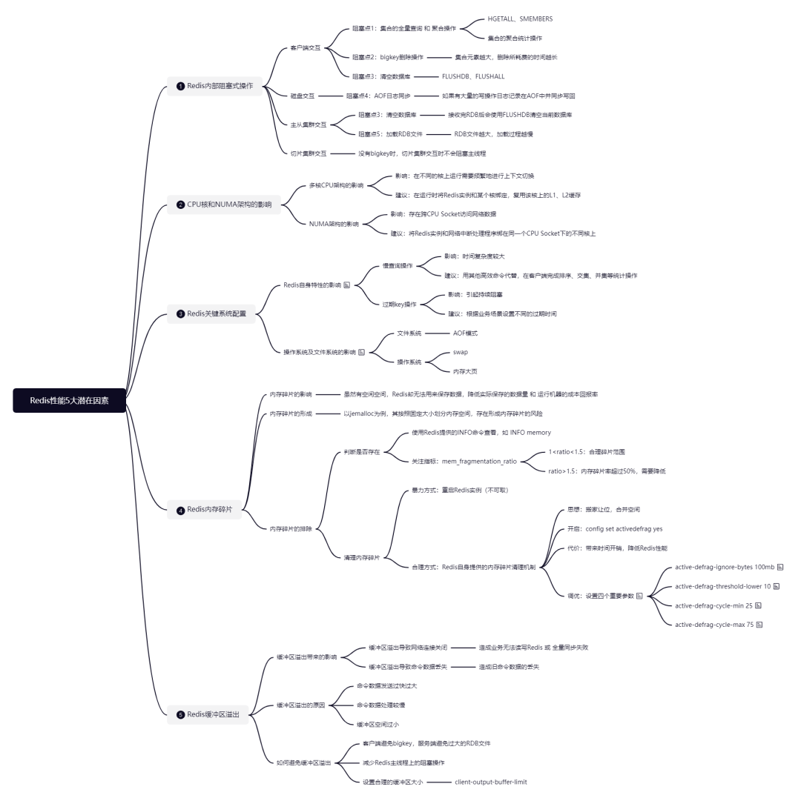

# 用压缩列表优化hash

## 1 String并不适合所有场景

对于我们在实际应用中来说，大部分场景下我们都会选择“万金油”的String来保存各种键值对，特别是“单值”场景，即一个键对应一个具体的值（而不是一个集合）。

**String的性能消耗**

对于一个单值案例，假设key/value如下，用于存储图片ID 和 存储系统中该图片的存储对象ID：

```
`photo_id: 1101000051`  
`photo_obj_id: 3301000051`

登录后复制


```

选用String来存储，在一亿个key/value的数据量下，内存占用大约用了6.4G。根据之前的学习，如果数据量不断加大，内存占用越来越高，就会影响生成RDB的过程，因为**大内存实例的Redis在fork子进程生成RDB时会造成主线程响应变慢**。

**探究String内存消耗原因**

String类型除了保存实际的数据之外，还会保存一些**元数据**，例如：**RedisObject结构、SDS结构 及 dictEntry结构**，它们都会在String类型保存的键值对本身占用内存空间不大（比如“单值”这种场景）的时候产生较大的内存开销。比如，key/value都是两个8字节的long型，照理说只需要占用16字节，而string类型却可以用到64字节，48字节都没用用于保存实际数据。

RedisObject结构体主要用来统一记录元数据，同时指向实际数据即底层数据结构SDS。当单值场景下，记录的实际数据字符串小于44字节时（比如上面的这个例子photo\_obj\_id: 3301000051），RedisObject中的元数据、指针和SDS是一块连续的内存区域，意在避免内存碎片。下图中绿色和黄色的部分就是RedisObject结构体，而指针指向的部分则是SDS结构体。SDS即Simple Dynamic String简单动态字符串，是String类型的底层数据结构实现。


dictEntry是Redis的全局哈希表的单个项的数据结构，用来指向一个key/value键值对，共占用24B。此外，Redis的内存分配库jemalloc在分配内存时会多分配一些来减少频繁分配的次数，因此对于此案例，当个dictEntry就会共计分配 24B + 8B =32B的空间。因此，总体来看的话，dictEntry + RedisObject \* 2 = 32B + 16B \* 2 = 64B。  


单个key/value总共占用64B，那么一亿个就会占用6.4GB，而其中4.8G内存空间都在保存元数据，**额外的内存空间开销很大！**

## 2 节省内存的数据结构

从之前的学习过程中，我们了解到Redis的底层数据结构中，压缩列表 和 跳表 是Redis优化过的结构。

**回顾压缩列表数据结构**

压缩列表也类似于一个数组，但和数组不同的是，压缩列表在表头有三个字段，分别表示列表长度、列表尾的偏移量 和 列表中entry的个数。压缩列表在表尾还有一个字段，表示列表结束，如下图所示：


压缩列表节省内存的关键之处就在于：**它是用一系列连续的entry来保存数据****，因此不需要用额外的指针进行连接，从而可以节省指针所占用的空间**，比如dictEntry的指针内存开销。

> **Note：** 每个entry的元数据包括：
>
> （1）prev\_len 表示前一个entry的长度。如果前一个entry长度小于254字节，prev\_len取值占1字节，否则，取值5字节； 
>
> （2）len 表示自身长度，占4字节； 
>
> （3）encoding 表示编码方式，占1字节； 
>
> （4）content 实际数据；

那么，对于上面的案例来说，一个ID为8B的long型数据来说，每个entry的prev\_len只需要1B占用。因此，每个ID占用空间合计为：1+4+1+8 = 14B，然后加上Redis的内存分配库jemalloc在分配内存时会多分配2B，合计：14 + 2 = 16B。最终，我们可以知道一个key/value最终会占用 16 \* 2 = 32B。

在使用Redis集合类型时，一个key就对应一个集合的数据，能保存的数据很多，但也只使用了一个dictEntry，就可以节省在string类型下每个数据都需要的dictEntry内存开销。

此外，压缩列表在查询效率也有优化：在压缩列表中要定位第一个和最后一个元素的话，只需要通过表头三个字段即可直接定位，无须遍历一次，因此查找首元素和尾元素的复杂度为**O(1)**。  

**如何使用压缩列表数据结构**

Redis中List、Hash 和 Sorted Set三种集合类型都用到了压缩列表数据结构，但是也是有前提条件的：

（1）对象保存的所有字符串元素的长度都小于64字节；

（2）对象保存的元素数量小于512个；

```
`#hash相关配置`  
`hash-max-ziplist-value 64 `  
`hash-max-ziplist-entries 512 `

登录后复制


```

因此，可以看出，虽然基于压缩列表可以充分节约dictEntry带来的开销，但是需要满足一定的条件。

那么针对上面的案例，该怎么设计从而利用到压缩列表的省内存特性呢？

我们可以使用**Hash类型**，然后**基于二级编码的设计思想**，将单值数据拆分为两部分：  
（1）将ID的前7位作为Hash的键

（2）将ID的最后3位作 和 存储对象的ID 分别作为 Hash类型的key和value

然后，为了能充分使用压缩列表的内存效率，我们还需要修改一下配置，使Hash对象保存的元素数量限制扩大为这里的二级key的个数。由于这里将后3位作为二级key，因此我们将限制从512改为1000即可：  

```
`hash-max-ziplist-entries 1000`

```

这样一来，Hash类型就可以满足我们的需求，一直使用高效的压缩列表数据结构来节省内存空间了。

**其他数据类型行不行**

Redis中List、Hash 和 Sorted Set三种集合类型都用到了压缩列表数据结构，但推荐使用Hash类型。

其实，Sorted Set类型也可以实现需求，还是按照二级编码设计思路，将ID的前7位作为Sorted Set的key，将ID的后三位作为member值，存储对象ID则作为score值。


同样，还需要将配置限制改为1000：

```
`zset-max-ziplist-entries 1000`

登录后复制


```

不过，鉴于Sorted Set在插入时需要按照score的大小排序，因此在底层数据结构为压缩列表的时候，其插入性能可能就低于Hash。因为Hash在插入元素时，只需要将新的元素插入到压缩列表的尾部即可，不需要定位到指定位置。

因此，鉴于这个案例的特殊性，更推荐使用Hash。

此外，使用压缩列表结构存储时，虽然可以利用CPU高速缓存，但也不适合存储过多的数据（hash-max-ziplist-entries和zset-max-ziplist-entries不宜设置过大），否则查询性能就会下降比较厉害。

整体来说，这样的方案就是**时间换空间，我们需要权衡使用**。

本文介绍了Redis下使用String的极端情况，从而引出压缩列表数据结构，并基于Hash类型的二级编码+压缩列表设计思路介绍了一种较为节省内存空间的使用方法。但是，这样的方案还是属于一个时间换空间的方案，我们需要权衡使用。

# 集合类型的典型应用场景及对应的四种统计模式


## 1 集合的应用场景

在很多业务场景中，一个key可能对应了一个数据集合，Redis的集合类型非常适合这类场景，比如：

*   统计新增用户数和留存用户数
    
*   最新评论列表
    
*   用户签到数
    
*   网页独立访客量
    

这些典型场景背后对应了四种统计模式：

*   聚合统计
    
*   排序统计
    
*   二值状态统计
    
*   基数统计
    

## ！2 四种统计模式

对于集合类型常见应用场景背后对应的四种统计模式，我们来了解一下都可以用哪些数据类型来进行操作。

**聚合统计**

聚合统计就是指统计多个集合元素的聚合结果，一般是交集、差集 与 并集操作。

适用类型：Set

注意事项：在数据量较大场景下，直接聚合统计会导致Redis实例阻塞，因此**建议选择一个从库，让它专门负责聚合计算**，或者将数据读取到客户端，在客户端完成聚合统计。

**排序统计**

排序统计一般是指集合类型能够对元素排序。

适用类型：Sorted Set 与 List

注意事项：List 中的元素虽然有序，但是一旦有新元素插入，原来的元素在 List 中的位置就会移动，那么，按位置读取的排序结果可能就不准确了。而 Sorted Set 本身是按照集合元素的权重排序，可以准确地按序获取结果，所以**建议优先使用Sorted Set**。

**二值状态统计**

二值状态统计就是指集合元素的取值只有0和1两种。

适用类型：Bitmap（Redis的扩展类型）

注意事项：Bitmap 对于一个数据只用 1 个 bit 记录，**在记录海量数据时，Bitmap 能够有效地节省内存空间**。不过，在实际应用时，**最好对Bitmap设置过期时间，让Redis自动删除不再需要的Bitmap记录**，以节省内存空间。

**基数统计**

基数统计是指统计一个集合中不重复的元素个数。

适用类型：Set Hash 或 HyperLogLog（Redis的扩展类型）  

注意事项：对于基数统计来说，如果集合元素量达到亿级别而且不需要精确统计时，建议使用 HyperLogLog 以节省内存空间。但是，**HyperLogLog 的统计规则是基于概率完成的，所以它给出的统计结果是有一定误差的，标准误算率是 0.81%，如果可以接受这个误差，使用 HyperLogLog**。否则，还是建议使用 Set 或 Hash 类型，这两种类型可以实现精确统计，但是内存开销较大。

一图胜千言，下图展示了Redis数据类型对统计模式的支持情况：


从上表中可以看出，除了基础的四大集合类型之外，Redis还提供了一些扩展的数据类型，下面我们就来了解一下这些扩展数据类型。

## 3 常见扩展数据类型

### **Bitmap**

Bitmap 本身是用 String 类型作为底层数据结构实现的一种统计二值状态的数据类型。String 类型是会保存为二进制的字节数组，所以，Redis 就把字节数组的每个 bit 位利用起来，用来表示一个元素的二值状态。我们可以把 Bitmap 看作是一个 bit 数组。

Bitmap的基本操作：

*   GETBIT：对一个bit位进行读操作（0 或 1）
    
*   SETBIT：对一个bit位进行写操作，这个bit位会被设置为1
    
*   BITCOUNT：统计bit数组中所有“1”的个数
    

Bitmap的注意事项：

偏移量是从0开始的，也就是说offset的最小值是0。

Bitmap的应用示例：

假设要统计 ID 3000 的用户在 2020 年 8 月份的签到情况

```
`// 1.记录该用户8月3号已签到`  
`SETBIT uid:sign:3000:202008 2 1`  
`// 2.检查该用户8月3号是否签到`   
`GETBIT uid:sign:3000:202008 2`   
`// 3.统计该用户在8月份的签到次数`  
`BITCOUNT uid:sign:3000:202008`   
```

Bitmap的扩展使用：

使用BITOP命令对多个 Bitmap 按位做“与”“或”“异或”的操作，操作的结果会保存到一个新的 Bitmap 中。


```


`BITOP AND/OR/XOR/NOT destkey key [key ...]`  


```

例如，在统计 1 亿个用户连续 10 天的签到情况时，可以把每天的日期作为 key，每个 key 对应一个 1 亿位的 Bitmap，每一个 bit 对应一个用户当天的签到情况。这时可以用BITOP AND命令对 10 个 Bitmap 做“与”操作，得到的结果也是一个 Bitmap。在这个 Bitmap 中，只有 10 天都签到的用户对应的 bit 位上的值才会是 1。最后，我们可以用 BITCOUNT 统计下 Bitmap 中的 1 的个数，这就是连续签到 10 天的用户总数了。

### **HyperLogLog**

https://blog.csdn.net/qq_41125219/article/details/119776824

HyperLogLog 是一种用于统计基数的数据集合类型，它的最大优势就在于，当集合元素数量非常多时，它计算基数所需的空间总是固定的，而且还很小。在 Redis 中，每个 HyperLogLog 只需要花费 12 KB 内存，就可以计算接近 2^64 个元素的基数。和元素越多就越耗费内存的 Set 和 Hash 类型相比，HyperLogLog 就非常节省空间。

HyperLogLog的应用示例：

假设要统计页面的UV数

```
`// 1.把访问page1页面的所有用户加到HyperLogLog`  
`PFADD page1:uv user1 user2 user3 user4 user5`  
`// 2.获取page1页面的UV值`  
`PFCOUNT page1:uv`
```

HyperLogLog的注意事项：

使用 HyperLogLog 统计的结果存在一定误差（0.8%左右），比如UV 是 100 万，但实际的 UV 可能是 101 万。虽然误差率不算大，但是，如果你需要精确统计结果的话，最好还是继续用 Set 或 Hash 类型。

### **GEO**

一句话概括：**GEO = Sorted Set类型 + GeoHash编码**

GEO数据类型适用于在LBS服务的场景中，比如“搜索附近的人或物”这样的功能，其底层数据结构就是用 Sorted Set 来实现的。

Sorted Set 元素的权重分数是一个浮点数（float 类型），而一组经纬度包含的是经度和纬度两个值，是没法直接保存为一个浮点数的，因此需要进行GeoHash编码，将经纬度各自的编码组合成一个最终编码。

Redis 采用了业界广泛使用的 GeoHash 编码方法，这个方法的基本原理就是“**二分区间，区间编码**”。用了 GeoHash 编码后，原来无法用一个权重分数表示的一组经纬度（116.37，39.86）就可以用 1110011101 这一个值来表示，就可以保存为 Sorted Set 的权重分数了。

GEO的应用示例：

叫车应用的车辆匹配场景

```
`// 1.将车辆ID=33的经纬度加入GEO集合中`  
`GEOADD cars:locations 116.034579 39.030452 33`  
`// 2.客户端根据用户经纬度信息查找附近5km从近到远的车辆信息`  
`// COUNT选项，指定返回的车辆信息的数量`  
`GEORADIUS cars:locations 116.054579 39.030452 5 km ASC COUNT 10`
```

### **Stream**

后续单独总结Stream的介绍和用法。

## 4 如何自定义数据类型

**两种实现途径**

*   基于现有数据类型，通过数据编码或是实现新的操作方式，来实现扩展数据类型
    
*   比如：基于Sorted Set和GeoHash编码实现的GEO，基于String和位操作实现的Bitmap
    
*   开发自定义的数据类型
    
*   增加新的数据类型定义，实现创建和释放函数，实现新数据类型支持的命令操作
    

**开发自定义类型的实现步骤**

一图总览：


第一步：定义新类型和底层结构（定义在新的newtype.h文件中）

```
`struct NewTypeObject {`  
 `struct NewTypeNode *head;`   
 `size_t len;`   
`}NewTypeObject;`  
  
  
`struct NewTypeNode {`  
 `long value;`  
 `struct NewTypeNode *next;`  
`};`
```

第二步：在RedisObject中增加新类型的定义（定义在Redis的server.h文件中）

```
`#define OBJ_STRING 0    /* String object. */`  
`#define OBJ_LIST 1      /* List object. */`  
`#define OBJ_SET 2       /* Set object. */`  
`#define OBJ_ZSET 3      /* Sorted set object. */`  
`…`  
`#define OBJ_NEWTYPE 7`
```

第三步：开发新类型的创建和释放函数（定义在Redis的object.c 文件中，增加下列函数）

```
`robj *createNewTypeObject(void){`  
 `NewTypeObject *h = newtypeNew();`   
 `robj *o = createObject(OBJ_NEWTYPE,h);`  
 `return o;`  
`}`  
`// 下列函数新增在t_newtype.c文件中`  
  
`NewTypeObject *newtypeNew(void){`  
 `NewTypeObject *n = zmalloc(sizeof(*n));`  
 `n->head = NULL;`  
 `n->len = 0;`  
 `return n;`  
`}`

```

第四步：开发新类型的命令操作

```
`// 在 t_newtype.c 文件中增加命令操作的实现`  
`void ntinsertCommand(client *c){`  
 `//基于客户端传递的参数，实现在NewTypeObject链表头插入元素`  
`}`  
`// 在 server.h 文件中进行声明以便引用`  
  
`void ntinsertCommand(client *c)`  
`// 在 server.c 文件中的 redisCommandTable 里面，把新增命令和实现函数关联起来`  
  
`struct redisCommand redisCommandTable[] = {`   
`...`  
`{"ntinsert",ntinsertCommand,2,"m",...}`  
`}`
```

## End总结  

本文介绍了Redis下集合类型的典型应用场景及对应的四种统计模式，从统计模式的应用下延伸出Redis的几种常见扩展数据类型，了解这些扩展数据类型对我们的日常开发工作有所裨益。

# Redis -> MQ

## 1 Redis也可以做MQ？

对于Redis来说，我们常常听说也可以用它来做消息队列。那么，它为什么可以做MQ呢？他不是一般只拿来做缓存吗？

在了解之前，我们先看看消息队列的消息存取到底有哪些需求吧。

**需求1：消息保序**

由于消费者是异步处理消息，但是消费者需要按照生产者发送消息的顺序来处理消息，避免后发送的消息被先处理了。

**需求2：重复消息处理**

有时候可能因为网络堵塞出现消息重传的情况，消费者需要保证幂等性。换句话说，对于同一条消息，消费者收到一次的处理结果和收到多次的处理结果是一致的。

**需求3：消息可靠性保证**

有时候消费者在处理消息时可能出现因故障或宕机导致消息没有处理完成的情况，因此消息队列需要提供消息可靠性的保证。换句话说，当消费者重启之后，可以重新读取消息并再次进行处理。

**综述**

消息队列的目的是在分布式的系统间进行通信，通信方式是通过网络传输的方式，通过网络传输就有消息丢失、重复发送消息、不同消息到达顺序混乱的可能。

==所以消息队列应用的三大需求是：==

1、消息保序

2、重复消息处理

3、消息可靠性保证

对应处理方案是：

1、消息数据有序存取

2、消息数据具有全局唯一编号

3、消息数据在未消费完宕机恢复时继续消费，消费完成后被删除

下面我们就可以看看Redis是如何满足这几个需求的。

## 2 Redis如何实现MQ的需求？

总体来说，Redis提供了两种解决方案：一是基于List的消息队列解决方案，另一种则是基于Stream的消息队列解决方案。

**基于List的MQ解决方案**

首先，对于需求1-消息保序，List是按照先进先出的顺序对数据进行存取的，因此使用List作为消息队列保存消息可以满足需求1。具体实现就是==LPUSH+RPOP/BRPOP。==


> **潜在风险点：** 即使没有新消息写入List，消费者也需要不停地调用RPOP命令，这就会导致消费者程序的CPU一直消耗在执行RPOP命令上，带来不必要的性能损失。因此，Redis提供了BRPOP命令，提供阻塞式读取，即在没有读到队列数据时，自动阻塞，直到有新的数据写入队列，再开始读取新数据。

其次，对于需求2-重复消息处理，List本身是不会为每个消息生成ID号的，所以，消息的全局唯一ID号就需要生产者程序在发送消息前自动生成，生成之后，在LPUSH时需要把这个全局唯一ID包含进去。

例如：将一条全局 ID 为 101030001、库存量为 5 的消息插入Redis消息队列

```
`LPUSH mq "101030001:stock:5"`  
`(integer) 1`  
```

最后，对于需求3-消息可靠性保证，List本身在读取一条消息后就不会再留存这条消息了，所以为了留存消息，List提供了==BRPOPLPUSH==命令，即让消费者程序从一个List中读取消息，同时再把这个消息插入到另一个List（可以理解为备份List）留存。这样一来，如果消费者程序读了消息但没能正常处理，等它重启后，就可以从备份 List 中重新读取消息并进行处理了。


综上所述，基于List可以满足对MQ的三大需求，但是，使用List还是存在一个问题：生产者消息发送很快，但是消费者处理消息的速度很慢，这就可能会导致List中的消息越积越多，给Redis的内存带来很大的压力。

在Redis 5.0开始，提供了Stream数据类型，它支持多个消费者程序组成一个消费组，一起分担消息处理压力。

**基于Stream的MQ解决方案**

Streams 是 Redis 专门为消息队列设计的数据类型，它提供了丰富的消息队列操作命令。

（1）XADD

插入消息，保证有序，可以自动生成全局唯一ID

（2）XREAD

读取消息，可以按ID读取数据

（3）XREADGROUP

按消费组形式读取消息

（4）XPENDING + XACK

XPENDING用来查询每个消费组内所有消费者已读取但尚未确认的消息

XACK用来向消息队列确认消息处理已完成

下面一一讲解各个核心命令操作：

XADD

XADD 命令可以往消息队列中插入新消息，消息的格式是键 - 值对形式。对于插入的每一条消息，Stream 可以自动为其生成一个全局唯一的 ID。

例如：往一个名为mqstream的队列中插入一条消息，key=repo, value=5，中间的\*表示让Redis为插入的数据自动生成一个全局唯一的ID号，这里是1599203861727-0，它的格式是当前服务器时间（精确到毫秒）+序号。

```
`XADD mqstream * repo 5`  
`"1599203861727-0"`  

```

XREAD

XREAD 在读取消息时，可以指定一个消息 ID，并从这个消息 ID 的下一条消息开始进行读取。

例如：从 ID 号为 1599203861727-0 的消息开始，读取后续的所有消息（示例中一共 3 条），下面命令中的block配置项代表XREAD的阻塞时间，即当消息队列中没有消息时，XREAD就会阻塞指定的毫秒数。

```
`XREAD BLOCK 100 STREAMS  mqstream 1599203861727-0`  
`1) 1) "mqstream"`  
 `2) 1) 1) "1599274912765-0"`  
 `2) 1) "repo"`  
 `2) "3"`  
 `2) 1) "1599274925823-0"`  
 `2) 1) "repo"`  
 `2) "2"`  
 `3) 1) "1599274927910-0"`  
 `2) 1) "repo"`  
 `2) "1"`  

```

此外，也可以直接在XREAD后跟"$"符号，代表读取最新的消息。下面命令中的 XREAD 执行后，消息队列 mqstream 中一直没有消息，所以，XREAD 在 1 秒后返回了空值（nil）。

```
`XREAD block 1000 streams mqstream $`  
`(nil)`  
`(1.00s)`  
```

XREADGROUP

Stream 使用 XGROUP 创建消费组，创建消费组之后，Stream 可以使用 XREADGROUP 命令让消费组内的消费者读取消息。

例如：使用下面的XGROUP命令创建一个消费组group1，这个消费组的消息队列是mqstream。

```
`XGROUP create mqstream group1 0`  
`OK`  
```

然后，再用下面的XREADGROUP命令来让消费组group1中的消费者consumer1从mqstream消息队列中读取所有消息。其中，命令最后的参数“>”，表示从第一条尚未被消费的消息开始读取。

```
`XREADGROUP group group1 consumer1 streams mqstream >`  
`1) 1) "mqstream"`  
 `2) 1) 1) "1599203861727-0"`  
 `2) 1) "repo"`  
 `2) "5"`  
 `2) 1) "1599274912765-0"`  
 `2) 1) "repo"`  
 `2) "3"`  
 `3) 1) "1599274925823-0"`  
 `2) 1) "repo"`  
 `2) "2"`  
 `4) 1) "1599274927910-0"`  
 `2) 1) "repo"`  
 `2) "1"`  

```

注意事项：当消息队列（上面例子是mqstream）中的消息被消息组中的其中一个消费者读取消费处理之后，就不能再被消费组中的其他消费者读取了，这时其他消费者再执行相同的XREADGROUP命令时，读到的就是空值。

```
`XREADGROUP group group1 consumer2  streams mqstream 0`  
`1) 1) "mqstream"`  
 `2) (empty list or set)` 

```

此外，使用消费组的目的是让组内的多个消费者共同分担读取消息，所以，我们通常会让每个消费者读取部分消息，从而实现消息读取负载在多个消费者间是均衡分布的，比如我们可以使用count N命令来让各个消费者各自读取N条消息。

```
`XREADGROUP group group2 consumer1 count 1 streams mqstream >`  
`1) 1) "mqstream"`  
 `2) 1) 1) "1599203861727-0"`  
 `2) 1) "repo"`  
 `2) "5"`  
  
`XREADGROUP group group2 consumer2 count 1 streams mqstream >`  
`1) 1) "mqstream"`  
 `2) 1) 1) "1599274912765-0"`  
 `2) 1) "repo"`  
 `2) "3"`  
  
`XREADGROUP group group2 consumer3 count 1 streams mqstream >`  
`1) 1) "mqstream"`  
 `2) 1) 1) "1599274925823-0"`  
 `2) 1) "repo"`  
 `2) "2"`  

```

使用扩展：如果一个生产者发送给消息队列的消息，需要被多个消费者进行读取和处理（例如，一个消息是一条从业务系统采集的数据，既要被消费者 1 读取进行实时计算，也要被消费者 2 读取并留存到分布式文件系统 HDFS 中，以便后续进行历史查询）。

这时我们可以基于Stream类型创建多个消费者组，实现同时消费生产者的数据。每个消费者组内可以再挂多个消费者分担读取消息进行消费，消费完成后，各自向Redis发送XACK，标记自己的消费组已经消费到了哪个位置，而且消费组之间互不影响。

> 另外，Redis 基于字典和链表数据结构，实现了发布和订阅功能，这个功能可以实现一个消息被多个消费者消费使用，也可以满足上面问题中的场景需求。

==XPENDING + XACK==

Stream 会自动使用内部队列（也称为 PENDING List）留存消费组里每个消费者读取的消息，直到消费者使用 XACK 命令通知 Stream “消息已经处理完成”，这时 Stream 就会将这个消息移除掉。

如果消费者没有成功处理消息，它就不会给 Stream 发送 XACK 命令，消息仍然会留存。此时，消费者可以在重启后，用 XPENDING 命令查看已读取、但尚未确认处理完成的消息。

例如：查看消费组group2中各个消费者已读取但尚未确认的消息数量，其中 XPENDING 返回结果的第二、三行分别表示 group2 中所有消费者读取的消息最小 ID 和最大 ID。

```
`XPENDING mqstream group2`  
`1) (integer) 3`  
`2) "1599203861727-0"`  
`3) "1599274925823-0"`  
`4) 1) 1) "consumer1"`  
 `2) "1"`  
 `2) 1) "consumer2"`  
 `2) "1"`  
 `3) 1) "consumer3"`  
 `2) "1"`  

```

当某个消费者例如group消费了某个消息之后，就可以用XACK命令通知Stream从PENDING LIST中移除这条消息。

```
`XACK mqstream group2 1599274912765-0`  
`(integer) 1`  
 `// 下面的命令可以查看某个消费者具体读取了哪些数据`  
`XPENDING mqstream group2 - + 10 consumer2`  
`(empty list or set)`  

```

**List 与 Stream 方案的对比**

一图胜千言：


## 3 ASP.NET 5中使用Stream

Redis环境配置：

```
`private static string _connstr = "172.16.3.119:6379";`  
`private static string _keyStream = "stream1";`  
`private static string _nameGrourp = "group1";`  
`private static string _nameConsumer = "consumer1";`  

登录后复制


```

基于CSRedisCore客户端组件：  

（1）发布

```


`csRedisClient.XAdd(_keyStream, "*", ("name", "message1"));`  

```

（2）订阅

```


`static async Task CsRedisStreamConsumer()`  
`{`  
`    Console.WriteLine("CsRedis StreamConsumer start!");`  
  
`    var csRedisClient = new CSRedis.CSRedisClient(_connstr);`  
`    csRedisClient.XAdd(_keyStream, "*", ("name", "message1"));`  
  
`    try`  
`    {`  
`        csRedisClient.XGroupCreate(_keyStream, _nameGrourp);`  
`    }`  
`    catch { }`  
  
`    (string key, (string id, string[] items)[] data)[] product;`  
`    (string Pid, string Platform, string Time) data = (null, null, null);`  
  
`    while (true)`  
`    {`  
`        try`  
`        {`  
`            product = csRedisClient.XReadGroup(_nameGrourp, _nameConsumer, 1, 10000, (_keyStream, ">"));`  
`            if (product?.Length > 0 == true && product[0].data?.Length > 0 == true)`  
`            {`  
`                Console.WriteLine($"message-id:{product.FirstOrDefault().data.FirstOrDefault().id}");`  
  
`                product.FirstOrDefault().data.FirstOrDefault().items.ToList().ForEach(value =>`  
`                {`  
`                    Console.WriteLine($"    {value}");`  
`                });`  
  
`                //csRedis.XAck(_keyStream, _nameGrourp, product[0].data[0].id);`  
`            }`  
`        }`  
`        catch { }`  
`    }`  
`}`  

登录后复制


```

（3）效果展示：


## End总结  

总结一下，Redis 是一个非常轻量级的键值数据库，部署一个 Redis 实例就是启动一个进程，部署 Redis 集群，也就是部署多个 Redis 实例。而 Kafka、RabbitMQ 部署时，涉及额外的组件，例如 Kafka 的运行就需要再部署 ZooKeeper。因此，相比 Redis 来说，Kafka 和 RabbitMQ 一般被认为是重量级的消息队列。

**如果分布式系统中的组件消息通信量不大，那么，Redis 只需要使用有限的内存空间就能满足消息存储的需求，而且，Redis 的高性能特性能支持快速的消息读写，不失为消息队列的一个好的解决方案**。比如，Redis 适用于消息量并不是非常巨大，数据不是非常重要，从而不必引入其他消息组件的场景，如发短信，站内信等业务场景。

  

# 缓存异常

## 1 缓存异常问题总览

对于Redis来说，使用其作为缓存，一般会碰到的缓存异常问题有以下几类：

*   缓存中的数据和DB不一致
    
*   缓存雪崩
    
*   缓存击穿
    
*   缓存穿透
    

## 2 缓存数据和DB不一致问题

**数据不一致问题定义**

不符合以下以下两种情况的就属于缓存和DB数据不一致的问题：

*   缓存中有数据，那么，缓存的数据值需要和DB中的值相同；
    
*   缓存中本身没有数据，那么，DB中的值必须是最新值。  
    

**解决数据不一致**

**（1）对于读写缓存的场景**

两种场景不同策略：

  **对数据一致性要求较高**

* 同步直写策略：写缓存时，也同步写数据库，缓存和数据库中的数据保持一致；

* 注意事项：需要在业务应用中使用事务机制，保证缓存和数据库的更新具有原子性；

  **对数据一致性要就不高**

* 异步写回策略：写缓存时不同步写数据库，等到数据从缓存中淘汰时，再写回数据库。

* 注意事项：潜在风险点在于如果数据还没有写回数据库，缓存就发生了故障，那么此时数据库就没有最新的数据了；


**（2）对于只读缓存的场景**

也是两种场景及问题：

*   **先删除缓存再更新数据库值**
    
*   潜在问题：数据库更新失败，导致请求再次访问缓存时，发现缓存缺失，再读数据库时，从数据库中读到旧值
    
*   **先更新数据库值再删除缓存**
    
*   潜在问题：缓存删除失败，导致请求再次访问缓存时，发现缓存命中，并从缓存中读取到旧值
    

如果是因为删除缓存值或更新数据库失败导致数据不一致，解决方案：**重试机制**

即_**把要删除的缓存值或者是要更新的数据库值暂存到消息队列中**_（例如使用 Kafka 消息队列）。当应用没有能够成功地删除缓存值或者是更新数据库值时，可以从消息队列中重新读取这些值，然后再次进行删除或更新。


如果在删除缓存值、更新数据库的这两步操作中，有其他线程的并发读操作，导致其他线程读取到旧值，解决方案：**延迟双删**。

基于此方案，当其他线程读取数据时，会发现缓存缺失，就会从数据库中读取最新值。而_**当这个数据在第一次被删除后，延迟一段时间会再次进行删除**_，所以叫“延迟双删”，类似于以下的伪代码：

```
`redis.delKey(X)`  
`db.update(X)`  
`Thread.sleep(N)`  
`redis.delKey(X)`
```

**数据不一致问题总结**

一图胜千言：


## 3 其他常见缓存异常问题

除了数据不一致问题，常常还会面临缓存异常的三个问题，分别是**缓存雪崩、缓存击穿和缓存穿透**。这三个问题一旦发生，会导致大量的请求积压到数据库层。如果请求的并发量很大，就会导致数据库宕机或是故障，这就是很严重的生产事故了。

**缓存雪崩**

问题定义：指**大量的应用请求**无法在 Redis 缓存中进行处理，紧接着，应用将大量请求发送到数据库层，导致数据库层的压力激增。

问题原因：

（1）缓存中有大量的数据同时过期，导致大量请求被打到数据库层；


（2）Redis缓存实例发生故障宕机了，无法处理请求，导致大量请求被打到数据库层；


解决方案：

（1）针对缓存大量同时过期，一来我们可以给每个数据的过期时间增加一个较小的随机数（比如：随机增加1~3分钟），二来我们还可以通过服务降级，具体来说它有两种处理方式：

*   当业务应用访问的是非核心数据（例如电商商品属性）时，暂停查询缓存，直接返回预定义信息、空值 或 错误信息；
    
*   当业务应用访问的是核心数据（例如电商商品库存）时，仍然允许查询缓存，如果缓存缺失，也可以降级到DB读取；
    

当只有部分核心数据请求被打到数据库，数据库的压力就没有那么大，因此可以保障服务稳定性。


（2）针对Redis实例发生故障宕机，具体有以下两个解决办法：

> 一般来说，一个 Redis 实例可以支持数万级别的请求处理吞吐量，而单个数据库可能只能支持数千级别的请求处理吞吐量，它们两个的处理能力可能相差了近十倍。

*   ==**事后解决：在业务系统中实现服务熔断或请求限流限制**；==
    
*   当监控系统监控到Redis宕机，DB服务器压力增大时，即可判断为缓存雪崩，从而启动服务熔断机制，暂停数据请求访问缓存和数据库 => 保证数据库正常运行；
    
*   当数据库每秒的请求数超出了正常数量的几倍，即可启动请求限流机制，避免大量并发请求打到数据库 => 尽可能减少业务应用的影响范围；
    
*   **事前预防：通过主从节点的方式构建高可用的Redis集群**；
    
*   如果主节点故障宕机了，从节点可以切换成主节点，继续提供缓存服务；
    

==**缓存击穿**==

问题定义：**某个访问非常频繁的热点数据请求**，无法在缓存中进行处理，然后访问该数据的大量请求都被打到了数据库，导致数据库压力激增。缓存击穿经常发生在热点数据过期失效的时候：


解决方案：对于访问非常频繁的热点数据，就不设置过期时间了。

**缓存穿透**

==问题定义：缓存穿透是指要访问的数据既不在 Redis 缓存中，也不在数据库中，导致请求在访问缓存时，发生缓存缺失，再去访问数据库时，发现数据库中也没有要访问的数据。如果应用持续有大量请求访问数据，就会同时给缓存和数据库带来巨大压力：==

问题原因：

（1）业务层的误操作：缓存和DB中的数据被误删除了。

（2）恶意攻击：专门访问DB中没有的数据；

解决方案：

（1）**缓存空值 或 缺省值**；

一旦发生缓存穿透，就可以针对查询的数据，在Redis中缓存一个空值 或是和 业务层协商确定的缺省值（比如：库存的缺省值为0）。这样后续的数据请求，就可以直接从Redis中获取到缺省值，避免大量无用请求到DB。

（2）**使用布隆过滤器**快速判断数据是否存在，避免从DB中查询数据是否存在，从而减轻DB压力；

布隆过滤器由一个初值都为 0 的 bit 数组和 N 个哈希函数组成，可以用来快速判断某个数据是否存在。当想要标记某个数据存在时（比如数据已经被写入DB），布隆过滤器会通过3个操作来完成标记：

*   首先，使用 N 个哈希函数，分别计算这个数据的哈希值，得到 N 个哈希值。
    
*   然后，我们把这 N 个哈希值对 bit 数组的长度取模，得到每个哈希值在数组中的对应位置。
    
*   最后，我们把对应位置的 bit 位设置为 1，这就完成了在布隆过滤器中标记数据的操作。
    

如果数据不存在，布隆过滤器也就不会标记，那么bit数组对应bit位的值仍然为0。

下图展示了一个包含10个bit位的数字，使用3个哈希函数的布隆过滤器，当标记数据X时，首先会经历3次哈希计算，然后将哈希结果对应的bit位标记为1，代表假设数据X已经在数据库了。这时，如果后续应用想要查询数据X时，只需要查看对应的3个bit位是否都为1，是则允许继续查询，不是的话，就代表X不在数据库中。


优点：快速检测，降低对Redis的压力，也避免对数据库的无效访问，保障系统稳定性；

缺点：还是存在一定的错误率，且删除比较困难；

解决：一是增加bit数组的长度，这样哈希计算后的数据会更加离散，降低哈希冲突概率；二是增加哈希函数的个数，相当于变相地增加数据特征，特征越多，冲突的概率越小；

适用：缓存穿透、请求限流、网页爬虫对URL的去重、反垃圾邮件 等场景；

> **NOTE：** Redis 4.0提供了布隆过滤器模块，而4.0以下则需要引入第三方库。

（3）在请求入口的前端进行请求检测，将恶意的请求直接过滤掉，不让它们访问缓存和数据库；

## End问题总结  

==三大问题的原因和应对方案，一图胜千言：==


针对实际应用场景中，尽量使用预防式方案，而不是事后解决方案（如服务熔断、限流与降级）。

*   **针对缓存雪崩，合理地设置数据过期时间，以及搭建高可靠缓存集群；**
    
*   **针对缓存击穿，在缓存访问非常频繁的热点数据时，不要设置过期时间；**
    
*   **针对缓存穿透，提前在入口前端实现恶意请求检测，或者规范数据库的数据删除操作，避免误删除。** 


# 缓存淘汰

## 1 设置多大的缓存容量合适？

容量规划不能一概而论，是需要**结合应用数据实际访问特征和成本开销来综合考虑**的。

一般来说，建议把缓存容量设置为总数据量的 **15% 到 30%**，兼顾访问性能和内存空间开销。

```
`# 以下命令用于将Redis最大缓存容量设置为4G`  
`CONFIG SET maxmemory 4gb`
```

## 2 Redis缓存淘汰策略总览

首先，我们要有一个基本认知：**缓存写满是不可避免的**。Redis提供了8种缓存淘汰策略，如下图所示：


> **NOTE：** Redis 4.0之前提供了6种，4.0之后又提供了2种，因此共计8种。

其中，在Redis3.0之前，默认是volatile-lru；而在Redis3.0之后（包括3.0），**默认淘汰策略是noeviction**。

## 3 针对设置了过期时间的淘汰策略  

(1) **volatile-ttl**

针对设置了过期时间的键值对，根据过期时间的先后进行删除，越早过期的越早被删除。

(2) **volatile-random**

针对设置了过期时间的键值对，随机选择键值对进行删除。

(3) **volatile-lru**

针对设置了过期时间的键值对，根据LRU算法（最近最少使用算法）筛选键值对进行删除。

(4) **volatile-lfu**

针对设置了过期时间的键值对，根据LFU算法（最不经常使用算法）筛选键值对进行删除。

## 4 针对所有键值数据的淘汰策略  

(1) **allkeys-random**

从所有键值对中，随机选择并进行删除。

(2) **allkeys-lru**

从所有键值对中，根据LFU算法筛选键值对进行删除。

(3) **allkeys-lfu**

从所有键值对中，根据LFU算法筛选键值对进行删除。

## 5 LRU缓存淘汰策略  

**算法介绍**

在Redis淘汰策略中，violatile-lru 和 allkeys-lru 都使用了LRU算法。LRU 算法的全称是 Least Recently Used，从名字上就可以看出，这是按照最近最少使用的原则来筛选数据，最不常用的数据会被筛选出来，而最近频繁使用的数据会留在缓存中。

LRU 会把所有的数据组织成一个链表，链表的头和尾分别表示 MRU 端和 LRU 端，分别代表最近最常使用的数据和最近最不常用的数据。假设现在有数据 6、3、9、20、5，通过不断被访问和新增数据，5就被淘汰了，如下所示：


在Redis中LRU算法被做了简化，没有使用额外的链表来管理，而是默认记录每个数据的最近一次访问的时间戳，**这个时间戳被记录在键值对数据结构RedisObject中的lru字段记录**。然后，在需要选择淘汰的数据时，Redis首先会随机选择N个数据将它们作为一个候选集合，然后比较他们的lru字段，将lru字段最小的数据淘汰掉（lru字段最小的可能不止一个）。

```
`# 以下命令可以设置Redis选出多少个记录用于比较lru字段`  
`CONFIG SET maxmemory-samples 100`
```

当需要再次淘汰时，Redis会再挑选一些lru字段比候选集合中最小lru字段还要小的键值对，将它们放入候选集，如果候选集的数据的个数达到了 maxmemory-sample 配置的个数，Redis就开始将lru字段值最小的数据淘汰（lru字段最小的可能不止一个）。

**使用建议**

*   **优先使用allkeys-lru策略**，提升应用的访问性能。适合业务数据中有明显的冷热数据区分。
    
*   **如果没有明显的冷热数据区分，建议使用allkeys-random策略**。
    
*   **如果有置顶需求的业务场景，建议使用volatile-lru策略 同时 不给这些置顶数据设置过期时间**。这样可以保证需要置顶的数据一直不会被删除，而其他数据会在过期时根据LRU规则被删除。
    

## 6 LFU缓存淘汰策略  

**算法介绍**

在Redis淘汰策略中，violatile-lfu 和 allkeys-lfu 都使用了LFU算法。LFU 缓存策略是在 LRU 策略基础上，为每个数据增加了一个计数器，来统计这个数据的访问次数。当使用 LFU 策略筛选淘汰数据时，**首先会根据数据的访问次数进行筛选，把访问次数最低的数据淘汰出缓存。如果两个数据的访问次数相同，LFU 策略再比较这两个数据的访问时效性**，把距离上一次访问时间更久的数据淘汰出缓存。

Redis 在实现 LFU 策略的时候，只是把原来RedisObject中的 24bit 大小的 lru 字段，又进一步拆分成了两部分。

（1）ldt 值：lru 字段的前 16bit，表示数据的访问时间戳；

（2）counter 值：lru 字段的后 8bit，表示数据的访问次数。

具体来说，就是当 LFU 策略筛选数据时，Redis 会在候选集合中，根据数据 lru 字段的后 8bit 选择访问次数最少的数据进行淘汰。当访问次数相同时，再根据 lru 字段的前 16bit 值大小，选择访问时间最久远的数据进行淘汰。

不过，由于8bit记录的最大值是255，而实际应用中一个数据可能被访问了成千上万次，因此，**Redis 在实现 LFU 策略时，并没有采用数据每被访问一次，就给对应的 counter 值加 1 的计数规则，而是采用了一个更优化的计数规则（非线性递增的计数器方法）**。

简单来说，LFU 策略实现的计数规则是：每当数据被访问一次时，首先，用计数器当前的值乘以配置项 lfu\_log\_factor 再加 1，再取其倒数，得到一个 p 值；然后，把这个 p 值和一个取值范围在（0，1）间的随机数 r 值比大小，只有 p 值大于 r 值时，计数器才加 1。

下面的部分代码展示了这一段逻辑，计数器的初始值 baseval 是 5（不是0，避免数据刚被写入就因访问少而被淘汰）：

```
`double r = (double)rand()/RAND_MAX;`  
`...`  
`double p = 1.0/(baseval*server.lfu_log_factor+1);`  
`if (r < p) counter++;`
```

我们可以通过设置不同的 lfu\_log\_factor 配置项，来控制计数器值增加的速度。而不同的lfu\_log\_factor因子，在不同的实际访问次数情况下，计数器的值也会随之变化。


当 lfu\_log\_factor 取值为 10 时，百、千、十万级别的访问次数对应的 counter 值已经有明显的区分了，所以，**在应用 LFU 策略时，一般可以将 lfu\_log\_factor 取值为 10**。

此外，Redis 在实现 LFU 策略时，还设计了一个 counter 值的衰减机制。简单来说，LFU 策略使用衰减因子配置项 lfu\_decay\_time 来控制访问次数的衰减。LFU 策略会计算当前时间和数据最近一次访问时间的差值，并把这个差值换算成以分钟为单位。然后，LFU 策略再把这个差值除以 lfu\_decay\_time 值，所得的结果就是数据 counter 要衰减的值。所以，**如果业务应用中有短时高频访问的数据的话，建议把 lfu\_decay\_time 值设置为 1**。

**使用建议**

在实际业务应用中，LRU 和 LFU 两个策略都有应用。LRU 和 LFU 两个策略关注的数据访问特征各有侧重，LRU 策略更加关注数据的时效性，而 LFU 策略更加关注数据的访问频次。

==通常情况下，**实际应用的负载具有较好的时间局部性，所以 LRU 策略的应用会更加广泛**。但是，**在扫描式查询的应用场景中，LFU 策略就可以很好地应对缓存污染问题了，建议优先使用**。==

## End总结  

本文总结了Redis缓存淘汰策略，涉及了针对过期时间的淘汰策略 以及 针对所有键值对的淘汰策略，重点了解了LFU 和 LRU两个淘汰策略算法。

在实际应用中，LRU 和 LFU 两个策略关注的数据访问特征各有侧重，LRU 策略更加关注数据的时效性，而 LFU 策略更加关注数据的访问频次。


# Redis变慢

## 1 Redis性能的5大因素



总体来说，Redis的性能一般具有上图所示的5大因素（**建议收藏**）。

Redis阻塞点：

- **客户端**: 网络 IO，键值对增删改查操作，数据库操作; 
  - 集合的全量查询和聚合操作
  - 大Key的删除操作（在应用程序释放内存时，操作系统需要把释放掉的内存块插入一个空闲内存块的链表，以便后续进行管理和再分配。这个过程本身需要一定时间，而且会阻塞当前释放内存的应用程序）
  - 清空数据库（FLUSHDB 和 FLUSHALL操作）
- **磁盘**: 生成 RDB 快照，记录 AOF 日志，AOF 日志重写;
  - RDB快照和AOF日志重写不会阻塞主进程，但是如果有大量的写操作需要记录在 AOF 日志中，并同步写回AOF日志的话（AOF配置成always），就会阻塞主线程了。

- **主从节点**: 主库生成、传输 RDB 文件，从库接收 RDB 文件、清空数据库、加载 RDB 文件;
  - 从库使用FLUSHDB清空数据库，以及加载RDB文件时会阻塞

- **切片集群实例**: 向其他实例传输哈希槽信息，数据迁移。
  - Redis Cluster遇到大Key的场景就会阻塞主线程


==可以通过异步方式解决的阻塞点：==

- AOF日志：配置成every sec
- 大Key：通过unlink删除大key（Redis 4.0之前通过SCAN删数据）
- 清空数据库：可以在 FLUSHDB 和 FLUSHALL 命令后加上 ASYNC 选项

## 2 Redis变慢的场景

在应用服务端有时会存在一个事务性操作，需要几个操作都保证事务的原子性。当Redis延迟增加，就会拖累应用服务端整个事务的执行。


## 3 如何判断Redis变慢  

**查看Redis的响应延迟**

在某时刻，如果Redis实例的响应延迟很高，如果持续时间不长，那可能叫延迟“毛刺”。但如果持续时间较长，那就可以认定Redis变慢了。

这种方法是看 Redis 延迟的绝对值，但需要根据不同软硬件环境来综合看待。

**比较Redis的基线性能**

基线性能是指一个系统在低压力、无干扰下的基本性能，这个性能由当前的软硬件配置决定。

redis-cli 命令提供了–intrinsic-latency 选项，可以用来监测和统计测试期间内的最大延迟，**这个延迟可以作为 Redis 的基线性能**。例如，下面的命令结果打印了120s内的最大延迟，可以看出119us。

```
`./redis-cli --intrinsic-latency 120`  
`Max latency so far: 17 microseconds.`  
`Max latency so far: 44 microseconds.`  
`Max latency so far: 94 microseconds.`  
`Max latency so far: 110 microseconds.`  
`Max latency so far: 119 microseconds.`  
  
`36481658 total runs (avg latency: 3.2893 microseconds  3289.32 nanoseconds per run).`  
`Worst run took 36x longer than the average latency.`
```

如果Redis运行在虚拟化环境中，其基线性能相较纯物理机部署会有一些性能消耗，因此，其基线性能会较高一些。

**一般情况下，对于基线性能，我们只考虑服务端软硬件环境的影响**，不考虑网络对基线性能的影响。如果需要排查网络对Redis的性能影响，可以使用iPerf这样的工具，观察网络延迟情况。如果这个网络延迟较高，那么可能网络环境中存在有大流量的其他应用程序在运行，导致网络拥塞了。

## 4 如何应对Redis变慢  

总体来说，Redis性能变慢的因素有两个点：一是Redis自身特性引起的，二是操作系统和文件系统引起的；


**Redis自身特性导致的问题排查与解决**

**(1) 慢查询命令**  

慢查询命令就是Redis中执行速度慢的命令，会导致Redis延迟增加，这和Redis不同命令操作的复杂度有关。

==传送门：Redis官方文档对每个命令的复杂度介绍（https://redis.io/commands/）==

处理方式：

*   用其他高效命令代替。
    
*   eg.避免一次返回大量数据，造成线程阻塞。
    
*   当需要执行排序、交集、并集时，可以在客户端完成
    
*   eg.不要用SORT、SUNION、SINTER等命令，以免拖慢Redis实例。
    

其他备注：KEYS命令需要遍历存储的键值对，所以操作延时高。一般不建议在生产环境中使用KEYS命令。我们可以使用Redis提供的SCAN、SSCAN、HSCAN等命令结合分页获取数据来替代KEYS。

例如：从user这个Hash集合中返回key前缀以103开头的100个键值对：

```
`HSCAN user 0  match "103*" 100


```

**(2) 过期key操作**

默认情况下，Redis 每 100 毫秒会删除一些过期 key，具体的算法如下：采样 ACTIVE\_EXPIRE\_CYCLE\_LOOKUPS\_PER\_LOOP 个数的 key，并将其中过期的 key 全部删除；如果超过 25% 的 key 过期了，则重复删除的过程，直到过期 key 的比例降至 25% 以下。

同一时间大量缓存过期，超过了上述第二条阈值（比如：缓存雪崩），会不断进行删除key + 操作系统整理内存。

删除操作是阻塞的（Redis 4.0后可以用异步线程减少阻塞影响），因此Redis线程会一直执行删除，进而引起其他键值操作的延迟增加，最终导致Redis变慢。

处理方式：

*   和缓存雪崩的对应方式类似，给一批key的过期时间加上一定范围的随机数，避免同一时间大量key失效。
    

**文件系统与操作系统导致的问题排查与解决**

如果在排查时，你发现 Redis 没有执行大量的慢查询命令，也没有同时删除大量过期 keys，那可能需要关注文件系统（比如：Redis持久化到磁盘这个过程依赖于文件系统）和操作系统（比如：操作系统的内存机制会影响Redis处理效率）了。

**(1) 文件系统：AOF模式**  

问题原因：由于 fsync 后台子线程和 AOF 重写子进程的存在，主 IO 线程一般不会被阻塞。但是，如果在重写日志时，AOF 重写子进程的写入量比较大，fsync 线程也会被阻塞，进而阻塞主线程，导致延迟增加。


处理方式：

*   检查Redis配置文件中的appendfsync配置项，它表明了Redis使用的哪种AOF日志写回策略（即：no everysec always）。
    
*   如果业务应用对延迟敏感，但允许一定量的数据丢失，可以做以下配置，表明在AOF重写时不进行fsync操作直接返回了：
    

```
`no-appendfsync-on-rewrite yes`
```

*   如果的确需要很高性能，可以考虑使用高速的SSD作为AOF日志的写入设备，从而降低对Redis的性能影响。
    

> 高速固态盘的带宽和并发度比传统的机械硬盘的要高出 10 倍及以上。在 AOF 重写和 fsync 后台线程同时执行时，固态硬盘可以提供较为充足的磁盘 IO 资源，让 AOF 重写和 fsync 后台线程的磁盘 IO 资源竞争减少。

**(2) 操作系统：swap**  

背景介绍：内存 swap 是操作系统里将内存数据在内存和磁盘间来回换入和换出的机制，涉及到磁盘的读写，所以，一旦触发 swap，无论是被换入数据的进程，还是被换出数据的进程，其性能都会受到慢速磁盘读写的影响。

问题原因：Redis 是内存数据库，内存使用量大，如果没有控制好内存的使用量，或者和其他内存需求大的应用一起运行了，就可能受到 swap 的影响，而导致性能变慢。**通常情况下，触发swap的原因主要是物理机内存不足**，对于Redis而言，有以下两种常见情况：

*   Redis实例自身使用了大量的内存，导致物理机的可用内存不足。
    
*   和Redis实例在同一台机器上的其他进程，在进行大量的读写操作，导致分配给Redis的内存变少，进而触发Redis发生swap。
    

处理方式：**增加机器的内存 或 使用Redis集群**。

> 当出现百 MB，甚至 GB 级别的 swap 大小时，就表明，此时，Redis 实例的内存压力很大，很有可能会变慢。所以，swap 的大小是排查 Redis 性能变慢是否由 swap 引起的重要指标。

**(3) 操作系统：内存大页**  

==背景介绍：内存大页机制（Transparent Huge Page, THP）支持2MB大小的内存页分配，而常规的内存页分配是按照4KB的粒度来执行的。==

问题原因：Redis使用内存大页，优点是在分配相同的内存量时可以减少分配次数，而缺点是在RDB持久化时为了继续接收客户端写请求会采取“写时复制”机制，采用内存大页会在客户端请求只修改较小数据（比如：100KB）的时候仍然需要拷贝2MB的大页，当大量的大页拷贝发生时，就会导致性能变慢。

处理方式：**关闭内存大页**。在生产环境中，建议禁用内存大页机制！

```
`// 查看是否开启了内存大页`  
`cat /sys/kernel/mm/transparent_hugepage/enabled`  
`// 禁用内存大页`  
`echo never > /sys/kernel/mm/transparent_hugepage/enabled`
```

## 5 Redis性能问题Checklist

一个9个检查点的Checklist，逐一排查，高效解决问题。

1.  获取 Redis 实例在当前环境下的基线性能。
    
2.  是否用了慢查询命令？如果是的话，就使用其他命令替代慢查询命令，或者把聚合计算命令放在客户端做。
    
3.  是否对过期 key 设置了相同的过期时间？对于批量删除的 key，可以在每个 key 的过期时间上加一个随机数，避免同时删除。
    
4.  是否存在 bigkey？对于 bigkey 的删除操作，如果你的 Redis 是 4.0 及以上的版本，可以直接利用异步线程机制减少主线程阻塞；如果是 Redis 4.0 以前的版本，==可以使用 SCAN 命令迭代删除；==对于 bigkey 的集合查询和聚合操作，可以使用 SCAN 命令在客户端完成。
    
5.  Redis AOF 配置级别是什么？业务层面是否的确需要这一可靠性级别？如果我们需要高性能，同时也允许数据丢失，可以将配置项 no-appendfsync-on-rewrite 设置为 yes，避免 AOF 重写和 fsync 竞争磁盘 IO 资源，导致 Redis 延迟增加。当然， 如果既需要高性能又需要高可靠性，最好使用高速固态盘作为 AOF 日志的写入盘。
    
6.  Redis 实例的内存使用是否过大？发生 swap 了吗？如果是的话，就增加机器内存，或者是使用 Redis 集群，分摊单机 Redis 的键值对数量和内存压力。同时，要避免出现 Redis 和其他内存需求大的应用共享机器的情况。
    
7.  在 Redis 实例的运行环境中，是否启用了透明大页机制？如果是的话，直接关闭内存大页机制就行了。
    
8.  是否运行了 Redis 主从集群？如果是的话，把主库实例的数据量大小控制在 2~4GB，以免主从复制时，从库因加载大的 RDB 文件而阻塞。
    
9.  是否使用了多核 CPU 或 NUMA 架构的机器运行 Redis 实例？使用多核 CPU 时，可以给 Redis 实例绑定物理核；使用 NUMA 架构时，注意把 Redis 实例和网络中断处理程序运行在同一个 CPU Socket 上。
    

## End总结  

本文总结了Redis性能的5大因素，重点整理了**Redis关键系统配置**部分导致的Redis变慢的问题及排查。感谢蒋老师提供了一份实战性特强的Checklist，它可以作为我们自查的清单。

# Redis锁

## 1 保证并发访问的方法

在Redis中存在一些“读取-修改-写回”的操作流程（Read-Modify-Write, RMW），并发的RMW操作可能会导致数据错误，因此Redis提供了两种保证并发访问正确性的方法：

*   **加锁**
    
*   优点：简单易行，适合于多个客户端加锁的场景。
    
*   缺点：一来加锁过多会降低系统的并发访问性能，二来Redis客户端加锁时需要用到分布式锁，分布式锁实现复杂。
    
*   **原子操作**
    
*   优点：执行过程保持原子性的操作，而且原子操作执行时并不需要再加锁，实现了无锁操作。
    
*   缺点：如果将过多的操作都放入原子操作中，也会降低Redis的并发性能。
    

## 2 Redis的原子操作方法

Redis的原子操作采用了两种方法：

*   把多个操作在 Redis 中实现成一个操作，也就是单命令操作；
    
*   在Redis 6.0之前，Redis是使用单线程串行处理请求操作的，当 Redis 执行某个命令操作时，其他命令是无法执行的，这相当于命令操作是互斥执行的。
    
*   如果想执行的只是对数据进行增减值操作，可以使用Redis提供的INCR和DECR命令来实现原子操作。
    

```
`// 直接完成对商品ID库存减1`  
`DECR id` 
```

*   把多个操作写到一个 Lua 脚本中，以原子性方式执行单个 Lua 脚本。
    
*   Redis 会将整个Lua脚本作为一个整体执行，从而保证Lua脚本中操作的原子性。
    
*   案例：使用Lua脚本实现 访问次数+1，判断访问次数是否=1，设置过期时间 三个操作的原子性：
    

```
`// lua.script内容如下：`  
`local current`  
`current = redis.call("incr",KEYS[1])`  
`if tonumber(current) == 1 then`   
 `redis.call("expire",KEYS[1],60)`  
`end`  
  
`// 通过Redis CLI执行脚本：`  
`redis-cli  --eval lua.script  keys , args`
```

注意事项：如果只是读操作，即使客户端有多个线程并发执行这两个操作，也不会改变任何值，所以并不需要保证原子性，就不建议把它们放到 Lua 脚本中了。**如果将过多的操作都放入Lua脚本中进行原子操作，****也会降低Redis的并发性能**。

## 3 Redis实现分布式锁

在分布式系统中，当有多个客户端需要获取锁时，我们需要分布式锁。此时，锁是保存在一个共享存储系统中的，可以被多个客户端共享访问和获取。

**分布式锁的两个要求**

*   要求1：分布所锁的加锁和释放锁的过程，涉及多个操作，需要保证这些操作的原子性；
    
*   要求2：在实现分布式锁时，需要保证共享存储系统的可靠性，进而保证锁的可靠性；
    

**单Redis实例实现分布式锁**  

加锁：因为加锁包含了三个操作（读取锁变量、判断锁变量 及 将锁变量设置为1），需要保障原子性。Redis提供了两个原子性的命令操作：

**（1）SETNX命令**

基本过程：SETNX + DEL 组合

```
`// 加锁`  
`SETNX lock_key 1`  
`// 业务逻辑`  
`DO THINGS`  
`// 释放锁`  
`DEL lock_key`


```

潜在风险：

*   如果有一个客户端在持有锁的期间崩溃没有主动释放锁，后导致其他客户端无法拿到锁而一直等待；
    
*   无法区分来自不同客户端的锁操作，可能存在解铃并非系铃人的情况发生；
    

**（2）SET命令**

命令格式：SET + Lua脚本组合；其中SET命令中的value是客户端的一个唯一标识，可以用一个随机字符串表示；


CSRedisCore中的Lock接口就是调用的Redis的SET命令：


释放锁：因为涉及到RMW操作，因此需要保障原子性，建议使用Lua脚本实现；

```
`// unlock.script：释放锁，比较unique_value是否相等，避免误释放`  
`if redis.call("get",KEYS[1]) == ARGV[1] then`   
 `return redis.call("del",KEYS[1])`  
`else`   
 `return 0`  
`end`  
  
`// 执行释放锁的lua脚本`  
`redis-cli  --eval  unlock.script lock_key , unique_value`

复制


```

CSRedisCore中的UnLock接口就是通过lua脚本来执行的：


**多Redis实例实现分布式锁**  

单Redis实例可以保障需求1-原子性，但无法保障需求2-可靠性。因此，为了避免Redis实例故障导致锁无法工作的问题，我们需要了解分布式锁算法Redlock。

> Redlock算法是由Redis的作者Antriez提出的，Redlock 算法是实现高可靠分布式锁的一种有效解决方案。

**（1）基本思路**

让客户端和多个独立的 Redis 实例依次请求加锁，**如果客户端能够和**半数以上****的实例成功地完成加锁操作，那么我们就认为，客户端成功地获得分布式锁了，否则加锁失败。即使单个实例发生了故障，锁变量也不会丢失，不会影响客户端进行锁操作。

**（2）算法步骤**

Step1. 客户端获取当前时间；

Step2. 客户端按照顺序依次向N个Redis实例执行加锁操作；

> **注意事项：** 在加锁操作中，需要设置超时时间，如果一直超时，则需要和下一个实例继续请求加锁。加锁操作的超时时间需要远远小于锁的有效时间，一般设置为几十毫秒。而锁的过期时间要提前评估好，要大于操作共享资源的时间。

Step3. 一旦客户端完成了和所有Redis实例的加锁操作，客户端就要计算整个加锁过程的总耗时；  

==客户端只有在满足下面的两个条件时，才能认为是加锁成功：==

*   条件一：客户端从超过半数（大于等于 N/2 +1）的 Redis 实例上成功获取到了锁；
    
*   条件二：客户端获取锁的总耗时没有超过锁的有效时间。
    

==如果没能满足任一条件，则客户端会向所有节点发起释放锁的操作。==

> **NOTE：** 客户端需要计算的是 锁的最初有效时间 减去 获取锁的总耗时，如果锁的有效时间已经来不及完成数据的操作了，这时就需要释放锁了，避免出现还没完成数据操作，锁就过期了的情况。

**（3）对比总结**

如果**为了效率**，使用基于单个 Redis 节点的分布式锁即可，此方案缺点是允许锁偶尔失效，优点是简单效率高。

如果是**为了正确性**，业务对于结果要求非常严格，建议使用 Redlock，但缺点是使用比较重，部署成本高。

## End总结  

本文总结了Redis保证并发访问的两种方法：原子操作 和 分布式锁。对于原子操作，我们可以使用Redis提供的原子操作命令 和 Lua脚本来实现。对于分布式锁，我们需要考虑场景需要来做权衡，偏重于效率，我们可以使用单Redis实例来实现，而如果偏重于正确性，我们可以使用Redlock方案。

# Redis秒杀系统

## 1 秒杀场景的系统支撑要求

在Redis中的应用场景，秒杀场景是一个经典的应用场景，相信大家或多或少都在使用Redis支撑不同量级的秒杀应用。

那么，秒杀场景到底具有什么特征呢？

*   **特征1：瞬时高并发访问量**
    

一般数据库的并发处理能力：千级别，Redis的并发处理能力：万级别。

因此，Redis先拦截大部分请求，保护数据库。

*   **特征2：读多写少**
    

一般商品库存查询操作（读操作）要远多于库存扣减和下单操作（写操作）。

## 2 Redis如何支撑秒杀

**Redis参与环节**

秒杀场景分成秒杀前、秒杀中和秒杀后三个阶段。**Redis主要参与秒杀中这个阶段中的两个重要环节：需要查验和扣减商品库存**。

一来库存查验会面临大量的高并发请求，二来库存扣减又需要和库存查验一起执行，以保证原子性。


**Redis如何参与**

****（1）基于原子操作支撑高并发****

假设我们用一个Hash类型保存了key/value：key-商品ID，value-总库存 和 已秒杀量：

```
`key: itemID`  
`value: {total: N, ordered: M}`

复制


```

因为库存查验 和 库存扣减 两个操作需要保证原子性，因此这里可以使用Lua脚本来保证。

下面是Lua脚本的伪代码：

```
`#获取商品库存信息`   
`local counts = redis.call("HMGET", KEYS[1], "total", "ordered");`  
`#将总库存转换为数值`  
`local total = tonumber(counts[1])`  
`#将已被秒杀的库存转换为数值`  
`local ordered = tonumber(counts[2])`   
`#如果当前请求的库存量加上已被秒杀的库存量仍然小于总库存量，就可以更新库存`   
`if ordered + k <= total then`  
 `#更新已秒杀的库存量`  
 `redis.call("HINCRBY",KEYS[1],"ordered",k)`   
 `return k;`   
`end`   
`#如果大于总库存，直接返回0`   
`return 0`

复制


```

**（2）基于分布式锁支撑秒杀场景**

基于分布式锁，可以保证多个客户端能够互斥地执行库存查验 和 扣减这两个操作。

具体做法：先让客户端向Redis申请分布式锁，只有拿到锁的客户端才能执行库存查验 和 库存扣减。

下面展示了使用分布式锁执行库存查验和扣减的过程的伪代码：

```
`//使用商品ID作为key`  
`key = itemID`  
`//使用客户端唯一标识作为value`  
`val = clientUniqueID`  
`//申请分布式锁，Timeout是超时时间`  
`lock = acquireLock(key, val, Timeout)`  
`//当拿到锁后，才能进行库存查验和扣减`  
`if(lock == True) {`  
 `//库存查验和扣减`  
 `availStock = DECR(key, k)`  
 `//库存已经扣减完了，释放锁，返回秒杀失败`  
 `if (availStock < 0) {`  
 `releaseLock(key, val)`  
 `return error`  
 `}`  
 `//库存扣减成功，释放锁`  
 `else{`  
 `releaseLock(key, val)`  
 `//订单处理`  
 `}`  
`}`  
`//没有拿到锁，直接返回`  
`else`  
 `return`

复制


```

使用扩展：对于大型秒杀活动，可以**使用Redis切片集群中的不同实例来分别保存分布式锁和商品库存信息**。这样可以将获取分布式锁 和 查询商品库存 的请求压力分摊开来，减轻保存库存信息的Redis实例的压力。此外，也建议不要将秒杀商品的库存信息和日常系统的数据 保存在同一个Redis实例，避免干扰业务系统的正常运行。

## 3 其他支撑环节

对于秒杀场景来说，只用 Redis 是不够的。秒杀系统是一个系统性工程，Redis 实现了对库存查验和扣减这个环节的支撑，其他环节也需要考虑支持：

*   **前端静态页面的设计**。秒杀页面上能静态化处理的页面元素，我们都要尽量静态化，这样可以充分利用 CDN 或浏览器缓存服务秒杀开始前的请求。
    
*   **请求拦截和流控**。在秒杀系统的接入层，对恶意请求进行拦截，避免对系统的恶意攻击，例如使用黑名单禁止恶意 IP 进行访问。如果 Redis 实例的访问压力过大，为了避免实例崩溃，我们也需要在接入层进行限流，控制进入秒杀系统的请求数量。
    
*   **库存信息过期时间处理**。Redis 中保存的库存信息其实是数据库的缓存，为了避免缓存击穿问题，我们不要给库存信息设置过期时间。
    
*   **数据库订单异常处理**。如果数据库没能成功处理订单，可以增加订单重试功能，保证订单最终能被成功处理。
    

## End总结  

本文总结了Redis支撑秒杀场景的关键技术：原子操作 和 分布式锁 的具体应用，但是需要注意，对于秒杀，只有Redis是不够的，秒杀系统是一个系统性的工程，需要考虑各个环节的设计。


# Redis集群

## 1 Redis集群方案一：Codis

**Codis整体架构**

Codis集群的整体架构和关键组件如下所示，其中心思想是**基于代理（Proxy）**设计实现。


Codis集群保证高可靠性的架构：配置了 server group 的 Codis 集群架构，在 Codis 集群中，通过部署 server group 和哨兵集群，实现 codis server 的主从切换，提升集群可靠性。


> **NOTE：** 对于 codis dashboard 和 codis fe 来说，它们主要提供配置管理和管理员手工操作，负载压力不大，所以，它们的可靠性可以不用额外进行保证了。

**Codis处理流程**

一个请求的整体处理如下图所示：


**数据映射分布**


在数据分布的实现方法上，Codis 和 Redis Cluster 很相似，都采用了 key 映射到 Slot、Slot 再分配到实例上的机制。但是，Codis是通过Codis Dashboard分配修改的，并保存在ZooKeeper集群中。而在Redis Cluster中，数据路由表是通过每个实例间的通信传递的，最后在每个实例上保存一份。

## 2。Redis集群方案二：Redis Cluster

Redis 3.0之后官方提供的切片集群方案，中心思想是去中心化设计实现。

**Redis Cluster整体架构**  


**数据映射分布**


需要注意的是：如果是手动分配哈希槽，需要手动把 16384 个槽都分配完，否则 Redis 集群无法正常工作。  

## 3 两种方案对比

一表胜千言：


综合比较 Codis 和 Redis Cluster：

*   Codis出现的早，工程实践多，比较稳定；
    
*   Codis有Proxy兼容单实例客户端，客户端无需改造；
    
*   Redis Cluster对Redis新特性、新命令支持的更好；
    
*   Codis支持异步迁移数据，迁移数据频繁建议用Codis；
    

## End总结  

本文总结了Redis集群的两种方案：Codis 和 Redis Cluster 的基础内容，希望对你有帮助。


# Redis 6


## 1 Redis 6.0

我们经常说Redis是高性能的单线程应用处理，但是Redis 6.0开始，它变成了多线程。

那么，Redis 6.0到底是真多线程 还是 伪多线程呢？今天我们来看看Redis 6.0的新特性。  

## 2 新特性1：多IO线程

Redis 6.0之前，从网络IO处理到实际的读写命令处理，都是单线程操作。一些非核心的命令操作（如：==数据删除、快照生成、AOF重写等==）使用的后台线程 或 子进程执行。

Redis 6.0开始，将网络IO处理改为多线程，但是实际的读写命令处理仍然保持单线程。这是因为，Redis处理请求时，网络处理经常是瓶颈，通过==多个IO线程并行处理网络操作==，可以提升实例的整体处理性能（主要是吞吐量）。

**主要流程：** 

（1）建立连接、分配线程、解析请求 和 执行命令：


（2）回写Socket


**多线程机制在Redis 6.0中默认是关闭的，需要手动开启**：

（1）设置io-thread-do-reads配置项为yes

```
`io-threads-do-reads yes`
```

（2）设置线程个数，**建议线程个数小于Redis实例所在机器的CPU核个数**

```
`// 假设机器是8核CPU，那么建议配置6个IO线程`  
`io-threads  6`
```

## 3 新特性2：客户端缓存  

Redis 6.0实现了服务端协助的客户端缓存功能，也称为跟踪（Tracking）功能。有了这个功能，业务应用中的 Redis 客户端就可以把读取的数据缓存在业务应用本地了，应用就可以直接在本地快速读取数据了。

当数据失效或被修改时，Redis 6.0的跟踪有两种模式：

*   **普通模式：** 服务端记录客户端读取过的key并监控其修改情况，一旦key发生变化，服务端会给客户端发送invalidate消息，告知客户端缓存失效。
    

```
`// 在客户端执行Tracking的开启或关闭`  
`CLIENT TRACKING ON|OFF`
```

*   **广播模式：** 服务端会给客户端广播所有 key 的失效情况。在实际应用时，建议让客户端注册希望跟踪的 key 的前缀，当带有注册前缀的 key 被修改时，服务端会把失效消息广播给所有注册的客户端，这样可以减少耗费的网络带宽资源。
    

```
`// 在客户端执行Tracking的开启，并指定跟踪前缀为user的key`  
`// 如果服务端更新了 user:id:1003 这个 key，那么客户端就会收到 invalidate 消息`  
`CLIENT TRACKING ON BCAST PREFIX user`

```

> **NOTE：** 普通模式和广播模式，需要客户端使用 RESP 3 协议，RESP 3 协议是 6.0 新启用的通信协议。

Redis 6.0之前客户端一般使用的是 RESP 2协议，只能使用另一种模式：重定向模式（Redirect）。

在重定向模式下，想要获得失效消息通知的客户端，就需要执行订阅命令 SUBSCRIBE，专门订阅用于发送失效消息的频道 redis:invalidate。同时，再使用另外一个客户端，执行 CLIENT TRACKING 命令，设置服务端将失效消息转发给使用 RESP 2 协议的客户端。

```
`// 客户端B执行，客户端B的ID号是303`  
`SUBSCRIBE _redis_:invalidate`  
  
`// 客户端A执行`  
`CLIENT TRACKING ON BCAST REDIRECT 303`
```

## 4 新特性3：访问权限控制  

Redis 6.0之前只提供了设置密码来控制安全访问，而Redis 6.0则提供了细粒度的访问权限控制：

*   支持创建不同的用户来使用Redis
    
*   例如：使用ACL SETUSER命令创建一个名为“normaluser”，密码为“abc”的用户
    

```
`ACL SETUSER normaluser on > abc`

```

*   支持以用户为粒度设置命令操作的访问权限
    
*   操作 及 作用
    


*   一些权限控制的例子
    

```
`// 设置用户 normaluser 只能调用 Hash 类型的命令操作，而不能调用 String 类型的命令操作`  
`ACL SETUSER normaluser +@hash -@string`  
`// 设置用户 normaluser 只能对以“user:”为前缀的 key 进行命令操作`  
`ACL SETUSER normaluser ~user:* +@all`

```

## 5 新特性4：RESP 3协议  

Redis 6.0之前使用的 RESP 2 协议，客户端和服务器端的通信内容都是以字节数组形式进行编码的，客户端需要根据操作的命令或是数据类型自行对传输的数据进行解码，增加了客户端开发复杂度。

Redis 6.0之后使用的 RESP 3 协议，直接支持多种数据类型的**区分编码**，包括空值、浮点数、布尔值、有序的字典集合、无序的集合等。

> 所谓区分编码，就是指直接通过不同的开头字符，区分不同的数据类型，这样一来，客户端就可以直接通过判断传递消息的开头字符，来实现数据转换操作了，提升了客户端的效率。除此之外，RESP 3 协议还可以支持客户端以普通模式和广播模式实现客户端缓存。

## End总结  

最后，以一张表来回顾一下Redis 6.0的新特性：


Redis 6.0 是推出不久的，新的功能特性还需要在实际应用中进行部署和验证，所以，如果我们想试用 Redis 6.0，**可以尝试先在非核心业务上使用 Redis 6.0**。
